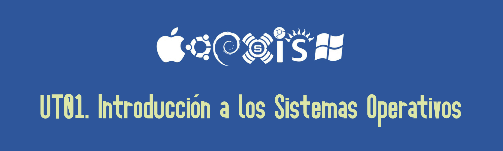

# 1.- INTRODUCCIÓN A LOS SISTEMAS OPERATIVOS

Un **sistema operativo** es un programa que controla la ejecución de los programas y actúa como interfaz entre el usuario de un computador y el hardware de este. 

El sistema operativo tiene dos funciones principales:

- **Extender la máquina**: si vemos un ordenador a muy bajo nivel podremos apreciar que su arquitectura (conjunto de instrucciones, organización, E/S y estructura de bus) es primitiva y complicada de programar. Como veremos, para permitir al usuario gestionar esta complejidad hará uso de abstracciones que mostrarán una vista más sencilla de la máquina subyacente al usuario.
- **Gestionar los recursos**: cuando hablamos de recursos nos referimos a procesadores, memorias, unidades de almacenamiento, … Cada programa y usuario necesita acceder a estos recursos y será el sistema operativo quien se encargue de repartirlos de la forma más equilibrada y óptima posible.

De estas dos funciones se pueden inferir tres objetivos que el sistema operativo pretende conseguir:

- **Comodidad**: el sistema operativo pretende que el usuario tenga una interacción más natural o sencilla con la máquina. Para ello abstrae todas las complejidades de la máquina subyacente mediante una interfaz de usuario que sea sencilla y manejable para el usuario.
- **Eficiencia**: el sistema operativo gestionará los recursos de la máquina de la forma más optima posible para dar servicio a los usuarios y aprovecharlos de la manera más eficiente.
- **Capacidad de evolución**: al igual que el hardware evoluciona con el tiempo, el sistema operativo debe evolucionar de forma paralela.

Veamos con más detalle estos tres objetivos:

## 1.1- El sistema operativo como interfaz usuario/computadora

El primer objetivo del sistema operativo es simplificar el manejo del ordenador para el usuario. A muy bajo nivel, un ordenador es una máquina muy compleja cuyo funcionamiento no tiene que conocer el usuario. Para simplificar el manejo, el sistema operativo crea una serie de capas de **abstracciones**, en las que el sistema operativo enmascara el trabajo a bajo nivel con el equipo mediante conceptos más familiares para el usuario.

Por ejemplo, a bajo nivel, un disco duro magnético es una superficie magnetizable que tiene la capacidad de almacenar bits que son accesibles mediante el movimiento de un cabezal magnético. Pero los sistemas operativos crean una abstracción mediante la que vemos todo ese almacenamiento como una serie de archivos y carpetas. Cuando el usuario abre un archivo, no necesita saber nada del funcionamiento interno del disco duro, ni de movimientos del cabezal, simplemente hace doble click en el icono que representa dicho archivo.

## 1.2.- Eficiencia en la gestión de recursos

Un ordenador tiene una serie de recursos (CPU, memoria, periféricos, …) cuyo uso debe compartir entre todos los procesos que están en ejecución en el sistema. Esto es más importante incluso en sistemas multiusuario en los que el sistema operativo debe repartir los recursos no solo entre procesos, sino también entre usuarios. 
Es su labor realizar un reparto ordenado de dichos recursos, llevando un control de quien está usando cada recurso, concediendo solicitudes de uso de estos y mediando entre diferentes procesos y usuarios que estén en conflicto.
La compartición o multiplexaje de recursos se puede realizar de dos formas en función del recurso:

- **Multiplexaje en el tiempo**: el recurso únicamente puede ser utilizado por un proceso en un momento determinado, por lo que se deben turnar para ir utilizándolo. Un ejemplo de este tipo de multiplexaje lo podemos ver en la CPU, que solo puede ser utilizada por un proceso en cada momento.
- **Multiplexaje en el espacio**: en este caso, cada proceso recibe una parte del recurso. El ejemplo más claro es la memoria RAM, donde cada proceso tendrá un espacio asignado por el sistema operativo.

## 1.3.- Facilidad de evolución del sistema operativo

Hay varias razones por las que un sistema operativo debe estar en continua evolución:

- **Actualizaciones de hardware y nuevos tipos de hardware**: el hardware está evolucionando constantemente, y, además, pueden aparecer nuevos tipos de hardware (por ejemplo, cuando aparecieron los primeros discos de estado sólido). El sistema operativo debe disponer de mecanismos para adaptarse a este hardware y obtener su máximo rendimiento. Habitualmente, esto se consigue mediante los drivers o controladores.
- **Nuevos servicios**: los sistemas operativos deben ir añadiendo nuevos servicios para facilitar la labor de los usuarios.
- **Correcciones**: un sistema operativo es un programa muy complejo con millones de líneas de código, por lo que es habitual que con el tiempo se detecten fallos y problemas de seguridad. Por tanto, será necesario ir solucionando estos bugs a medida que se detecten mediante parches y actualizaciones.

*** 

[**Volver** al menú de la UT01](index_UT01.md)

[**Siguiente>** 2. Historia de los sistemas operativos](02_historia.md)