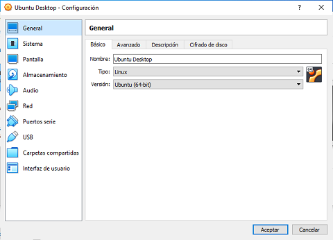

# UT02. VIRTUALIZACIÓN

### Contenidos

1. [Conceptos básicos de virtualización](01_conceptos_básicos.md)
2. [Tipos de máquinas virtuales](02_tipos_MV.md)
3. [Tipos de hipervisores](03_tipos_hipervisores.md)
4. [**Oracle VirtualBox**](04_virtualbox.md)
5. [Microsoft Hyper-V](05_hiper-v.md)


## 4.- ORACLE VIRTUALBOX


### 4.1.- Introducción a VirtualBox

**Oracle VM VirtualBox** es un software de virtualización para arquitecturas x86/AMD64 que en la actualidad pertenece a Oracle Corporation. Es un hipervisor de tipo 2, por lo que requiere de un sistema operativo base para ser instalado, teniendo soporte para Windows, GNU/Linux, Mac OS X, OS/2 Warp, Genode y Solaris/Open Solaris.


### 4.2.- Configuración de preferencias

Si vamos a *Archivo -> Preferencias* podremos configurar aspectos comunes de todo VirtualBox. Las opciones disponibles son:

- **General**: aquí se puede indicar el directorio donde se almacenarán los archivos correspondientes a las máquinas virtuales que se creen. Por defecto estos ficheros se almacenan en el disco `C:`, pero hay que tener en cuenta que los ficheros de los discos duros virtuales pueden ocupar varias decenas de gigabytes, por lo puede ser conveniente cambiar la ruta para que se almacenen en otra partición.
- 


### 4.3.- Creación de una máquina virtual


### 4.4.- Configuración de la máquina virtual

Una vez creada una máquina virtual es posible editar su configuración mediante la opción *Preferencias*. Las opciones de configuración son:


#### 4.4.1.- General



En la pestaña **Básico** se puede cambiar el nombre que le hemos asignado a la máquina virtual. Asimismo, también se puede modificar el **tipo** y la **versión** del sistema operativo que contendrá la máquina virtual.

Es importante que tanto el tipo como la versión se correspondan con el sistema operativo que instalaremos, ya que VirtualBox optimizará la máquina virtual para dicho sistema operativo, por lo que una elección errónea puede suponer un mal funcionamiento de la máquina virtual.


#### 4.4.2.- Sistema

Aquí hay varias opciones relativas a las características hardware de la máquina virtual, entre las que destacan:

- **Memoria base**: la cantidad de memoria que se asignará a la máquina virtual. Hay que tener en cuenta que la memoria asignada a la MV se tomará de la máquina física, por lo que, si asignamos mucha memoria o abrimos simultáneamente muchas máquinas virtuales se corre el riesgo de que la máquina física ocupe toda la memoria y se colapse el sistema.
- **Opción de arranque**: de forma análoga a como se hace en una máquina física, aquí se puede indicar el orden en que se seleccionarán los dispositivos para arrancar la máquina virtual.
- **Procesadores**: aquí se indica el número de CPUs virtuales que se asignarán a la MV. Al igual que pasaba con la memoria RAM, tiene correspondencia con los núcleos que tenga la máquina física (si la máquina física tiene Hyperthreading cada núcleo físico contará por dos), por lo que si asignamos demasiados puede que la máquina física se quede sin recursos.
- **Límite de ejecución**: permite limitar el uso de cada CPU asignada a la máquina virtual.


#### 4.4.3.- Pantalla


#### 4.4.4.- Almacenamiento


#### 4.4.5.- Audio


#### 4.4.6.- Red


### 4.5.- Adaptadores de red en VirtualBox

Un aspecto importante en la configuración de cualquier máquina virtual es la gestión de los adaptadores de red, ya que la elección de uno y otro tipo de adaptador determinará con qué otras máquinas virtuales e incluso equipos físicos podrá tener conectividad la máquina virtual.

En VirtualBox se pueden añadir hasta 4 adaptadores de red, que la máquina virtual verá como si fueran tarjetas de red. Se pueden añadir nuevos adaptadores desde el cuadro de diálogo *Configuración* e la máquina virtual siempre y cuando ésta se encuentre apagada.

También hay que tener en cuenta que es posible que los diferentes adaptadores de red tengan diferentes modos, por ejemplo, se podría añadir un adaptador en *modo NAT* que proporcione acceso a Internet a la máquina y otro en modo *red interna* que comunique la máquina virtual con otras máquinas virtuales.

Los modos de red disponibles son los siguientes:

#### 4.5.1.- Modo NAT

Es el modo más básico y su objetivo es proporcionar acceso a Internet a la máquina virtual de forma totalmente transparente para el usuario.

VirtualBox se encargará de otorgar una IP dinámica a la máquina virtual mediante DHCP y de enrutar todos los paquetes hacia Internet. La máquina virtual podrá acceder a cualquier dirección de Internet, pero estará totalmente aislada de cualquier otro equipo o máquina virtual.

#### 4.5.2.- Adaptador puente

En el modo **Adaptador puente** la máquina virtual se comportará con el adaptador de red exactamente igual a como lo haría una máquina física. Es decir, la máquina virtual accederá directamente a la red física, y por tanto es como si estuviera conectado directamente a la red local.

De esta forma, si en la red física hubiera un servidor DHCP la máquina virtual podría obtener su dirección IP de este servidor, pero no si no lo hubiera habría que configurar la IP estática con los parámetros de la red física (máscara, puerta de enlace, ...)


#### 4.5.3.- Red interna

Hay ocasiones en que se trabaja con varias máquinas virtuales y se desea que tengan conectividad entre ellas. En ese caso es posible seleccionar el modo **red interna** que crea una red virtual a la que se interconectan las máquinas. Hay que tener varias cosas en cuenta:

- Al seleccionar *red interna* se muestra la opción de elegir un nombre. Todos los equipos que se encuentran en una red con el mismo nombre se podrán ver entre ellos. Si se desea tener varias redes independientes entre sí simplemente hay que asignarles nombres diferentes.
- Las máquinas solo pueden ver a otras máquinas que se encuentren en la misma red interna, ni la máquina física, ni otras máquinas físicas ni direcciones de Internet.
- VirtualBox no asigna IPs dinámicas a los adaptadores en modo *red interna*, por lo que será necesario asignar una IP estática manualmente si se desea que haya interconectividad entre las máquinas.


#### 4.5.4.- Adaptador solo-anfitrión

El **adaptador en modo solo-anfitrión** se puede considerar como una *red interna* a la que también se añade la máquina física. Para ello, VirtualBox creará un adaptador virtual en la máquina física que tendrá una IP en el mismo rango que los adaptadores en modo *solo-anfitrión* de las máquinas virtuales.

Si se ejecuta el comando `ipconfig` en la línea de comandos se puede ver este adaptador virtual al que suele asignar el nombre `Virtual Host-Only Network`

```powershell
PS C:\> ipconfig

Configuración IP de Windows

Adaptador de Ethernet VirtualBox Host-Only Network:

   Sufijo DNS específico para la conexión. . :
   Vínculo: dirección IPv6 local. . . : fe80::50a5:54ad:4f94:d7df%4
   Dirección IPv4. . . . . . . . . . . . . . : 192.168.56.1
   Máscara de subred . . . . . . . . . . . . : 255.255.255.0
   Puerta de enlace predeterminada . . . . . :
```

Una diferencia importante de este modo respecto al modo *red interna* es que VirtualBox asigna una **IP dinámica** a los equipos que tengan este tipo de adaptador, asegurándose de que se encuentre en el mismo rango que el adaptador virtual que ha creado en el equipo físico.

En este modo no hay conectividad con Internet ni con otros equipos físicos.

Es posible tener diferentes redes en modo *solo-anfitrión*, pero es necesario configurarlas primero yendo a *Herramientas -> Red* y seleccionando crear. Al hacerlo, se creará un nuevo adaptador virtual en el equipo físico y deberemos indicar lo siguiente:

- IP y máscara que tendrá el adaptador virtual del equipo físico
- Si habrá servidor DHCP que otorgue direcciones dinámicas a todas las máquinas virtuales que tengan este adaptador
- El rango de direcciones IP que otorgará el servidor DHCP.


#### 4.5.5.- Red NAT

El modo **red NAT** combina las ventajas de la red interna (que permite la interconexión entre máquinas virtuales) y el modo NAT (que permite interconexión con Internet).

De forma análoga al modo *solo-anfitrión*, es posible crear diferentes redes en este modo aisladas entre sí. Para crearlas hay que ir al menú *Archivo -> Preferencias -> Red* y hacer click en el icono *Crear*. Hay que indicar la dirección IP y máscara de la red y si habrá un servidor DHCP o hay que configurar la IP de las máquinas virtuales como estática.


*** 

[Volver al índice](index_UT02.md)