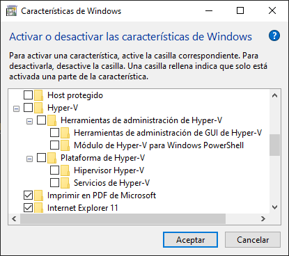
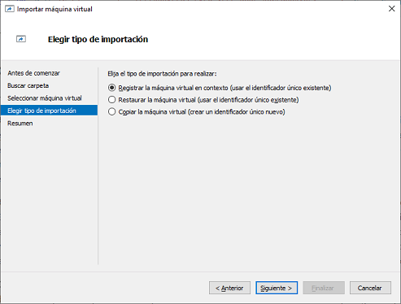

## Contenidos

1. [Conceptos básicos de virtualización](01_conceptos_básicos.md)
2. [Tipos de máquinas virtuales](02_tipos_MV.md)
3. [Tipos de hipervisores](03_tipos_hipervisores.md)
4. [Oracle VirtualBox](04_virtualbox.md)
5. [Microsoft Hyper-V](05_hiper-v.md)

# 5. MICROSOFT HYPER-V

## 5.1.- Habilitar Hyper-V en Windows 10

Hyper-V es una herramienta que inicialmente estaba orientada a las versiones de servidor de Windows, pero recientemente ha sido incluido como una característica en Windows 10. Los requisitos que debe tener el ordenador son:

- Windows 10 Enterprise, Pro o Education
- Procesador de 64 bits con traducción de direcciones de segundo nivel (SLAT).
- Compatibilidad de CPU con la extensión del modo monitor de la máquina virtual (VT-c en CPU de Intel).
- Mínimo de 4 GB de memoria.

La edición de Windows instalada se puede ver en *Panel de Control -> Sistema*, donde también se muestra si la arquitectura del equipo y el sistema son de 64 bits. Sin embargo, puede ser más complicado saber si el procesador dispone de SLAT y del juego de instrucciones de virtualización. Hay diversas formas de verificarlo, pero lo más sencillo es recurrir al conjunto de herramientas que Microsoft denomina [SysInternals](https://docs.microsoft.com/en-us/sysinternals/), que son varias utilidades en línea de comandos que realizan tareas muy concretas sobre el sistema operativo. 

La que interesa en este caso es [**CoreInfo**](https://docs.microsoft.com/en-us/sysinternals/downloads/coreinfo), que extrae información sobre las características del microprocesador. Esta herramienta debe ser ejecutada en la consola, y si lo hacemos con el parámetro `-v` mostrará únicamente las características del procesador relativas a la virtualización.

```powershell
PS C:\Users\Victor\Desktop> .\Coreinfo64.exe -v

Coreinfo v3.52 - Dump information on system CPU and memory topology
Copyright (C) 2008-2021 Mark Russinovich
Sysinternals - www.sysinternals.com


Note: Coreinfo must be executed on a system without a hypervisor running for
accurate results.

AMD Ryzen 5 2600 Six-Core Processor
AMD64 Family 23 Model 8 Stepping 2, AuthenticAMD
Microcode signature: 00000000
HYPERVISOR      *       Hypervisor is present
SVM             -       Supports AMD hardware-assisted virtualization
NP              -       Supports AMD nested page tables (SLAT)
```

**HACER CAPTURA CON EL PORTÁTIL, QUE ES INTEL**

Si se cumplen todas las condiciones será posible habilitar Hyper-V en el ordenador. Hyper-V es una **característica**, programas o utilidades incluidas en el sistema operativo pero que se pueden habilitar o deshabilitar a voluntad. Para ello, hay que ir a *Panel de Control -> Programas -> Activar o desactivar las características de Windows* y marcar la entrada que pone Hyper-V. Opcionalmente, se pueden instalar independientemente los diversos componentes de que dispone:

- **Herramientas de administración de Hyper-V**: tiene dos componentes, el primero es la interfaz gráfica para administrar Hyper-V mientras que el segundo es el módulo de Powershell que incluye todos los comandos necesarios para interactuar con las máquinas virtuales. Estos componentes se pueden instalar de forma aislada si, por ejemplo, se va a administrar de forma remota un hipervisor que se encuentra ubicado en otra máquina.
- **Plataforma de Hyper-V**: es el hipervisor propiamente dicho.



La instalación de estas características requiere del reinicio del sistema ya que Hyper-V es un **hipervisor de tipo 1**. Esto quiere decir que no se instala sobre un sistema operativo, sino que el hipervisor es el propio sistema operativo. Lo que hace Windows cuando habilitamos Hyper-V es cargar el hipervisor y hacer que el sistema operativo que tenemos en nuestro ordenador pase a ejecutarse sobre una máquina virtual.

[Interfaz de Hyper-V](imgs/hyperv_interfaz.png)


## 5.2.- Creación de una máquina virtual

La creación de una máquina virtual es muy sencilla, únicamente hay que ir a *Nuevo -> Máquina virtual* y seguir los pasos del asistente. Algunos datos que se piden son:

- **Nombre**: Cada máquina virtual está identificada por un nombre. Es deseable que el nombre sea suficientemente descriptivo y que no sea muy complicado ya que, si administramos las máquinas virtuales desde Powershell, haremos referencia a ella por el nombre.
- **Generación**: La generación de la máquina virtual hace referencia al hardware virtual de la misma y determina algunas de sus funcionalidades. Lo más destacable probablemente es que las máquinas de generación 1 permiten instalar sistemas operativos tanto de 32 como de 64 bits, mientras que las máquinas de 64 bits únicamente soportan sistemas operativos de 64 bits. Si quieres un listado completo de las diferencias entre ambas generaciones puedes consultarlas [aquí](https://docs.microsoft.com/es-es/windows-server/virtualization/hyper-v/Hyper-V-feature-compatibility-by-generation-and-guest).
- **Memoria RAM**: La cantidad de memoria RAM que se asignará a la máquina virtual y que por supuesto, tomará de la RAM de la máquina cuando la máquina virtual esté en ejecución.
- **Funciones de red**: Aquí se escoge el adaptador de red que tendrá la máquina. Más adelante se verá en detalle el funcionamiento de los adaptadores de red.
- **Disco duro virtual**: De forma análoga a como se hacía con VirtualBox, se puede crear un disco duro, reutilizar uno existente o no conectar ningún disco. Si vamos a reutilizar un disco existente, el formato nativo de discos virtuales de Hyper-V es `.vhd` y `.vhdx`.
- **Disco de arranque**: Donde se podrá seleccionar una imagen ISO desde la que instalar el sistema operativo.

Y con estas opciones ya estaría creada la máquina virtual. Ahora ya se puede arrancar, pero antes hay que diferenciar entre dos términos u operaciones diferentes que se pueden realizar con la máquina:

- **Iniciar**: Esta operación arranca la máquina virtual, pero no muestra una interfaz para interactuar con ella. La máquina se ejecuta haciendo lo que tenga que hacer, pero nosotros no veremos una ventana que nos la muestre.
- **Conectar**: Cuando hacemos click en *conectar* se abre una ventana que nos muestra la máquina virtual. Esto no implica la ejecución de la máquina, que no se producirá hasta que no pulsemos en *iniciar*.
- **Desconectar**: Esta acción apaga la máquina virtual de forma inmediata, es decir, sería el equivalente a desconectar el cable de corriente de un equipo físico. _No es recomendable_ en absoluto, salvo que la máquina se haya colgado y no haya otra posibilidad.
- **Apagar**: Envía una señal de apagado a la máquina virtual, por lo que esta se apagará de forma ordenada.
- Si **cerramos la ventana* de la máquina virtual, dejaremos de verla pero la máquina seguirá ejecutándose.


## 5.3.- Conexión a la máquina virtual

Cuando se realiza una conexión a la máquina virtual se muestra un cuadro de diálogo como el de la imagen inferior. Inpendientemente de que se pulse el botón *Conectar* o se cierre  este diálogo pulsando en la X de la esquina superior derecha la conexión a la máquina virtual se realizará, sin embargo, hay una gran diferencia en función de la acción escogida que se puede ver con más detalle cuando se pulsa en *Mostrar opciones*. Esto hará que aparezca una nueva pestaña denominada *recursos locales* y que refleja los recursos de la máquina física a los que tendrá acceso la máquina virtual como si fueran propios. Estos recursos solo serán accesibles si se accede tras pulsar el botón *Conectar*, mientras que acceder tras cerrar la ventana implica no acceder a ningún recurso físico.

Por defecto, los recursos compartidos son cualquier impresora que haya conectada a la máquina física y el portapapeles, pero también se podría compartir cualquier dispositivo periférico conectado por USB, como por ejemplo una webcam, o incluso las unidades de almacenamiento de la máquina física.


## 5.3.- Cambios en la configuración de una máquina virtual

Tras crear la máquina virtual se puede afirnar su configuración haciendo click derecho sobre ella y seleccionando *Configuración*. Las opciones más relevantes son:

- **BIOS**: aquí se indica en qué orden se buscarán dispositivos arrancables cuando iniciamos la máquina.
- **Memoria**: aquí es posible modificar el valor de memoria RAM de la máquina virtual. Aquí también se puede configurar la **memoria dinámica**. Si está habilitada se pueden indicar los siguientes valores:
  - *RAM mínima*: es la cantidad de RAM que tendrá inicialmente la máquina y el valor al que tenderá.
  - *RAM máxima*: a medida que la MV vaya requiriendo RAM, esta irá creciendo hasta el valor que hayamos puesto en este campo.
  - *Ponderación de memoria*: si hay varias máquinas en ejecución y todas demandan RAM, será este valor el que determinará cuáles tienen prioridad sobre otras.
- **Procesador**: aquí lo más relevante es el número de procesadores virtuales que se pueden asignar a la máquina virtual.
- **Controladora**: las controladores (IDE o SCSI), son el punto de conexión de los discos duros virtuales, así como de las unidades ópticas. Las controladoras IDE únicamente pueden tener conectados dos dispositivos, mientras que las controladores SCSI permiten hasta 64.
- **Servicios de integración**: son diversos servicios que permiten de alguna manera la interacción entre el anfitrión y el invitado. Por ejemplo, el *latido* sirve para permitir que el anfitrión sepa si la máquina virtual está funcionando o no. En la web de Microsoft hay información completa sobre todos los [servicios de integración](https://docs.microsoft.com/es-es/virtualization/hyper-v-on-windows/reference/integration-services).
- **Puntos de control**: los puntos de control de Hyper-V son equivalente a las instantáneas de VirtualBox, aunque en este caso hay dos tipos diferentes:
  - *Puntos de control de producción*, requieren que el sistema operativo invitado lo permita y su característica es que no incluyen el estado de las aplicaciones que se están ejecutando en el momento de realizarlo.
  - *Puntos de control estándar*, son el equivalente a las instantáneas de VirtualBox, por lo que reflejan el estado actual de toda la máquina.


## 5.5.- Gestión de la red en Hyper-V

A diferencia de VirtualBox donde se definía un tipo de adaptador para cada interfaz de red, en Hyper-V hay disponibles diferentes modos de configuración de la red a través de los que denomina **conmutadores virtuales**.

Por defecto, al instalar Hyper-V únicamente hay un conmutador virtual denominado **Default Switch** cuyo funcionamiento es equivalente al adaptador en modo NAT, donde el hipervisor se encarga de otorgar una dirección IP al equipo invitado de forma que tenga acceso a Internet, aunque no podrá ver a ningún otro equipo ni otras máquinas virtuales.

Si se desea algún otro modo de configuración de los adaptadores de red será necesario crear un nuevo *conmutador virtua*, que pueden ser de tres tipos: externo, interno o privado.

- **Conmutador virtual externo**: enlaza una tarjeta de red física del equipo anfitrión con una virtual, por lo que dará acceso a la máquina virtual a la red local. Al crear un conmutador con este modo hay que tener cuidado con la opción *Permitir que el sistema operativo de administración comparta este adaptador de red*, ya que si la desmarcamos el adaptador de red se cederá en exclusiva a la máquina virtual, por lo que el anfitrión no podrá usarla.
- **Conmutador virtual interno**: se debe utilizar cuando se quiere crear una red virtual independiente que interconecte varias máquinas virtuales entre ellas y también con el hipervisor. También proporcionará salida a Internet mediante NAT.
- **Conmutador virtual privado**: crea una red virtual donde todas las máquinas conectadas se verán entre ellas, pero no al equipo anfitrión. Esto aislará completamente las máquinas virtuales.


## 5.6.- Clonación de máquinas virtuales

Hyper-V no tiene una opción de clonar máquinas virtuales tal como tenía VirtualBox, sino que las copias de máquinas virtuales tienen que realizarse mediante la opción de **exportar** e **importar**.

**Exportar** una máquina virtual es muy sencillo, únicamente hay que escoger esta opción en el menú contextual de la máquina virtual que se desea exportar y seleccionar la ubicación de disco donde se quiere guardar la máquina exportada. Ahí creará una carpeta con el nombre de la máquina virtual y en su interior copiará los archivos de la máquina (la propia máquina, discos duros virtuales y los ficheros de los puntos de comprobación).

Para **importar** una máquina hay que seleccionar esta opción en el panel de acciones de la parte derecha del hipervisor, lo que lanzará un asistente. En este asistente se pedirá la ruta donde se encuentra la máquina virtual que se desea importar, tras indicarlo, preguntará por el tipo de importanción, pudiendo escoger entre las siguientes opciones:

- **Registrar la máquina virtual en contexto (usar el identificador único existente)**: esto quiere decir que no se va a realizar una copia de los archivos de la máquina virtual, sino que simplemente se registra en Hyper-V para poder utilizar la máquina, pero los archivos se quedan en la ubicación en que se encuentren.
- **Restaurar la máquina virtual (esar el identificador único existente)**: con esta opción sí se realiza una copia de los archivos de la máquina virtual en el directorio que se haya indicado para contener las máquinas virtuales y se registra la copia en el hipervisor. El **identificador único** al que hace referencia el texto es un identificador con que se reconocen las máquinas virtuales en el hipervisor; si se mantiene el identificador y ya hay una máquina con el mismo registrada (por ejemplo, si se importa una máquina que se acaba de exportar) dará lugar a un error.. Una vez completada la importación, los archivos exportados permanecen intactos y se pueden quitar o importar de nuevo.
- **Copiar la máquina virtual (crear un identificador único núevo)**: en este caso copia la máquina y le asigna un nuevo identificador, por lo que podría convivir con la máquina que original.




*** 

[Volver al índice](index_UT02.md)