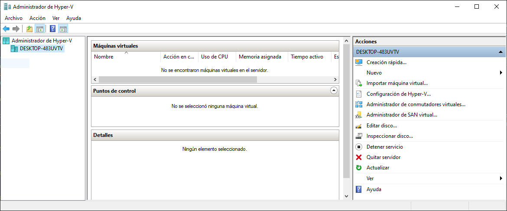
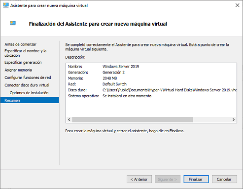

# UT02. VIRTUALIZACIÓN

### Contenidos

1. [Conceptos básicos de virtualización](01_conceptos_básicos.md)
2. [Tipos de máquinas virtuales](02_tipos_MV.md)
3. [Tipos de hipervisores](03_tipos_hipervisores.md)
4. [Oracle VirtualBox](04_virtualbox.md)
5. [Microsoft Hyper-V](05_hiper-v.md)


# 1. CONCEPTOS BÁSICOS DE VIRTUALIZACIÓN

## 1.1.- Definición de máquina virtual

Una **máquina virtual** es un software que permite reproducir una máquina con la misma arquitectura que la máquina sobre la que se está ejecutando. Es decir, podemos considerarla como un programa que simula un ordenador completo de forma que podemos hacer sobre esa máquina virtual cualquier tarea que podríamos realizar sobre una máquina física.

Las máquinas virtuales no simulan todo el hardware, sino que se apoyan en el hardware subyacente haciendo en muchas ocasiones de puente entre el sistema virtualizado y la máquina física. Por este motivo, la máquinas virtuales siempre tienen que tener la misma **arquitectura** que la máquina física en la que se están ejecutando.

Cuando hablamos de arquitectura nos referimos al diseño interno del procesador, sus instrucciones al más bajo nivel y su estructura operacional.

Las arquitecturas más habituales son:

- **x86-64**: es la que utilizan todos los procesadores de Intel y AMD. 
- **ARM**: usada en dispositivos móviles. Algunos fabricantes que la utilizan son Qualcomm, Mediatek, Samsung, ..

Esto implica que un ordenador de sobremesa con Windows, que solo se ejecuta sobre arquitecturas x86, solo podrá tener máquinas virtuales basadas en dicha arquitectura. Así, podrá instalar un Windows, un Linux o incluso un BeOS, pero nunca podría instalar un Android (en realidad se podría, pero serían imágenes preparadas para ejecutarse sobre x86).

Los programas que permiten instalar sistemas operativos de arquitecturas diferentes se llaman **emuladores** y son mucho más lentos que las máquinas virtuales, ya que absolutamente todas las funciones del hardware se tienen que simular por software.

Algunos ejemplos de emulador sería:

- **BlueStacks**: permite emular Android en nuestro ordenador, es decir, es un software que emula completamente una arquitectura ARM.
- **ePSXe**: en este caso es un emulador de la PlayStation, que también tiene una arquitectura completamente diferente.

En la actualidad la virtualización es una tecnología madura que está ampliamente extedida en todos los ámbitos, desde pequeños sistemas de virtualización en equipos personales hasta sistemas en la nube capaces de virtualizar cientos de servidores. 

Algunas de las aplicaciones de virtualización más conocidas son:

- Oracle VirtualBox
- VMWare, con soluciones de virtualización para escritorio y también para grandes servidores
- Xen
- Microsoft Hyper-V


## 1.2.- Ventajas e inconvenientes de la virtualización

La amplia difusión de las tecnologías de virtualización se deben a las múltiples ventajas que tiene, entre las que destacan:

- **Reducción de costes y mejor gestión de los recursos hardware**. Se pueden agrupar todos los recursos hardware en una misma máquina que ejecuta múltiples máquinas virtuales, pudiendo tener un reparto más eficiente de los recursos. 
- **Las MV pueden ser creadas, clonadas y destruidas a demanda**. La creación, clonación y destrucción de máquinas es un proceso casi instantáneo, pudiendo crear fácilmente máquinas a medida que las vamos necesitando.
- **Posibilidad de vender capacidad de cálculo a otras empresas (VPS, Virtual Private Servers)**. Hay múltiples empresas que proporcionan servidores virtuales en la nube con los recursos hardware que deseemos, como [Digital Ocean](https://www.digitalocean.com) o [Vultr](https://www.vultr.com/). ESte tipo de servicio se denomina **IaaS (Infrastruture as a Service)**.
- **Mayor facilidad para restablecer sistemas de mantenimiento, disponibilidad o recuperación de datos tras un desastre**. Dado que se puede levantar una máquina virtual en pocos segundos, cuando un servidor cae se puede levantar una máquina virtual que lo reemplace de forma casi instantánea.
- **Simplificación de los sistemas de copia de seguridad**. 
- **Permiten guardar el estado**. Al ser todo virtual, se puede almacenar el estado exacto en que está en una máquina virtual para recuperarlo cuando deseemos. Así, por ejemplo, podemos guardarlo antes de aplicar las actualizaciones y, en caso de que algo vaya mal, recuperar el estado anterior para dejar la máquina como estaba.
- **Permiten rápida incorporación de nuevos recursos**. Es muy sencillo añadir más memoria RAM, más discos duros o más núcleos virtuales a una máquina virtual siempre que la máquina física disponga de esos recursos.
- **Entornos de aprendizaje y pruebas**. Las máquinas virtuales son ideales para probar otros sistemas operativos sin realizar ningún cambio permanente en nuestro equipo.
- **Compatibilidad de programas**. Podemos utilizar programas que solo estén disponibles para otro sistema operativo. Por ejemplo, si tenemos un programa antiguo que solo funciona en Windows XP podemos instalar este sistema en una máquina virtual y ejecutar ahí el programa.
- **Entornos controlados**. Se pueden probar los efectos de programas en los que no confiamos, por ejemplo si sospechamos que tienen algún tipo de software malicioso o si preveemos que pueden perjudicar nuestro ordenador de alguna forma.
- **Fácil migración de unos ordenadores a otros**. Mover una máquina virtual entre equipos es tan fácil como mover un archivo.
- **Más ecológicas**. Requieren menor cantidad de recursos duplicados como ventiladores, monitores, … y por tanto reducen el consumo energético y el ruido.

Aunque son muy pocos, las máquinas virtuales también tienen algunos **inconvenientes**.

- **Ralentizan el sistema**. Hay que pasar a través de la máquina virtual para ejecutar el sistema. Sin embargo, este inconveniente es cada vez menos perceptible, sobre todo desde que los procesadores incluyen las extensiones del juego de instrucciones de virtualización.
- **Se vuelve inestables a nivel de velocidad si hay varias máquinas ejecutándose simultáneamente**. El reparto de recursos entre las máquinas virtuales puede no ser todo lo equitativo que debiera, provocando incrementos de latencia temporales. Aunque hay que tener en cuenta que esto no afectará a la estabilidad a nivel de resultados.
- **Los usuarios pueden instalar programas no permitidos en el anfitrión**.


# 2.- TIPOS DE MÁQUINAS VIRTUALES

Si nos fijamos en la funcionalidad del software de virtualización, podemos distinguir dos grandes tipos:
- Máquinas virtuales de proceso
- Máquinas virtuales de sistema


## 2.1.- Máquinas virtuales de proceso

Este tipo de máquinas virtuales se salen de la idea que tenemos de virtualización donde se simula un ordenador completo. Las máquinas virtuales de proceso tienen como objetivo ejecutar código nativo de los procesos para los que fueron diseñadas. Es decir, su objetivo es únicamente ejecutar código diseñado para una arquitectura específica, no relacionado con ninguna máquina física.

Probablemente la máquina más conocida es la máquina virtual de Java (JVM). Los programas en Java se convierten en un código denominado **bytecodes** que se ejecuta en dicha máquina virtual. Como la máquina virtual de Java se puede instalar en múltiples sistemas operativos (Windows, Linux, Mac OS) conseguimos que el código Java sea multiplataforma.


## 2.2.- Máquinas virtuales de sistema

En este tipo de sistemas, la máquina física se replica en varias máquinas virtuales, cada una con su sistema operativo. Hay múltiples soluciones de virtualización de este tipo, como 
- VirtualBox
- VMware
- Parallels
- QEMU
- Xen

En este caso el software de virtualización proporciona una réplica del ordenador físico con un subconjunto de sus recursos. Al ordenador físico que ejecuta el software se le denomina **anfitrión**, mientras que las máquinas virtuales se les suele denominar **invitados**. Esto permite tratar a la máquina virtual como un ordenador y, por tanto, instalar sistemas operativos en ella.

Entre sus utilidades destacan:
- Coexistencia de varios sistemas operativos
- Simulación de hardware
- Implantación de servidores
- Virtualización de equipos

Como curiosidad, aunque puede parecer que la virtualización es algo reciente, la primera máquina virtual surgió a finales de los 60 con el sistema CP/CMS de IBM, aunque no ha sido hasta estos últimos años cuando los sistemas virtuales se han popularizado.

Actualmente la virtualización está cobrando gran importancia, por lo que los dos grandes fabricantes de procesadores de PC incluyen un juego específico de instrucciones para la virtualización en sus procesadores.

- **Intel VT** (Intel Virtualization Technology)
- **AMD-V** (AMD Virtualization)

Aunque difieren en el nombre, ambas tecnologías son similares y su presencia en el microprocesador permite ejecutar máquinas virtuales de forma mucho más eficiente. Incluso algunas funcionalidades de las máquinas virtuales no estarán disponibles si no disponemos de alguno de estos juegos de instrucciones, por ejemplo, la capacidad de ejecutar máquinar virtuales de 64 bits o utilizar la virtualización anidada (crear máquinas virtuales dentro de otras máquinas virtuales).

Que un procesador no disponga de estos juegos de instrucciones no quiere decir que no pueda ejecutar software de virtualización, pero el rendimiento será peor.

Por norma general estos juegos de instrucciones hay que habilitarlos en la BIOS (se accede a ella pulsando Supr, F2 o alguna similar durante el arranque del sistema)


# 3.- TIPOS DE HIPERVISORES

La solución software que permite crear máquinas virtuales se denomina **hipervisor**. Hay multiples hipervisores, pero en general se pueden dividir en dos grandes grupos:

- Hipervisores tipo 1
- Hipervisores tipo 2

Adicionalmente, hay otro enfoque diferente en la virtualización que no se podría incluir en ninguno de los dos tipos , que son los **contenedores**.


## 3.1.- Hipervisores de tipo 1

También se denominan **unhosted**, **nativos** o **bare metal**. Este tipo de hipervisores no se instalan sobre ningún sistema operativo, sino que se ejecutan directamente sobre el hardware. En realidad, lo normal es que el propio hipervisor incluya su propio sistema operativo, el cual únicamente incluye las funciones estrictamente necesarias para ejecutar el hipervisor. Por ejemplo, VMWare ESXi incluye se propio kernel, llamado VMkernel, y algunas aplicaciones básicas de Linux (como un servidor `ssh` o un intérprete bash)

El que estos hipervisores estén ellos solos a la máquina, unido al hecho de que este tipo de soluciones profesionales de virtualización están orientadas a su instalación en grandes servidores que no suelen estar dotados de teclado ni de monitor, hace que si acceso y administración siempre se realice de forma remota, normalmente por SSH, RDP o a través de portales web.

La principal **ventaja** de los hipervisores de tipo 1 es que al eliminar la capa de sistema operativo entre el hipervisor y el hardware subyacente se consigue un mejor rendimiento. Además, al eliminar el sistema operativo de base se consigue una menor superficie de ataque que redunda en una menor probabilidad de que haya agujeros de seguridad.

Como se ha dicho, estos hipervisores están orientados a entornos profesionales. Algunos de los más populares son:
- VMware eESXi
- Xen
- Citrix Xen Server
- Microsoft Hyper-V

## 3.2 Hipervisores de tipo 2

También denominados **hosted**, se caracterizan porque son programas que se ejecutan sobre un sistema operativo. Obviamente, esto introduce un alto nivel de ineficiencia, ya que cualquier operación que realice el sistema operativo instalado en la máquina virtual deberá ser procesado primero por el hipervisor, luego por el sistema operativo de base, para finalmente llegar al hardware.

Como son aplicaciones normales, su interfaz con el usuario es como el de una aplicación normal, siendo accesible desde el entorno de ventanas de Windows o del sistema operativo en el que esté instalado el hipervisor.

La mayor **ventaja** de los hipervisores de tipo 2 es que tienen una funcionalidad bastante limitada que se traduce en una fácil administración. Esto hace que sean útiles para la realización de pruebas a nivel personal o en entornos académicos, en los que prima la facilidad de manejo frente a la capacidad de realizar un gran número de funciones.

Algunos de los hipervisores de tipo 2 más utilizados son:

- Oracle VirtualBox
- KVM
- Vmware Workstation


## 3.3.- Contenedores

Este tipo de virtualización difiere de los tipos anteriores, siendo incluso discutible el que se trate de virtualización. Los contenedores también se denominan **virtualización del sistema operativo**. Mientras que los hipervisores que hemos visto buscan reproducir una máquina hardware mediante software, los contenedores únicamente virtualizan o duplican el kernel del sistema operativo y las librerías necesarias para realizar una determinada tarea.

Los contenedores no contienen sistemas operativos como las máquinas virtuales, sino que por norma general contienen servicios. Es decir, únicamente la parte del sistema que necesita para lanzar un servicios determinado (por ejemplo, un servidor Web), la cual se ejecuta en un entorno aislado a disposición únicamente de los servicios que ejecuta.

La principal ventaja de los contenedores es que son extremadamente livianos. Esto hace que su creación sea muy rápida y con muy poco impacto en el sistema operativo en que se ejecutan.

Al ser una tecnología reciente no hay muchas soluciones de contenedores, siendo la más popular **Docker**.


# 4.- ORACLE VIRTUALBOX


## 4.1.- Introducción a VirtualBox

**Oracle VM VirtualBox** es un software de virtualización para arquitecturas x86/AMD64 que en la actualidad pertenece a Oracle Corporation. Es un hipervisor de tipo 2, por lo que requiere de un sistema operativo base para ser instalado, teniendo soporte para Windows, GNU/Linux, Mac OS X, OS/2 Warp, Genode y Solaris/Open Solaris.


## 4.2.- Consideraciones previas

### 4.2.1.- Selección de directorio destino

Antes de proceder a crear la máquina virtual es conveniente seleccionar la carpeta donde se almacenarán por defecto las máquinas virtuales creadas, ya que por defecto las almacena en `C:` y puede consumir rápidamente todo el espacio disponible en el disco si se crean muchas máquinas virtuales, las cuales pueden llegar a ocupar varias decenas de gigabytes cada una.

Si se desea almacenar por defecto las máquinas virtuales en otro disco o partición hay que ir a *Archivo -> Preferencias -> General*, donde se mostrará la opción de escoger el directorio donde se ubicarán las máquinas.

Cada máquina virtual está compuesta por varios archivos, que se distinguen por su extensión. Estos archivos son:

- **Especificaciones de la máquina**. Este fichero tiene extensión `.vbox` y contiene las características que tiene la máquina virtual, como cantidad de memoria, procesador, ... Es un archivo XML, por lo que se podría abrir con cualquier editor de texto y ver su contenido. Por supuesto, no es aconsejable modificarlo manualmente en ningún caso.

```xml
<?xml version="1.0"?>
<!--
** DO NOT EDIT THIS FILE.
** If you make changes to this file while any VirtualBox related application
** is running, your changes will be overwritten later, without taking effect.
** Use VBoxManage or the VirtualBox Manager GUI to make changes.
-->
<VirtualBox xmlns="http://www.virtualbox.org/" version="1.15-windows">
  <Machine uuid="{5fd99477-4330-45ea-8efb-69e1f695da29}" name="W10" OSType="Windows10_64" snapshotFolder="Snapshots" lastStateChange="2021-09-17T05:05:10Z">
    <MediaRegistry>
      <HardDisks>
        <HardDisk uuid="{bb89abfa-8b3a-4cb3-8192-4720c2b059c8}" location="W10.vdi" format="VDI" type="Normal"/>
      </HardDisks>
      <DVDImages>
        <Image uuid="{fd54411c-d2a3-46df-838d-a135502c2a9d}" location="E:/00 - Im&#xE1;genes CDs/Windows/Windows 10/Windows 10 - Versi&#xF3;n 2020.iso"/>
        <Image uuid="{0d8f7ab7-9679-4279-a547-159c1e42a02a}" location="C:/Program Files/Oracle/VirtualBox/VBoxGuestAdditions.iso"/>
      </DVDImages>
    </MediaRegistry>
    <ExtraData>
      <ExtraDataItem name="GUI/LastGuestSizeHint" value="751,452"/>
      <ExtraDataItem name="GUI/LastNormalWindowPosition" value="0,23,640,522"/>
    </ExtraData>
    <Hardware>
      <CPU>
        <PAE enabled="false"/>
        <LongMode enabled="true"/>
        <HardwareVirtExLargePages enabled="true"/>
      </CPU>
      <Memory RAMSize="4096"/>
      <HID Pointing="USBTablet"/>
      ...
```

- **Copia de seguridad de la MV**. Es un fichero con extensión `vbox-prev` y simplemente es una copia del fichero anterior.
- **Discos virtuales**. Cada disco duro virtual que tenga la máquina tiene su propio fichero, con extensión `.vdi` (aunque VirtualBox también soporta discos virtuales de otras aplicaciones de virtualización). El que los discos virtuales tengan su propio fichero hace que sea muy sencillo moverlos de una máquina virtual a otra, de forma análoga a como haríamos con un disco físico.


### 4.2.2.- Instalación del Extensión Pack

Aunque con VirtualBox recién instalado ya se pueden crear máquinas virtuales y trabajar con ellas, hay un conjunto de herramientas denominado **Extension Pack** que se pueden instalar y aumentan la funcionalidad. Algunas de estas nuevas funciones que habría disponibles de instalarlas son:

- Funcionalidad **USB 2.0 y 3.0**
- **VirtualBox Remote Display Protocol (VRDP)**, que permite la conexión remota a las máquinas virtuales mediante RDP.
- **Intel PXE ROM**, para arrancar las máquinas virtuales desde la red.
- **Disk Encryption**, que permite el cifrado de los discos duros virtuales.
- **Host Webcam**, por si queremos utilizar desde la máquina virtual la webcam de la máquina física.

El proceso de instalación es muy sencillo, únicamente hay que ir al apartado de descargas de la web de [VirtualBox](https://www.virtualbox.org/wiki/Downloads), descargar el Extension Pack y seguir las instrucciones.


## 4.3.- Creación de una máquina virtual

El proceso de creación de una máquina virtual es bastante sencillo ya que únicamente hay que seguir las instrucciones que nos dará el asistente.

El primer paso será indicar el **nombre** que asignaremos a la máquina virtual y el **tipo y versión** de sistema operativo que instalaremos en ella. Es importante que tanto el tipo como la versión se correspondan con el sistema operativo que instalaremos, ya que VirtualBox optimizará la máquina virtual para dicho sistema operativo, por lo que una elección errónea puede suponer un mal funcionamiento de la máquina virtual.

A continuación, hay que seleccionar la **cantidad de memoria RAM** que se asignará a la máquina virtual.Hay que tener en cuenta que la memoria asignada a la MV se tomará de la máquina física, por lo que, si asignamos mucha memoria o abrimos simultáneamente muchas máquinas virtuales se corre el riesgo de que la máquina física ocupe toda la memoria y se colapse el sistema. Por defecto, sugiere una cantidad de memoria acorde a los requisitos del sistema operativo que se ha escogido en el paso anterior.

La siguiente ventana del asistente corresponde al **disco duro de la máquina virtual**, pudiendo escoger entre crear uno (la opción más habitual), conectar un disco virtual ya existente o no agregar ningún disco.

Al crear un disco se puede escoger entre dos tipos:

- **Tamaño fijo**: El tamaño del fichero `.vdi` será igual que el tamaño del disco virtual que hayamos escogido. Por ejemplo, si hemos creado un disco virtual de 25GB estaremos ocupando siempre 25GB del disco físico.
- **Reservado dinámicamente**: El tamaño del fichero `.vdi` será igual al tamaño que ocupen _los datos_ contenidos en el disco virtual. Por ejemplo, si en el disco virtual anterior solo tenemos ocupados 2 GB el tamaño del fichero .vdi será de 2 GB

Escoger un disco de tamaño reservado dinámicamente tiene la ventaja de que ahorra mucho espacio en disco, incluso se podría crear un disco virtual mucho mayor que el espacio disponible en el disco físico (siempre que los datos que contenga no excedan de este tamaño). Como inconveniente, el rendimiento es inferior al de los discos de tamaño fijo.

Y con esto ya estaría creada la máquina virtual, únicamente faltaría agregar un disco a la unidad óptica, que puede ser tanto un disco físico como una imagen ISO.


## 4.4.- Configuración de la máquina virtual

Una vez creada una máquina virtual es posible editar su configuración mediante la opción *Preferencias*. Hay un gran número de opciones de configuración que se encuentran agrupadas en secciones seleccionables en la parte izquierda de la ventana y, para cada una de ellas, en pestañas. Algunas de las más relevantes son:


En el apartado **Básico** se puede cambiar el nombre que le hemos asignado a la máquina virtual. Asimismo, también se puede modificar el **tipo** y la **versión** del sistema operativo que contendrá la máquina virtual.

Interesante en el caso de máquinas cuyo contenido queramos proteger especialmente es la posibilidad de **cifrar el disco duro**. Este cifrado protege el disco por completo, independientemente del sistema operativo que tengamos instalado en él y de cualquier herramienta de cifrado que tenga dicho sistema operativo (como BitLocker).

El apartado **Sistema** se centra en las características del hardware virtual de la máquina. Aquí se podrá modificar la memoria RAM asignada y también el número de CPUs virtuales que asignaremos a la máquina virtual, así como el porcentaje de uso máximo que ocupará la máquina de cada núcleo virtual. Al igual que pasa con al memoria RAM, los recursos virtuales se detraen de los recursos físicos del equipo, por lo que hay que tener cuidado con no dejar a la máquina física sin recursos. El número de CPUs virtuales que se pueden asignar es igual al número de núcleos que tenga el procesador, o el doble en caso de que disponga de la tecnología *Hyperthreading*.

En el apartado **Pantalla** destaca la opción de habilitar la **pantalla remota**, que permite acceder a la máquina virtual desde otro equipo utilizando una conexión de escritorio remoto. Para ello solo hay que indicar el puerto que se quiere utilizar (por defecto el 3389) y si se desea algún tipo de autenticación. También es posible permitir que varios usuarios se conecten simultáneamente a la misma máquina.

Aquí es importante reseñar que, aunque se realiza una conexión de escritorio remoto, el servidor que recibe dicha conexión no es el del sistema operativo que haya instalado en la máquina virtual, sino que es VirtualBox quien recibe esa conexión y se encarga de enviar la pantalla. Es decir, el sistema que tengamos instalado no es consciente de que está sirviendo una conexión de escritorio remoto, sino que la ve como una conexión local.

El apartado de **Almacenamiento** centraliza la gestión de todos los sistemas de almacenamiento de la máquina virtual. Tanto los discos virtuales como los discos ópticos deben de ser conectados a través de una **controladora**, por lo que en este apartado veremos las controladores que hay en el equipo virtual, aunque se pueden añadir las que se deseen.

Las controladoras pueden ser de dos tipos, y la principal diferencia es que las controladoras IDE únicamente permiten la conexión de dos dispositivos de almacenamiento mientras que las controladoras SATA permiten hasta 30 dispositivos conectados.

Recientemente VirtualBox ha añadido el **Administrador de medios virtuales** que facilita llevar un seguimiento centralizado de todo el almacenamiento utilizado por las máquinas virtuales. Cualquier disco duro virtual o imagen de DVD que se vaya a utilizar debe ser agregada primero al *Administrador de medios virtuales*, y ahí se pueden ver todos los discos con opciones como:

- Ver el espacio total y libre de cada disco.
- Copiarlo o moverlo a otra ubicación.
- Eliminar la imagen de disco

# 5. MICROSOFT HYPER-V

## 5.1.- Habilitar Hyper-V en Windows 10

Hyper-V es una herramienta que inicialmente estaba orientada a las versiones de servidor de Windows, pero recientemente ha sido incluido como una característica en Windows 10. Los requisitos que debe tener el ordenador son:

- Windows 10 Enterprise, Pro o Education
- Procesador de 64 bits con traducción de direcciones de segundo nivel (SLAT).
- Compatibilidad de CPU con la extensión del modo monitor de la máquina virtual (VT-c en CPU de Intel).
- Mínimo de 4 GB de memoria.

La edición de Windows instalada se puede ver en *Panel de Control -> Sistema*, donde también se muestra si la arquitectura del equipo y el sistema son de 64 bits. Sin embargo, puede ser más complicado saber si el procesador dispone de SLAT y del juego de instrucciones de virtualización. Hay diversas formas de verificarlo, pero lo más sencillo es recurrir al conjunto de herramientas que Microsoft denomina [SysInternals](https://docs.microsoft.com/en-us/sysinternals/), que son varias utilidades en línea de comandos que realizan tareas muy concretas sobre el sistema operativo. 

La que interesa en este caso es [**CoreInfo**](https://docs.microsoft.com/en-us/sysinternals/downloads/coreinfo), que extrae información sobre las características del microprocesador. Esta herramienta debe ser ejecutada en la consola, y si lo hacemos con el parámetro `-v` mostrará únicamente las características del procesador relativas a la virtualización.

```powershell
PS C:\> .\Coreinfo64.exe -v

Coreinfo v3.52 - Dump information on system CPU and memory topology
Copyright (C) 2008-2021 Mark Russinovich
Sysinternals - www.sysinternals.com

Intel(R) Core(TM) i5-7200U CPU @ 2.50GHz
Intel64 Family 6 Model 142 Stepping 9, GenuineIntel
Microcode signature: 000000B4
HYPERVISOR      -       Hypervisor is present
VMX             *       Supports Intel hardware-assisted virtualization
EPT             *       Supports Intel extended page tables (SLAT)
URG             *       Supports Intel unrestricted guest
```

Si se cumplen todas las condiciones será posible habilitar Hyper-V en el ordenador. Hyper-V es una **característica**, programas o utilidades incluidas en el sistema operativo pero que se pueden habilitar o deshabilitar a voluntad. Para ello, hay que ir a *Panel de Control -> Programas -> Activar o desactivar las características de Windows* y marcar la entrada que pone Hyper-V. Opcionalmente, se pueden instalar independientemente los diversos componentes de que dispone:

- **Herramientas de administración de Hyper-V**: tiene dos componentes, el primero es la interfaz gráfica para administrar Hyper-V mientras que el segundo es el módulo de Powershell que incluye todos los comandos necesarios para interactuar con las máquinas virtuales. Estos componentes se pueden instalar de forma aislada si, por ejemplo, se va a administrar de forma remota un hipervisor que se encuentra ubicado en otra máquina.
- **Plataforma de Hyper-V**: es el hipervisor propiamente dicho.


La instalación de estas características requiere del reinicio del sistema ya que Hyper-V es un **hipervisor de tipo 1**. Esto quiere decir que no se instala sobre un sistema operativo, sino que el hipervisor es el propio sistema operativo. Lo que hace Windows cuando habilitamos Hyper-V es cargar el hipervisor y hacer que el sistema operativo que tenemos en nuestro ordenador pase a ejecutarse sobre una máquina virtual.




## 5.2.- Creación de una máquina virtual

La creación de una máquina virtual es muy sencilla, únicamente hay que ir a *Nuevo -> Máquina virtual* y seguir los pasos del asistente. Algunos datos que se piden son:

- **Nombre**: Cada máquina virtual está identificada por un nombre. Es deseable que el nombre sea suficientemente descriptivo y que no sea muy complicado ya que, si administramos las máquinas virtuales desde Powershell, haremos referencia a ella por el nombre.
- **Generación**: La generación de la máquina virtual hace referencia al hardware virtual de la misma y determina algunas de sus funcionalidades. Lo más destacable probablemente es que las máquinas de generación 1 permiten instalar sistemas operativos tanto de 32 como de 64 bits, mientras que las máquinas de 64 bits únicamente soportan sistemas operativos de 64 bits. Si quieres un listado completo de las diferencias entre ambas generaciones puedes consultarlas [aquí](https://docs.microsoft.com/es-es/windows-server/virtualization/hyper-v/Hyper-V-feature-compatibility-by-generation-and-guest).
- **Memoria RAM**: La cantidad de memoria RAM que se asignará a la máquina virtual y que por supuesto, tomará de la RAM de la máquina cuando la máquina virtual esté en ejecución.
- **Funciones de red**: Aquí se escoge el adaptador de red que tendrá la máquina. Más adelante se verá en detalle el funcionamiento de los adaptadores de red.
- **Disco duro virtual**: De forma análoga a como se hacía con VirtualBox, se puede crear un disco duro, reutilizar uno existente o no conectar ningún disco. Si vamos a reutilizar un disco existente, el formato nativo de discos virtuales de Hyper-V es `.vhd` y `.vhdx`.
- **Disco de arranque**: Donde se podrá seleccionar una imagen ISO desde la que instalar el sistema operativo.



Y con estas opciones ya estaría creada la máquina virtual. Ahora ya se puede arrancar, pero antes hay que diferenciar entre dos términos u operaciones diferentes que se pueden realizar con la máquina:

- **Iniciar**: Esta operación arranca la máquina virtual, pero no muestra una interfaz para interactuar con ella. La máquina se ejecuta haciendo lo que tenga que hacer, pero nosotros no veremos una ventana que nos la muestre.
- **Conectar**: Cuando hacemos click en *conectar* se abre una ventana que nos muestra la máquina virtual. Esto no implica la ejecución de la máquina, que no se producirá hasta que no pulsemos en *iniciar*.
- **Desconectar**: Esta acción apaga la máquina virtual de forma inmediata, es decir, sería el equivalente a desconectar el cable de corriente de un equipo físico. _No es recomendable_ en absoluto, salvo que la máquina se haya colgado y no haya otra posibilidad.
- **Apagar**: Envía una señal de apagado a la máquina virtual, por lo que esta se apagará de forma ordenada.
- Si **cerramos la ventana* de la máquina virtual, dejaremos de verla pero la máquina seguirá ejecutándose.


## 5.3.- Conexión a la máquina virtual

Cuando se realiza una conexión a la máquina virtual se muestra un cuadro de diálogo como el de la imagen inferior. Inpendientemente de que se pulse el botón *Conectar* o se cierre  este diálogo pulsando en la X de la esquina superior derecha la conexión a la máquina virtual se realizará, sin embargo, hay una gran diferencia en función de la acción escogida que se puede ver con más detalle cuando se pulsa en *Mostrar opciones*. Esto hará que aparezca una nueva pestaña denominada *recursos locales* y que refleja los recursos de la máquina física a los que tendrá acceso la máquina virtual como si fueran propios. Estos recursos solo serán accesibles si se accede tras pulsar el botón *Conectar*, mientras que acceder tras cerrar la ventana implica no acceder a ningún recurso físico.

Por defecto, los recursos compartidos son cualquier impresora que haya conectada a la máquina física y el portapapeles, pero también se podría compartir cualquier dispositivo periférico conectado por USB, como por ejemplo una webcam, o incluso las unidades de almacenamiento de la máquina física.


## 5.3.- Cambios en la configuración de una máquina virtual

Tras crear la máquina virtual se puede afirnar su configuración haciendo click derecho sobre ella y seleccionando *Configuración*. Las opciones más relevantes son:

- **BIOS**: aquí se indica en qué orden se buscarán dispositivos arrancables cuando iniciamos la máquina.
- **Memoria**: aquí es posible modificar el valor de memoria RAM de la máquina virtual. Aquí también se puede configurar la **memoria dinámica**. Si está habilitada se pueden indicar los siguientes valores:
  - *RAM mínima*: es la cantidad de RAM que tendrá inicialmente la máquina y el valor al que tenderá.
  - *RAM máxima*: a medida que la MV vaya requiriendo RAM, esta irá creciendo hasta el valor que hayamos puesto en este campo.
  - *Ponderación de memoria*: si hay varias máquinas en ejecución y todas demandan RAM, será este valor el que determinará cuáles tienen prioridad sobre otras.
- **Procesador**: aquí lo más relevante es el número de procesadores virtuales que se pueden asignar a la máquina virtual.
- **Controladora**: las controladores (IDE o SCSI), son el punto de conexión de los discos duros virtuales, así como de las unidades ópticas. Las controladoras IDE únicamente pueden tener conectados dos dispositivos, mientras que las controladores SCSI permiten hasta 64.
- **Servicios de integración**: son diversos servicios que permiten de alguna manera la interacción entre el anfitrión y el invitado. Por ejemplo, el *latido* sirve para permitir que el anfitrión sepa si la máquina virtual está funcionando o no. En la web de Microsoft hay información completa sobre todos los [servicios de integración](https://docs.microsoft.com/es-es/virtualization/hyper-v-on-windows/reference/integration-services).
- **Puntos de control**: los puntos de control de Hyper-V son equivalente a las instantáneas de VirtualBox, aunque en este caso hay dos tipos diferentes:
  - *Puntos de control de producción*, requieren que el sistema operativo invitado lo permita y su característica es que no incluyen el estado de las aplicaciones que se están ejecutando en el momento de realizarlo.
  - *Puntos de control estándar*, son el equivalente a las instantáneas de VirtualBox, por lo que reflejan el estado actual de toda la máquina.


## 5.5.- Gestión de la red en Hyper-V

A diferencia de VirtualBox donde se definía un tipo de adaptador para cada interfaz de red, en Hyper-V hay disponibles diferentes modos de configuración de la red a través de los que denomina **conmutadores virtuales**.

Por defecto, al instalar Hyper-V únicamente hay un conmutador virtual denominado **Default Switch** cuyo funcionamiento es equivalente al adaptador en modo NAT, donde el hipervisor se encarga de otorgar una dirección IP al equipo invitado de forma que tenga acceso a Internet, aunque no podrá ver a ningún otro equipo ni otras máquinas virtuales.

Si se desea algún otro modo de configuración de los adaptadores de red será necesario crear un nuevo *conmutador virtua*, que pueden ser de tres tipos: externo, interno o privado.

- **Conmutador virtual externo**: enlaza una tarjeta de red física del equipo anfitrión con una virtual, por lo que dará acceso a la máquina virtual a la red local. Al crear un conmutador con este modo hay que tener cuidado con la opción *Permitir que el sistema operativo de administración comparta este adaptador de red*, ya que si la desmarcamos el adaptador de red se cederá en exclusiva a la máquina virtual, por lo que el anfitrión no podrá usarla.
- **Conmutador virtual interno**: se debe utilizar cuando se quiere crear una red virtual independiente que interconecte varias máquinas virtuales entre ellas y también con el hipervisor. También proporcionará salida a Internet mediante NAT.
- **Conmutador virtual privado**: crea una red virtual donde todas las máquinas conectadas se verán entre ellas, pero no al equipo anfitrión. Esto aislará completamente las máquinas virtuales.


## 5.6.- Clonación de máquinas virtuales

Hyper-V no tiene una opción de clonar máquinas virtuales tal como tenía VirtualBox, sino que las copias de máquinas virtuales tienen que realizarse mediante la opción de **exportar** e **importar**.

**Exportar** una máquina virtual es muy sencillo, únicamente hay que escoger esta opción en el menú contextual de la máquina virtual que se desea exportar y seleccionar la ubicación de disco donde se quiere guardar la máquina exportada. Ahí creará una carpeta con el nombre de la máquina virtual y en su interior copiará los archivos de la máquina (la propia máquina, discos duros virtuales y los ficheros de los puntos de comprobación).

Para **importar** una máquina hay que seleccionar esta opción en el panel de acciones de la parte derecha del hipervisor, lo que lanzará un asistente. En este asistente se pedirá la ruta donde se encuentra la máquina virtual que se desea importar, tras indicarlo, preguntará por el tipo de importanción, pudiendo escoger entre las siguientes opciones:

- **Registrar la máquina virtual en contexto (usar el identificador único existente)**: esto quiere decir que no se va a realizar una copia de los archivos de la máquina virtual, sino que simplemente se registra en Hyper-V para poder utilizar la máquina, pero los archivos se quedan en la ubicación en que se encuentren.
- **Restaurar la máquina virtual (esar el identificador único existente)**: con esta opción sí se realiza una copia de los archivos de la máquina virtual en el directorio que se haya indicado para contener las máquinas virtuales y se registra la copia en el hipervisor. El **identificador único** al que hace referencia el texto es un identificador con que se reconocen las máquinas virtuales en el hipervisor; si se mantiene el identificador y ya hay una máquina con el mismo registrada (por ejemplo, si se importa una máquina que se acaba de exportar) dará lugar a un error.. Una vez completada la importación, los archivos exportados permanecen intactos y se pueden quitar o importar de nuevo.
- **Copiar la máquina virtual (crear un identificador único núevo)**: en este caso copia la máquina y le asigna un nuevo identificador, por lo que podría convivir con la máquina que original.


