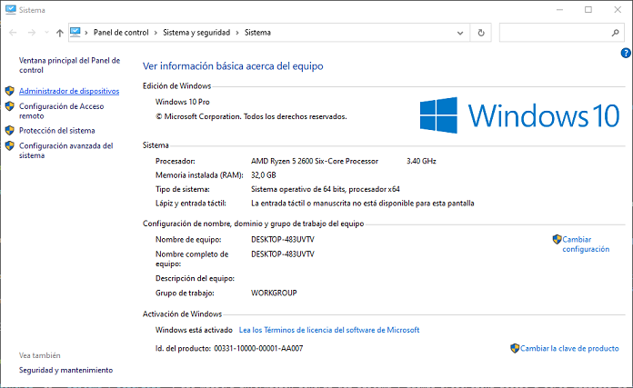
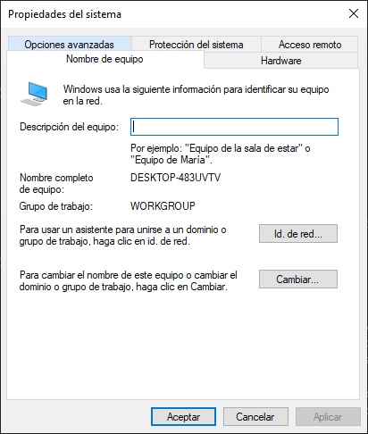
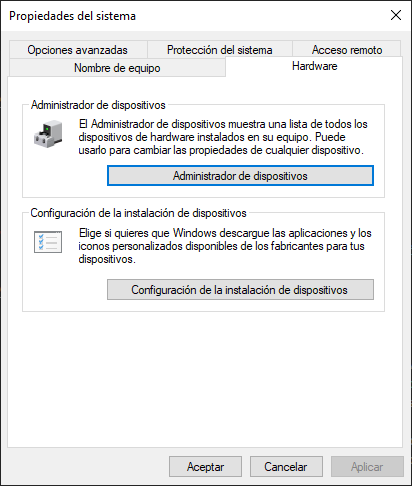
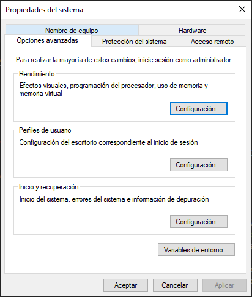
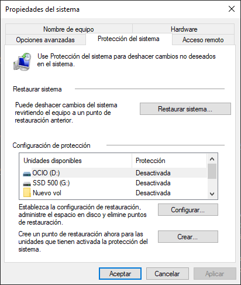
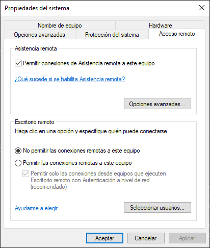

## Contenidos

1. [Herramientas de administración](01_herramientas_administración.md)
2. [**Panel de control. Sistema**](02_sistema.md)
3. [Panel de control. Otras opciones](03_otras_opciones.md)
4. [Gestión de usuarios](04_usuarios.md)
5. [Gestión de grupos](05_grupos.md)


# 2.- PANEL DE CONTROL. SISTEMA

La primera opción del *Panel de control* es **Sistema y seguridad**, que muestra información general del sistema y además proporciona acceso a otros diálogos de administración. Veamos todo lo que podemos hacer desde aquí.

## 2.1.- Ver información básica acerca del equipo



Según accedemos a *Sistema* se nos muestra información general sobre el equipo, que incluye:

- **Edición de Windows**, indicando la versión de Windows que tenemos instalada. si quisiéramos información más específica sobre la versión del sistema operativo podemos ejecutar el comando `winver.exe`, que indica la compilación exacta que tenemos.
- **Sistema**, con información del hardware del equipo, en concreto el modelo de procesador y la cantidad de memoria RAM instalada. Además, este es un buen sitio para comprobar la arquitectura del equipo, que puede ser x86 para arquitectura de 32 bits o x64 si tenemos un procesador de 64 bits. También se indica si el sistema operativo es de 32 o de 64 bits. Respecto a la arquitectura hay que tener en cuenta:
  - Para tener un sistema operativo de 64 bits obligatoriamente necesitamos un procesador de 64 bits.
  - Un sistema operativo de 32 bits se puede instalar tanto en arquitecturas de 32 bits como de 64 bits. Si instaláramos un sistema operativo de 32 bits en un sistema x64 habría algunas limitaciones inherentes al uso de 32 bits, por ejemplo, no podríamos direccionar más de 4 GB de RAM aunque tuviéramos más memoria instalada. 
- **Configuración de nombre, dominio y grupo de trabajo del equipo**, donde veremos el nombre del equipo y si pertenece a un dominio o a un grupo de trabajo. Si aquí hacemos click en *Cambiar configuración* nos llevará al diálogo **Propiedades del sistema**, que a su vez tiene varias pestañas.
  
## 2.2.- Nombre del equipo



En esta pestaña del cuadro de diálogo *Propiedades del sistema* podremos asignar un nuevo nombre al equipo. El nombre de equipo es por el que será conocido nuestro equipo en la red (también se conoce como **nombre NetBIOS**), por ejemplo, cuando otros equipos quieran acceder a carpetas compartidas que tengamos alojadas en nuestro ordenador.

Algunas restricciones que tiene que tener el nombre de equipo son:

- Debe tener una longitud de entre 1 y 15 caracteres.
- Debe ser una secuencia de caracteres alfanuméricos ASCII (letras A-Z y dígitos 0-9)
- No puede estar formado exclusivamente por dígitos
- Están permitidos símbolos como guión bajo (`_`), guión (`-`), coma (`,`), dos puntos (`:`), almohadilla (`#`), .... Sin embargo, **su uso está desaconsejado**, por lo que lo ideal es _utilizar únicamente letras mayúsculas y dígitos_.

En esta [entrada del foro de asistencia de Microsoft](https://answers.microsoft.com/en-us/windows/forum/all/which-characters-are-acceptable-for-a-computer/fddb4895-4295-47ab-a2b9-7773b329718c) puedes ver con detalle todos los requisitos que deben tener los nombres de equipo en Windows.

Desde aquí también se puede cambiar el nombre del *grupo de trabajo* al que pertenece nuestro ordenador y agregarlo a un dominio, aunque esta opción ya la veremos en futuras unidades.

## 2.3.- Hardware



Esta pestaña nos permite acceder al **Administrador de dispositivos**, que es la herramienta que nos mostrará la lista de todos los componentes hardware conectados al sistema.
Aquí podremos ver si un componente hardware es detectado por el sistema y si funciona correctamente. En caso de que un elemento hardware no funcione correctamente se mostrará mediante un símbolo de advertencia. Además, podremos instalar los **controladores** o **drivers** de los componentes hardware.

Los **controladores** son piezas de software que le indican al sistema operativo como debe hacer para comunicarse eficientemente con el hardware. Por ejemplo, cuando instalamos una impresora es necesario instalar los *drivers* para poder aprovechar toda la funcionalidad. Los controladores se pueden dividir en dos tipos:

- **Drivers universales**: permiten trabajar con prácticamente todos los dispositivos hardware, aunque no aprovechan todo su potencial. Se pueden considerar como controladores genéricos que únicamente soportan la funcionalidad mínima que tienen en común todos los dispositivos de un determinado tipo. Así, por ejemplo, podríamos utilizar una impresora pero no podríamos tener acceso a algunas opciones avanzadas de la misma como la impresión a doble cara.
- **Drivers específicos**: son los desarrollados por el fabricante para ese componente hardware en concreto y aprovechan al máximo sus capacidades. 

Windows 10 tiene una gestión automática bastante buena de drivers, descargándose los específicos automáticamente al detectar un componente hardware nuevo, por lo que normalmente los usuarios no tienen que preocuparse de ello. Únicamente sería necesario acudir a la web del fabricante para el caso de dispositivos que no funcionen correctamente o si queremos disponer de la última versión de los mismos para aprovechar al máximo las funcionalidades del dispositivo.

## 2.4.- Opciones avanzadas



En la pestaña de *Opciones avanzadas* tenemos cuatro opciones diferentes:

- **Rendimiento**: si seleccionamos esta opción nos llevará a un cuadro de diálogo que a su vez tiene tres pestañas:
  - **Efectos visuales**: esta pestaña puede ser interesante en equipos con prestaciones limitadas. Aquí podremos deshabilitar efectos visuales (como transparencias, movimientos fluidos de las ventanas, sombras, ...) para mejorar el rendimiento del sistema.
  - **Opciones avanzadas**: donde a su vez está:
    - *Programación del procesador*,  podemos configurar si queremos optimizar el rendimiento de los programas interactivos o de los servicios en segundo plano. Es una opción que conviene no tocar salvo que tengamos algún tipo de servidor instalado.
    - *Memoria virtual*, la **memoria virtual** es un espacio de disco duro que el sistema operativo utiliza como si fuera RAM. Por defecto, es gestionada por el propio sistema operativo, pero podemos configurarla manualmente indicando si queremos tenerla o no, qué tamaño debe tener y en qué disco duro se almacenará. El fichero que corresponde a la memoria virtual se llama `pagefile.sys` y por defecto se puede encontrar en la raíz del disco C:, aunque oculto y marcado como *archivo del sistema*.
    - *Prevención de ejecución de datos (DEP)*, que es una característica que evita que se pueda ejecutar código que esté ubicado en el área de datos de memoria. Por norma general suelen ser programas maliciosos los que intentan copiar su código en áreas de memoria reservadas para datos, por lo que DEP impediría su ejecución. Por defecto, está activado para programas y servicios de Windows, pero activarlo para todos los programas es una buena medida para proteger nuestro equipo. Podríamos querer deshabilitarlo en alguna de estas situaciones:
      - Programas muy antiguos, normalmente de 32 bits
      - Algunos programas que tienen bastante interacción con los servicios de Windows. En estos casos el fabricante ya aconseja deshabilitar DEP
      - Juegos antiguos o emuladores para juegos todavía más antiguos.
      - Controladores muy antiguos
- **Perfiles de usuario**: aquí hay algunas opciones relativas a los perfiles de usuario que veremos cuando hablemos de los usuarios.
- **Inicio y recuperación**: aquí configuramos el arranque del sistema y qué debe hacer en caso de error inesperado. Cuando hablamos de errores del sistema nos referimos a los famosos *Blue Screen of Death (BSoD)*. Los motivos por los que ocurren pueden ser muy variados:
  - Si es durante las actualizaciones
    - Por programa antiguos
    - Por software de seguridad de terceros
    - Por ficheros de instalación corruptos
  - Si es en otra ocasión:
    - Por drivers antiguos
    - Por algún problema con alguna aplicación instalada recientemente, un driver o una actualización.
- Una de las opciones es crear un **volcado de memoria**, que consiste en almacenar toda la información de memoria en el momento en que se colgó el equipo para poder determinar la causa exacta que motivó el mismo. Hay aplicaciones para leer los archivos de volcado de memoria, pero obviamente, requieren un conocimiento muy extenso del funcionamiento interno del sistema operativo para poder extraer información útil del mismo. 
- **Variables de entorno**: Las variables de entorno son valores almacenados en variables con información del sistema. Estas variables pueden ser consultadas por cualquier programa. Por ejemplo la variable `PATH` almacena la lista de directorios donde el sistema busca automáticamente los ejecutables. Tradicionalmente las variables de entorno se han indicado rodeando su nombre con el símbolo `%`, por ejemplo, `%SystemRoot%`
- En Powershell la sintaxis ha cambiado y se indican de la forma `$env:SystemRoot`. Podemos ver todas las variables de entorno definidas en el sistema con la orden:

```powershell
PS C:\> Get-ChildItem Env:

Name                           Value
----                           -----
ALLUSERSPROFILE                C:\ProgramData
APPDATA                        C:\Users\Victor\AppData\Roaming
CommonProgramFiles             C:\Program Files\Common Files
CommonProgramFiles(x86)        C:\Program Files (x86)\Common Files
CommonProgramW6432             C:\Program Files\Common Files
COMPUTERNAME                   DESKTOP-483UVTV
...
```

## 2.5.- Protección del sistema



Siguiendo con las pestañas del cuadro de diálogo *Propiedades del sistema* encontramos esta que permite trabajar con los **puntos de restauración**, que veremos en posteriores unidades.

## 2.6.- Acceso remoto



Aquí hay dos opciones para acceder de forma remota al ordenador. La primera de ellas es **Asistencia remota**, una funcionalidad diseñada para que el servicio técnico se pudiera conectar de forma remota al equipo, pero que está siendo reemplazado por **Asistencia rápida**, cuya funcionalidad veremos en una práctica.

El otro apartado es el de **Escritorio remoto**, cuyo fin es permitir conexiones remotas a nuestro ordenador. Los pasos que hay que realizar para permitir estas conexiones son:

- Habilitar la casilla *Permitir las conexiones remotas a este equipo* en este cuadro de diálogo
- Seleccionar qué usuarios se podrán conectar por escritorio remoto
- Y, en el equipo desde el que nos vayamos a conectar, abrir la aplicación **Conexión a escritorio remoto** e introducir la dirección IP o nombre del equipo al que nos vayamos a conectar.


*** 

[Volver al índice](index_UT03.md)