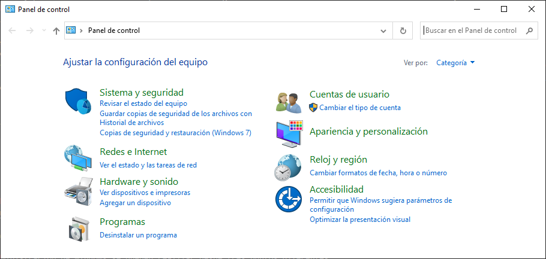
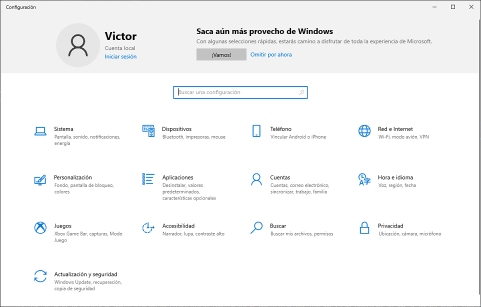
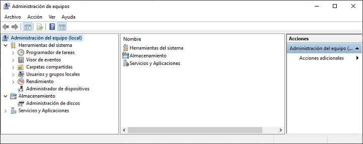

# UT03. WINDOWS 10. INSTALACIÓN Y PRIMEROS PASOS

### Contenidos

1. [Gestión de usuarios](01_usuarios.md)
2. [Gestión de grupos](02_grupos.md)
3. [**Herramientas de administración**](03_herramientas_administración.md)
4. [Panel de control. Sistema](04_sistema.md)
5. [Panel de control. Otras opciones](05_otras_opciones.md)
6. [Gestión de usuarios y grupos]
- Usuarios y grupos en Powershell (**Mover**)

## 3.- HERRAMIENTAS ADMINISTRATIVAS

En versiones anteriores de Windows, prácticamente todas las opciones de configuración se encontraban en el **Panel de Control**, el cual era el punto de partida para realizar cualquier tarea administrativa que se deseara en el sistema, desde crear usuarios hasta configurar la conexión a la red. Sin embargo, en los últimos años Microsoft ha ido aligerando la funcionalidad de esta herramienta en detrimento de otras herramientas, principalmente en la denominada *Configuración*.

Hay que tener en cuenta que estas aplicaciones son simplemente caminos para llegar hasta las herramientas con las que se administra el sistema, por lo que en muchas ocasiones podremos llegar al mismo sitio tomando diferentes rutas. Por ejemplo, podemos llegar a *Conexiones de red*, la herramienta para configurar los adaptadores de red yendo desde *Panel de control -> Redes e Internet -> Centro de redes y recursos compartidos -> Cambiar configuración del adaptador*, pero también llegaríamos al mismo sitio si vamos a *Configuración -> Red e Internet -> Ethernet -> Cambiar opciones del adaptador*, incluso se podría acceder también haciendo click derecho en el icono de red del panel de notificación y seleccionando *Abrir Configuración de red e Internet*. Por ello, no es tan importante conocer el camino para llegar a las herramientas, como conocer qué herramientas hay disponibles y cuál utilizar en cada ocasión.

### 3.1.- El Panel de Control

### 3.2.- Configuración

Esta herramienta lleva muchos años absorbiendo funcionalidades del *Panel de control*, por lo que es de esperar que acabe reemplazándolo completamente en un futuro próximo. La forma más fácil de acceder a ella es desde el icono del engranaje que se encuentra en el *Menú de inicio*.

### 3.3.- Microsoft Management Console (MMC)

La **Consola de Administración de Microsoft** es una herramienta que ha acompañado a Windows prácticamente desde las primeras versiones. Se puede considerar como un marco de ejecución para las verdaderas herramientas de admnistración que se cargan en el MMC como *Complementos*. Es decir, el MMC por si solo no puede realizar ninguna tarea de administración, pero se puede ver como un **contenedor** que permite cargar complementos para administrar determinados aspectos del sistema.

Al contrario de lo que ocurre con el *Panel de control* y *Configuración*, que en muchas ocasiones llevan al mismo sitio, las funciones de administración que se pueden realizar desde el MMC únicamente pueden realizarse desde él, como puede ser con la administración de discos o la gestión de directivas locales.

Para utilizar el MMC debemos invocar el comando ^mmc.exe^ y cargar los complementos que necesitemos desde el menú *Archivo -> Agregar o quitar complemento...*. Sin embargo, también podemos acceder a una consola de administración precargada con los complementos más habituales haciendo click derecho en *Este Equipo* y seleccionando *Administrar*. A esta consola preconfigurada Microsoft la denomina **Administrador de equipos**.

