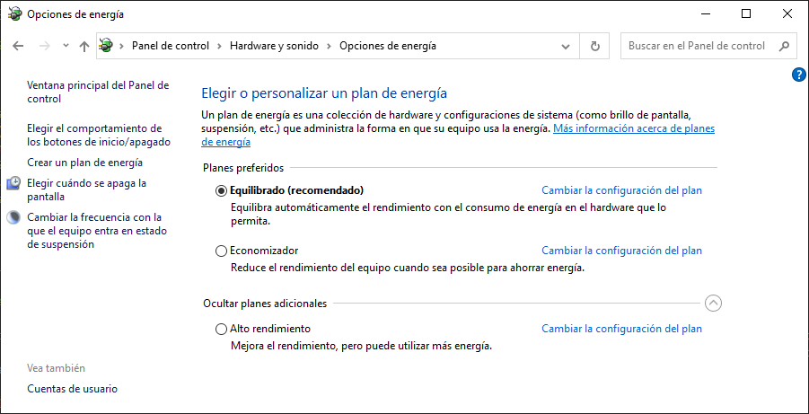
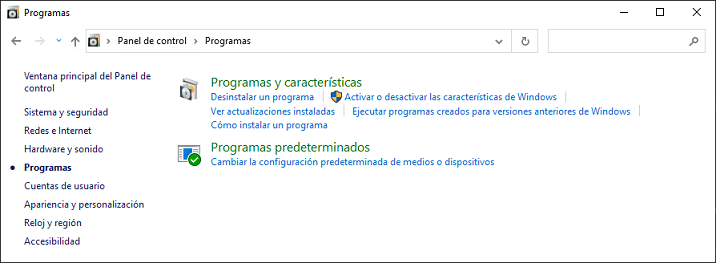

<link rel="stylesheet" href="../styles.css">

<link rel="stylesheet" href="../styles.css">

## Contenidos

1. [Herramientas de administración](01_herramientas_administración.md)
2. [Panel de control. Sistema](02_sistema.md)
3. [**Panel de control. Otras opciones**](03_otras_opciones.md)
4. [Gestión de usuarios](04_usuarios.md)
5. [Gestión de grupos](05_grupos.md)

# 3.- PANEL DE CONTROL. OTRAS OPCIONES

## 3.1.- Opciones de energía

Desde el *Panel de control* también podemos acceder a la configuración de **Opciones de energía**, donde se puede gestionar el comportamiento del equipo en lo relativo a la gestión de la energía. La gestión de energía en Windows 10 se hace a través de los denominados **planes de energía**, un conjunto preconfigurado de directivas que establecen ciertos valores para diversos aspectos de la energía buscando un punto de equilibrio entre consumo y rendimiento.

Los tres planes disponibles, según se potencie el ahorro energético o el rendimiento del equipo, son:

- Equilibrado
- Economizador
- Alto rendimiento

Es posible cambiar la configuración establecida para alguno de estos planes pulsando en *Cambiar la configuración del plan*, lo que en un primer paso permitirá cambiar el tiempo de inactividad que esperar el sistema para:

- Apagar el monitor
- Suspender el equipo
- Apagar los discos duros

Es posible afinar más en la configuración de cada uno de los planes yendo a *Cambiar la configuración avanzada de energía*, donde se podrán cambiar características como la frecuencia del procesador o la suspensión de los puertos USB.

En lo que respecta a la gestión de energía, Windows 10 sigue el estándar **Advanced Configuration Power Interface (ACPI)**, que especifica cuatro diferentes niveles de energía:

- **PC en funcionamiento**
- **Suspensión**: Cuando el equipo entra en suspensión se mantiene la alimentación de energía de la memoria RAM, desconectando todos los demás componentes (monitor, CPU, discos duros, ventiladores, …). Al pulsar una tecla, vuelven a activarse todos los componentes y, como el estado de la memoria se mantiene, se vuelve al estado anterior casi inmediatamente.
- **Hibernación**:En este caso el contenido de la memoria es volcado a un archivo en el disco, tras lo cual, se desconecta completamente todo el hardware (incluida la memoria). Para volver del estado de hibernación hay que usar el botón de encendido. El arranque es más lento que en la suspensión (aunque más rápido que un arranque normal), ya que hay que copiar nuevamente el contenido del archivo en la memoria. El **archivo de hibernación** lo podemos ver en C: como archivo oculto y del sistema, llamado `hiberfil.sys`.
- **Apagado completo** del PC

Para obtener información más detallada del control en energía en el equipo y realizar algunas tareas no disponibles en la interfaz gráfica, está disponible el comando `powercfg`, que a través de sus múltiples parámetros da acceso diversas operaciones relacionadas con la energía. En esta [web](https://www.softzone.es/windows-10/como-se-hace/comandos-basicos-dominar-powercfg/) tienes una guía con las opciones más comunes, entre las que destacan:

- `powercfg -hibernate ON`: habilita la hibernación en el equipo
- `powercfg -hibernate OFF`: deshabilita la hibernación en el equipo
- `powercfg /energy`: genera un reporte HTML analizando la eficiencia energética del equipo
- `powercfg /batteryreport`: genera un informe sobre el estado de la batería de un portátil

## 3.2.- Programas

Desde **Programas** podremos realizar las siguientes operaciones:

- **Desinstalar o cambiar un programa**: Ver el listado de todas las aplicaciones instaladas en el sistema con información sobre las mismas (editor, fecha de instalación, tamaño, ...) y desinstalarlas.
- **Características de Windows**: Las características son funcionalidades o programas incluidos en el sistema operativo, aunque no tienen por qué estar necesariamente activados por defecto. Desde aquí podremos activarlas o desactivarlas.
- **Ver actualizaciones instaladas**: Muestra el listado de todas las actualizaciones instaladas y da la posibilidad de desinstalarlas.
- **Programas predeterminados**: Cuando el usuario hace doble click sobre un archivo para abrirlo, Windows mira la extensión de dicho archivo y selecciona un programa acorde para abrirlo con él. Por ejemplo, si pulsa un fichero con extensión `.html` lo abrirá con un navegador. En *Programas predeterminados* es donde se selecciona exactamente qué aplicación se utilizará para abrir cada archivo en función de la extensión.

*** 

[Volver al índice](index_UT03.md)