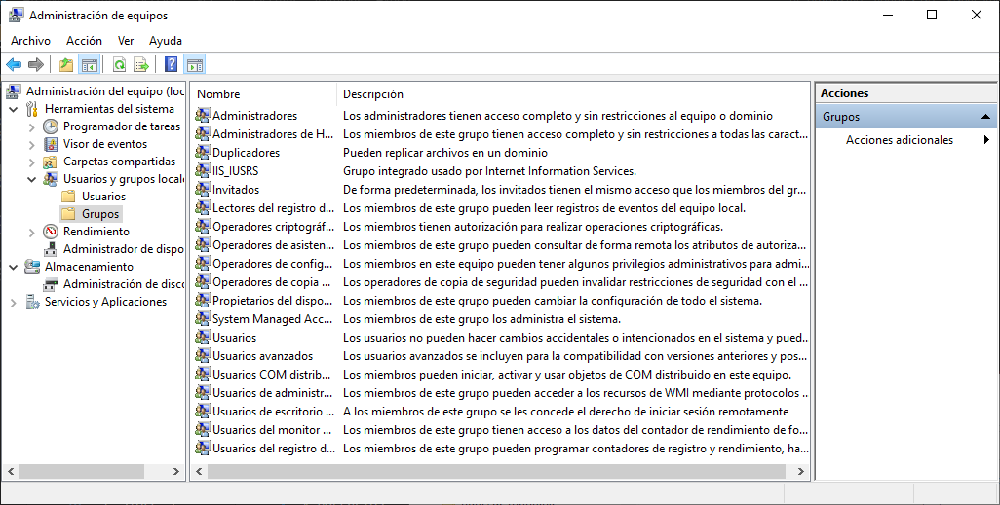

<link rel="stylesheet" href="../styles.css">

<link rel="stylesheet" href="../styles.css">

## Contenidos

1. [Herramientas de administración](01_herramientas_administración.md)
2. [Panel de control. Sistema](02_sistema.md)
3. [Panel de control. Otras opciones](03_otras_opciones.md)
4. [Gestión de usuarios](04_usuarios.md)
5. [**Gestión de grupos**](05_grupos.md)

# 5.- GESTIÓN DE GRUPOS EN WINDOWS

Los grupos son otro de los denominados **principales de seguridad** de Windows, y, al igual que sucedía con los usuarios, son una parte fundamental en las tareas de administración del sistema, permitiendo asignar permisos y derechos a conjuntos de usuarios en lugar de hacerlo individualmente.

De forma análoga a los usuarios predefinidos, Windows 10 incluye un gran número de **grupos predefinidos**, que tienen asignados derechos para realizar determinadas tareas del sistema, como por ejemplo realizar copias de seguridad.

Toda la gestión de grupos se realiza desde el complemento *Usuarios y grupos del MMC*, desde la que se podrá crear grupos, determinar la pertenencia de los usuarios a grupos, renombrarlos y borrarlos.

## 5.1.- Grupos predefinidos

En un equipo con Windows 10 los grupos locales predefinidos ya ha sido creados y asignados con todos los permisos necesarios para realizar sus tareas básicas. Los grupos predefinidos que podemos encontrar en Windows 10 una vez instalado son los siguientes: 

- **Administradores**: el grupo de administradores tiene todos los permisos y privilegios. Sus miembros se pueden garantizar a ellos mismos cualquier permiso que no tengan para administrar todos los objetos del ordenador. En un equipo recién instalado, el usuario administrador y el usuario inicial son miembros de este grupo, aunque hay que recordar que el usuario administrador está deshabilitado por defecto. Algunos permisos que tienen los administradores son los siguientes:
    - Instalar el sistema operativo.
    - Instalar y configurar dispositivos de hardware.
    - Instala servicio del sistema 
    - Actualizar sistema operativo.
    - Reparar este operativo 
    - Crear cuentas administrativas 
    - Para e iniciar cualquier servicio 
    - Trabajar con las cuotas de disco 
    - Apagar de forma remota al equipo 
    - Administrar las propiedades del disco 
- **Operadores de copia de seguridad**: los miembros de este grupo tienen permiso para hacer una copia de seguridad y restaurar el sistema de ficheros incluso si el sistema de ficheros es NTFS y no tienen permisos para acceder al mismo. para ello como los miembros de este grupo poblacional en ficheros solamente a través de una herramienta de copia de seguridad punto para acceder directamente a él ficheros los operadores de copia de contener permisos asignados explícitamente. por defecto en ningún usuario es miembro de este grupo. 
- **Lectores del registro de eventos**: los miembros de este grupo tienen acceso para leer el registro de eventos del equipo local.
- **Invitados**: el grupo invitados tiene acceso limitado el ordenador. Este grupo permite que puedas autorizar a gente que no tiene acceso regular al equipo para que lo utilice ocasionalmente. Por regla general, la mayoría de los administradores no permite el acceso a los invitados, ya que supone un potencial riesgo de seguridad. Por defecto el único miembro de este grupo es el usuario invitado. 
- **Operadores de configuración de red**: los miembros de este grupo tienen algunos derechos administrativos para gestionar la configuración de red del equipo, por ejemplo, editar la configuración TCP IP. 
- **Usuarios avanzados**: este grupo está incluido en Windows 10 por compatibilidad coma para asegurar de que ordenadores actualizados desde Windows XP funcionan correctamente. De otra manera coma el grupo de usuarios avanzados tiene derechos administrativos limitados. 
- **Usuarios de escritorio remoto**: los miembros de este grupo podrán iniciar sesión de forma remota utilizando el servicio de escritorio remoto. 
- **Usuarios**: el grupo Usuarios es al que pertenecen todos los usuarios que utilizan el sistema de forma limitada. Por defecto, todos los usuarios creados en el ordenador, salvo el usuario inicial y el Invitado, son miembros del grupo de usuarios.

## 5.2.- Grupos especiales

Otro tipo de grupos disponible en Windows 10 es son los grupos especiales. Estos grupos están creados desde el inicio de sistema, pero no pueden ser administrados a través del complemento Usuarios locales y grupos del MMC, sino que la _pertenencia no pertenencia a este a este grupo es automática_ según determinadas circunstancias.

Los más destacados de estos grupos son: 

- **Anonymous logon**: Este grupo incluye a usuarios que acceden al ordenador a través de inicios de sesión anónimos, por ejemplo, mediante una conexión remota. 
- **Usuarios autenticados**: este grupo incluye automáticamente a todos los usuarios que acceden a Windows 10 a través de unas credenciales como compuestas por nombre de usuario y contraseña, válidas. 
- **Creator Owner**: esta es la cuenta que creó o tomará posesión de un objeto. Cuando hablamos de objetos nos referimos por ejemplo a: ficheros, carpetas, trabajos de impresión, etc. Así, por ejemplo, un usuario que haya enviado un trabajo a la impresora podrá modificar este trabajo, pero no podrá trabajar con trabajos de impresión enviados por otros usuarios. 
- **Todos**: este grupo incluye a cualquiera que pueda acceder al ordenador, todos los usuarios que han sido creados en el ordenador (incluyendo invitado), y, si el equipo pertenece al dominio, también todos los usuarios del dominio. La única excepción a la pertenencia al grupo Todos son los miembros del grupo Anonymous Logon, que no pertenecen al grupo Todos. 
- **Interactivo**: este grupo incluye todos los usuarios que usan los recursos del ordenador de forma local, es decir, están sentados físicamente en el equipo.
- **System**:  hay ocasiones en las que Windows 10 necesitará acceder a funciones dentro del sistema. Cuando el sistema operativo accede a estas funciones, lo hace como un usuario del sistema, el cual pertenece al grupo System.

## 5.3.- Administración de grupos 

Todo lo relativo a la administración del grupo se realiza a través de la consola *Usuarios y grupos del MMC*. Desde aquí podemos crear grupos, eliminarlos y también determinar la pertenencia de usuarios a estos grupos. 

### 5.3.1.- Creación de grupos

Para crear un grupo hay que ser miembro del grupo *Administradores*. Al igual que sucedía con los nombres de usuarios, es conveniente tener una nomenclatura clara para nombrar los grupos, en general, se deberían seguir las siguientes normas: 

- Debe ser descriptivo 
- El nombre del grupo debe ser único en el ordenador y diferente al resto de nombre del grupo y nombres de usuario que existen en el ordenador. 
- Los nombres de grupo pueden tener hasta 256 caracteres. Es recomendable utilizar caracteres alfanuméricos para facilitar la administración. La barra invertida no está permitida. 
  
El proceso para crear un grupo es muy simple, análogo al proceso para crear usuarios. Simplemente hacemos clic derecho en el panel *Grupos* y seleccionamos *Nuevo grupo*. Aquí introduciremos el nombre del grupo, una descripción opcional, y también podríamos añadir directamente miembros al grupo. 

### 5.3.2.- Añadiendo miembros al grupo

Los miembros se pueden añadir al grupo durante su creación, pero también se pueden añadir posteriormente. Esto se puede hacer desde dos sitios: desde la pestaña propiedades del propio grupo, o desde la pestaña propiedades del usuario. El primer caso habrá que escoger *Añadir*, mientras que en el segundo caso iremos a la pestaña *Miembro de*. Es importante tener en cuenta que cada usuario tendrá la suma de todos los permisos y derechos de cada uno de los grupos a los que pertenezca, por lo que hay que ser cuidadoso al agregar usuarios a grupos.

### 5.3.3.- Eliminar grupos

También es posible eliminar grupos, que, al no tener asociados datos como como en el caso de los usuarios, no está desaconsejado. Lo único que se perdería serían las asignaciones de permiso especificadas para dicho grupo.

Si eliminamos un grupo y posteriormente creamos otro grupo con el mismo nombre, no habrá ningún problema, ya que, al igual que en el caso de los usuarios, internamente los grupos están identificados mediante su **identificador de seguridad (SID)**. 

*** 

[Volver al índice](index_UT03.md)