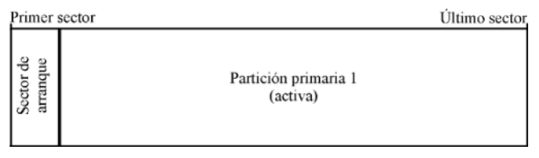

# UT04. WINDOWS 10. GESTIÓN DEL ALMACENAMIENTO

### Contenidos

1. Organización del almacenamiento
2. Configuración de discos en Windows
3. El sistema de ficheros NTFS
4. Carpetas compartidas

## 1.- ORGANIZACIÓN DEL ALMACENAMIENTO

En esta unidad de trabajo estudiaremos cómo se organizan los sistemas de almacenamiento en un ordenador, es decir, la forma en la que los sistemas operativos operan con los discos duros y los organizan para poder almacenar datos en ellos.

### 1.1.- ESTRUCTURA FÍSICA DE UN DISCO DURO

Físicamente, los discos duros magnéticos están compuestos por varios **discos** o **platos** apilados que giran todos simultáneamente. Normalmente estos discos están fabricados en aluminio o cristal y están recubiertos de un material ferromagnético que tiene la capacidad de ser alterado magnéticamente en dos polarizaciones diferentes.

Cada uno de los discos tiene su propio **cabezal de lectura/escritura** que se puede desplazar sobre el disco. Este cabezal puede leer la polarización de cada uno de los puntos del disco o bien de modificar dicha polarización en las operaciones de escritura.

La superficie de cada disco está dividida en una serie de **pistas concéntricas** donde se almacena la información. Dado que los discos tienen varios platos, el conjunto de pistas concéntricas de cada cara de cada plato que se encuentran en la misma posición se denomina **cilindro**.

Finalmente, las pistas se encuentran divididas en **sectores**. El sector es la unidad básica de almacenamiento de datos sobre los discos duros. El tamaño habitual de los sectores es de 512 bytes.

### 1.3.- ESTRUCTURA LÓGICA DE UN DISCO DURO

A nivel físico un disco duro simplemente almacena 0s y 1s, pero de alguna forma es necesario darle forma a esa secuencia de bits para que sean datos comprensibles por el ordenador. Por ejemplo, el ordenador tiene que saber que bits corresponden a una imagen o cuáles corresponden a un fichero de texto. Por lo tanto, es necesario crear una serie de estructuras de datos que permitan al ordenador saber qué bits que hay en el disco duro corresponden a un fichero o a otro. Esta forma de organizar el disco es lo que se llama la **estructura lógica del disco**.

En la estructura lógica podemos hablar de dos niveles: en un primer nivel están las **particiones de disco** y luego dentro de cada partición está el **sistema de ficheros**.

Crear **particiones** en un disco duro consiste en crear una serie de divisiones lógicas en un único disco duro físico de forma que el sistema operativo pueda gestionarlas de forma independiente. Esto quiere decir que el sistema operativo verá cada una de las particiones como si fuera un disco duro independiente.

Existen muchos **motivos** por los que podemos querer dividir un disco en varias particiones:

- Si queremos instalar varios sistemas operativos y solo tenemos un disco físico necesitamos una partición por cada sistema operativo.
- Aun cuando tenemos un único sistema operativo es buena práctica crear una partición para el sistema y otra para los datos. De esta forma si por algún motivo queremos reinstalar el sistema operativo no necesitamos preocuparnos por los datos, ya que están en una partición diferente.
  
El hecho de que hayamos creado una partición no quiere decir que el sistema operativo pueda acceder a ella ya que también necesita que el sistema de ficheros de dicha partición sea reconocible por el sistema.

#### 1.3.1.- PARTICIONAMIENTO

Cuando se realizan particiones en un disco duro es necesario almacenar en algún lugar de dicho disco el tamaño y ubicación de dichas particiones. Este lugar es la tabla de particiones y se encuentra ubicada en los primeros sectores del disco. 

Por lo tanto, en un disco duro se puede distinguir entre los siguientes elementos:

- La tabla de particiones
- Espacio particionado
- Espacio sin particionar.
- 
La **tabla de particiones** contiene información sobre las particiones que hay en el disco duro, más el código de arranque del sistema. Podemos encontrar dos tipos de tablas de particiones en los ordenadores actualmente:

- Master Boot Record (MBR)
- Tabla de particiones GUID (GPT) 

El **espacio particionado** es el espacio del disco que ha sido asignado a una partición mientras que el **espacio no particionado** es espacio que aún no ha sido asignado a ninguna partición. Hay que tener en cuenta que todo el espacio asignado a una partición tiene que ser contiguo en el disco.
En la siguiente imagen se puede ver un ejemplo de un disco duro físico en el que se han creado dos particiones: dos primarias y dos lógicas. Al final del disco queda espacio sin particionar por lo que ahí se podría crear otra partición.

 
El caso más sencillo consiste en un sector de arranque que contenga una tabla de particiones con una sola partición, y que esta partición ocupe la totalidad del espacio restante del disco. En este caso, no existiría espacio sin particionar. 

#### 1.3.2.- MASTER BOOT RECORD (MBR)

El primer sector de todo el disco (cabeza 0, cilindro 0 y sector 1) es el denominado **sector de arranque**. Al igual que todos los sectores, tiene un tamaño de 512 bytes y es ahí donde se guarda el **Master Boot Record**.

En el MBR se almacena la tabla de particiones, un código de identificación del disco duro y el programa que se encarga de inicializar el sistema operativo. Este programa es el encargado de mirar cuál es la **partición activa** en la tabla de particiones y cede el control al sector de arranque de esa partición.

El MBR tiene siempre la misma estructura:

- Los primeros 446 bytes del MBR contienen el **código de arranque** (boot loader). 
- A continuación, se encuentra la **tabla de particiones**. Esta tabla contiene 4 entradas cada una de las cuales ocupa 16 bytes. En estos 16 bytes se encuentra la siguiente información:
    - **Estado de la partición** (1 byte). El bit 7 de este byte indica si esta es la partición activa. El resto de los bits están a 0, cualquier otro valor es inválido.
    - **Primer sector de la partición** (3 bytes). Dirección del primer sector de la partición en formato CHS (Cilindro-Cabeza-Sector).
    - **Tipo de partición** (1 byte). Este byte almacena el sistema de ficheros con que se ha formateado la partición. Por ejemplo, el valor 07h corresponde a un sistema de ficheros NTFS.
    - **Último sector de la partición** (3 bytes). Dirección del último sector de la partición en formato CHS.
    - **Dirección LBA del primer sector de la partición** (4 bytes). LBA (Logical Block Addressing) es una alternativa al formato CHS que no se basa en los detalles físicos del disco. Es un método muy simple que se basa en numerar sucesivamente todos los sectores del disco duro.
    - **Longitud de la partición** (4 bytes). Almacena la longitud de la partición medida en sectores.
- Los últimos dos bytes del MBR están ocupados por la **firma de unidad arrancable** cuyo valor siempre es 55h AAh cuando el disco es arrancable.
 
Como se puede ver, el MBR únicamente tiene cuatro entradas en la tabla de particiones. Esto obliga a que haya tres tipos diferentes de particiones:

- Primarias
- Extendidas 
- Lógicas

Si creamos estas 4 particiones estamos hablando de las **particiones primarias**. Si hacemos esto habremos ocupado todo el espacio disponible en la tabla de particiones y por tanto ya no podremos crear más, incluso aunque aún nos quede espacio libre en el disco duro.

La alternativa a esta limitación de 4 particiones está en la creación de una **partición extendida**. Esta es una partición especial de la que únicamente se puede crear una y que ocupa un espacio en la tabla de particiones (y por tanto limitaría el número de particiones primarias a 3). A esta partición no se le puede aplicar formato (luego no puede contener datos) sino que sirve para contener particiones.

Las particiones que se pueden crear dentro de la partición extendida son las **particiones lógicas**. Estas particiones no ocupan espacio en la tabla de particiones del primer sector del disco ya que la partición extendida tiene su propia tabla de particiones. Además, esta tabla de particiones no tiene la limitación de tener que caber en un sector por lo que el número de particiones lógicas que podemos crear aumenta hasta 128.

#### 1.3.3.- TABLA DE PARTICIONES GUID (GPT)

La tabla de particiones **GUID (GPT)** es parte del estándar **Extensible Firmware Interface (EFI)** cuyo objetivo es reemplazar las antiguas BIOS del PC. El objetivo de GPT es superar las limitaciones del MBR.

GPT se caracteriza porque a cada partición se le asocia un único identificador global (GUID). Además, GPT no tiene ningún límite en cuanto a número de particiones más allá de los límites establecidos por cada sistema operativo. Por ejemplo, Windows tiene un límite de 128 particiones.

La fiabilidad de los discos GPT es mucho mayor que la de MBR ya que GPT crea varias copias redundantes de la tabla de particiones a lo largo de todo el disco, de forma que si hay cualquier fallo en la tabla de particiones se puede recuperar su valor de alguna de esas copias.

En cuanto a compatibilidad, todas las versiones de Windows de 64 bits pueden arrancar desde discos GPT mientras que las versiones de 32 bits pueden leer y escribir en ellos, pero no arrancar desde estos discos.

### 1.4.- GESTORES DE ARRANQUE

Cuando en el sistema tenemos un único sistema operativo instalado, por ejemplo, Windows, el proceso de arranque es totalmente transparente para el usuario. Simplemente vemos una serie de pantallas que se van sucediendo hasta que tenemos delante el escritorio del sistema operativo.

Sin embargo, cuando tenemos más de un sistema operativo instalado en nuestro ordenador el proceso cambia ya que solo podemos tener una partición marcada como activa y por tanto únicamente podríamos arrancar un sistema operativo.

Para solucionar este problema necesitamos un programa especial denominado gestor de arranque que nos permitirá elegir cuál de los sistemas operativos que tenemos instalados queremos ejecutar.
Para ello el gestor de arranque reemplaza el código de arranque que se encuentra en el MBR por un programa que nos mostrará un menú donde seleccionaremos el sistema operativo deseado.  Hay muchos gestores de arranque disponibles, algunos de los más comunes son:

- Windows Boot Manager (BOOTMGR): es el gestor de arranque de Windows y únicamente permite elegir entre diferentes sistemas Windows.
- GAG (Graphical Boot Manager): este sencillo gestor de arranque nos muestra un menú gráfico para elegir el sistema operativo. Se instala completamente en el MBR al contrario que otros gestores que almacenan parte de su código fuera del MBR.
- GRUB (GNU Grand Unified Loader): es el gestor de arranque utilizado por la mayoría de los sistemas Linux y funciona perfectamente tanto para sistemas operativos Windows como Linux. Al contrario que GAG parte del código se almacena dentro de la partición `/boot`.

### 1.5.- SISTEMAS DE ARCHIVO

Cada partición puede contener un sistema de archivos diferente.

Un sistema de archivos:

- Establece los mecanismos para acceder a los datos que contiene
- Permite o no el acceso a dichos datos en determinadas circunstancias.
- En caso de alguna inconsistencia posibilita medios para su restauración.

#### 1.5.1.- DIFERENTES SISTEMAS DE FICHEROS

Existen diferentes sistemas de archivos y cada sistema operativo soporta diferentes sistemas de archivos, algunos de ellos son los siguientes:

- **Ext2**: El primer sistema de archivos diseñado expresamente para Linux.
- **Ext3**: Versión mejorada de Ext2, ampliamente utilizada en distribuciones Linux
- **Ext4**: Nuevo sistema de ficheros para Linux evolucionado de Ext3 algunas de sus ventajas con respecto a este último son:
    - Aumento del tamaño del sistema de ficheros a 1 Exabyte = 220 Terabyte y del tamaño máximo por archivo (16 Tb).
    - Número ilimitado de directorios frente a los 32.000 de Ext3
    - Mayor velocidad en la creación y borrado de ficheros
- **XFS**: Implementado para sistemas Unix, rápido acceso para grandes cantidades de datos y altas velocidades, pero lento en ficheros pequeños. Se utiliza en grandes servidores y donde se maneje mucha información.
- **ReiserFS**: Sistema de archivos diseñado e implementado por la empresa Namesys, liderado por Hans Reiser. Es soportado por Linux y otros sistemas operativos (algunos a través de implementaciones muy inestables).
- **Fat16/Fat32**: Sistemas DOS/Windows 95, Windows 98, este sistema de archivos produce una gran fragmentación del disco.
- **NTFS**: Sistema de archivos implementado para los sistemas operativos Windows Xp/2000/2003 server, Vista y 7.
- **ReFS (Resilient File System)**: Este sistema es propietario de Microsoft y fue introducido en Windows Server 2012. Entre sus características se incluyen mecanismos para la protección de los datos y además aumenta el tamaño de discos que soporta hasta 1 Yotabyte, con un tamaño de fichero máximo de 16 Exabytes.
  
A la acción de crear un sistema de ficheros dentro de una partición se le llama también **formatear** la partición.

#### 1.5.2.- FILE ALLOCATION TABLE (FAT)

Para comprender mejor cómo funcionan los sistemas de ficheros vamos a ver en detalle el funcionamiento de uno de los más sencillos, el sistema de ficheros FAT.  Este sistema apareció en el año 1980 y aún es utilizado en dispositivos de almacenamiento de pequeño tamaño.

El sistema de archivos FAT se compone de 4 secciones:

- El **sector de arranque** o **MBR**, es el primer sector del disco como ya hemos visto.
- La región **FAT**, contiene dos copias de la tabla de asignación de archivos por seguridad. Estas tablas contienen información sobre los clústeres ocupados por los archivos.
- La región del **directorio raíz**, que es el índice principal de archivos y carpetas.
- La región de **datos**, que es donde se almacenan ya los archivos y carpetas.

Los **clústeres** son los bloques en que se divide la partición. Mientras que el sector es la unidad mínima con la que trabaja el disco duro, el clúster es la unidad mínima con la que trabaja el sistema operativo.

El tamaño de clúster se puede elegir al formatear la partición y los tamaños a elegir dependen de la variante de FAT utilizada, variando entre 2 y 32 KB. Cada archivo ocupa uno o más clústeres en función de su tamaño, de manera que un archivo queda representado por una cadena secuencial de clústeres, que no tienen por qué ser adyacentes. Esta es la causa del problema de la **fragmentación**.

La tabla de asignación de archivos consta de una lista de entradas, cada una con información sobre un clúster. Esta información puede ser:

- Indicador de que el bloque correspondiente está libre (FREE)
- Indicador de que el bloque correspondiente es defectuoso (BAD)
- Un número indicando el siguiente bloque del archivo
- Indicador de que es el último bloque del archivo (EOF)

La región del directorio raíz contiene un listado de nombres de fichero y directorios que se encuentran en el directorio raíz, junto con el número del primer clúster del fichero, así como información relativa al fichero (atributos, fecha y hora de creación, tamaño, ...).

Hay diferentes versiones de FAT:

- **FAT12**: cada entrada de la tabla de asignación tiene 12 bits, lo que limita el número de bloques a 212.
- **FAT16**: cada entrada en la tabla de asignación tiene 16 bits. Además, aumenta el tamaño de bloque hasta los 32KB, por lo que permite discos de hasta 2 GB. El problema es que el gran tamaño de bloque produce una gran fragmentación interna (cualquier fichero, por pequeño que sea, ocupará por lo menos 32KB).
- **FAT32**: cada entrada tiene 32 bits. Tiene un límite de tamaño de archivo de 4GB y de partición de 8TB.
- **exFAT**: apareció con Windows Vista y aumenta el tamaño de archivo hasta los 16 exabytes.

#### 1.5.3.- EL SISTEMA DE FICHEROS NTFS

##### 1.5.3.1.- CARACTERÍSTICAS DE NTFS

NTFS es el sistema de ficheros que fue implantado por primera vez en el sistema Windows NT 3.1 e incluía un gran número de mejores respecto a FAT. Entre estas mejoras destacan:

- **Recuperación**: una de las características más importantes de NTFS es su capacidad para recuperarse ante los errores en el sistema y los fallos de disco. En el caso de dichos fallos, NTFS es capaz de reconstruir volúmenes de disco y devolverlos a un estado consistente. Para ello, utiliza un sistema por el que cada cambio en el sistema de archivos (por ejemplo, la escritura de un fichero) se realiza como una acción atómica, lo que implica que o se realiza de forma completa o no se realiza en absoluto. Estas operaciones, con posibilidad de recuperación, se denominan transacciones y se dice que un sistema de ficheros que los implementa es **transaccional**.
Además, NTFS utiliza almacenamiento redundante para los datos críticos del sistema de archivos, como puede ser la tabla de localización de ficheros.
- **Seguridad**: NTFS asocia a cada elemento del sistema de ficheros (directorios y archivos) una lista de control de acceso (ACL), que determina quienes pueden acceder a dicho fichero y con qué permisos.
- **Discos y archivos grandes**: NTFS permite archivos y volúmenes más grandes que FAT, permitiendo archivos de hasta 16 TiB y volúmenes de hasta 256 TiB.

##### 1.5.3.2.- VOLÚMENES NTFS Y ESTRUCTURA DE ARCHIVOS

NTFS hace uso de los siguientes conceptos de almacenamiento de disco:

- Sector: la unidad física de almacenamiento más pequeña del disco, normalmente de un tamaño de 512 bytes.
- Clúster: uno o más sectores contiguos. El tamaño del clúster en sectores siempre es un múltiplo de 2.
- Volumen: una partición lógica de un disco, formada por un conjunto de clústeres y utilizada por el sistema de archivos para asignar espacio. Un volumen está formado por: 
  
    - La información del sistema de archivos
    - Una colección de archivos
    - Un espacio restante que se puede asignar a los archivos.

El clúster es la unidad fundamental de asignación en NTFS, que no trabaja con sectores. El tamaño máximo de clúster es entre 1 y 128 sectores.

##### 1.5.3.3.- ESTRUCTURA DE UN VOLUMEN NTFS

Cada elemento de un volumen NTFS es un archivo, y cada archivo está formado por una colección de atributos. Incluso el contenido del archivo se trata como un atributo.

La estructura de un volumen NTFS es:

Los diferentes elementos son:
•	Sector de arranque de la partición (aunque se llame sector, puede estar formado por un máximo de 16 sectores): contiene información sobre la estructura del volumen, las estructuras del sistema de archivos y la información de arranque de inicio y el código.
•	Tabla maestra de archivos (Master File Table, MFT): contiene información sobre todos los archivos y carpetas (directorios) del volumen NTFS, y la información sobre el espacio disponible no asignado. En esencia, la MFT es una lista de todos los contenidos de este volumen, organizada como un conjunto de filas en una estructura de base de datos relacional.
•	Archivos del sistema (suele tener 1MB de longitud): entre los archivos de esta región se encuentran los siguientes:
o	MFT2: un espejo de las tres primeras filas del MFT, utilizado para garantizar el acceso a la MFT en caso de fallo de un único sector.
o	Archivo registro: una lista de pasos de transacciones utilizadas para la recuperación en NTFS.
o	Mapa de bits de los clústeres: una representación del volumen, mostrando que clústeres están ocupados.
o	Tabla de definición de atributos: define los tipos de atributos soportados en este volumen.
1.5.3.4.- TABLA MAESTRA DE ARCHIVOS
El corazón del sistema de archivos NTFS es la MFT. La MFT se organiza como una tabla de registros de longitud variable (entre 1 y 4 KB). Cada registro describe un archivo o una carpeta de un volumen, incluyendo la propia MFT, que se trata como un archivo.
Si un archivo es suficientemente pequeño, se localiza completamente en una fila de la MFT. En otro caso, el registro para dicho archivo contiene información parcial y el resto del archivo se encuentra en otros clústeres del volumen.
 
Cada registro de la MFT está formado por un conjunto de atributos que sirve para definir las características del archivo y sus contenidos.
Algunos ejemplos de atributos son:
•	Información estándar: permisos, fechas de creación y modificación, …
•	Nombre de archivo o carpeta
•	Descriptor de seguridad: propietario de archivo y quien puede acceder
•	Datos: contenido del archivo

