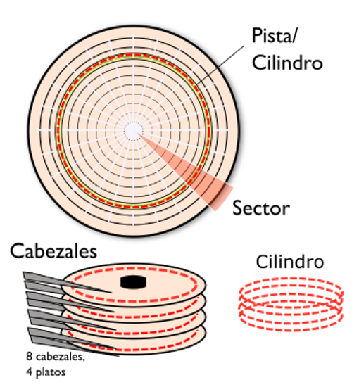
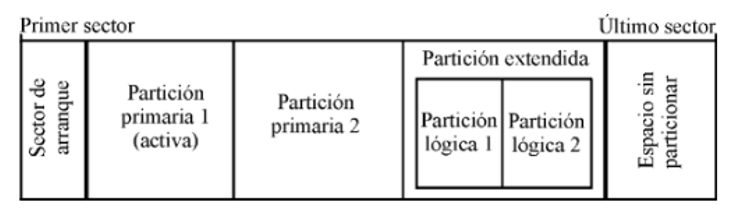

## Contenidos

1. [**Organización del almacenamiento**](01_organización.md)
2. [Sistemas de archivos](02_sistemas_archivos.md)
3. [Configuración de discos en Windows](03_configuración_discos.md)
4. [El sistema de ficheros NTFS](04_ntfs.md)
5. [Carpetas compartidas](05_compartidas.md)

# 1.- ORGANIZACIÓN DEL ALMACENAMIENTO

En esta unidad de trabajo estudiaremos cómo se organizan los sistemas de almacenamiento en un ordenador, es decir, la forma en la que los sistemas operativos operan con los discos duros y los organizan para poder almacenar datos en ellos.

## 1.1.- Estructura física de un disco duro

Físicamente, los discos duros magnéticos están compuestos por varios **discos** o **platos** apilados que giran todos simultáneamente. Normalmente estos discos están fabricados en aluminio o cristal y están recubiertos de un material ferromagnético que tiene la capacidad de ser alterado magnéticamente en dos polarizaciones diferentes.

Cada uno de los discos tiene su propio **cabezal de lectura/escritura** que se puede desplazar sobre el disco. Este cabezal puede leer la polarización de cada uno de los puntos del disco o bien de modificar dicha polarización en las operaciones de escritura.

La superficie de cada disco está dividida en una serie de **pistas concéntricas** donde se almacena la información. Dado que los discos tienen varios platos, el conjunto de pistas concéntricas de cada cara de cada plato que se encuentran en la misma posición se denomina **cilindro**.

Finalmente, las pistas se encuentran divididas en **sectores**. El sector es la unidad básica de almacenamiento de datos sobre los discos duros. El tamaño habitual de los sectores es de 512 bytes.

## 1.2.- Estructura lógica de un disco duro

A nivel físico un disco duro simplemente almacena 0s y 1s, pero de alguna forma es necesario darle forma a esa secuencia de bits para que sean datos comprensibles por el ordenador. Por ejemplo, el ordenador tiene que saber que bits corresponden a una imagen o cuáles corresponden a un fichero de texto. Por lo tanto, es necesario crear una serie de estructuras de datos que permitan al ordenador saber qué bits que hay en el disco duro corresponden a un fichero o a otro. Esta forma de organizar el disco es lo que se llama la **estructura lógica del disco**.

En la estructura lógica podemos hablar de dos niveles: en un primer nivel están las **particiones de disco** y luego dentro de cada partición está el **sistema de ficheros**.

Crear **particiones** en un disco duro consiste en crear una serie de divisiones lógicas en un único disco duro físico de forma que el sistema operativo pueda gestionarlas de forma independiente. Esto quiere decir que el sistema operativo verá cada una de las particiones como si fuera un disco duro independiente.

Existen muchos **motivos** por los que podemos querer dividir un disco en varias particiones:

- Si queremos instalar varios sistemas operativos y solo tenemos un disco físico necesitamos una partición por cada sistema operativo.
- Aun cuando tenemos un único sistema operativo es buena práctica crear una partición para el sistema y otra para los datos. De esta forma si por algún motivo queremos reinstalar el sistema operativo no necesitamos preocuparnos por los datos, ya que están en una partición diferente.
  
El hecho de que hayamos creado una partición no quiere decir que el sistema operativo pueda acceder a ella ya que también necesita que el sistema de ficheros de dicha partición sea reconocible por el sistema.

### 1.2.1.- Particionamiento

Cuando se realizan particiones en un disco duro es necesario almacenar en algún lugar de dicho disco el tamaño y ubicación de dichas particiones. Este lugar es la tabla de particiones y se encuentra ubicada en los primeros sectores del disco. 

Por lo tanto, en un disco duro se puede distinguir entre los siguientes elementos:

- La tabla de particiones
- Espacio particionado
- Espacio sin particionar.
- 
La **tabla de particiones** contiene información sobre las particiones que hay en el disco duro, más el código de arranque del sistema. Podemos encontrar dos tipos de tablas de particiones en los ordenadores actualmente:

- Master Boot Record (MBR)
- Tabla de particiones GUID (GPT) 

El **espacio particionado** es el espacio del disco que ha sido asignado a una partición mientras que el **espacio no particionado** es espacio que aún no ha sido asignado a ninguna partición. Hay que tener en cuenta que todo el espacio asignado a una partición tiene que ser contiguo en el disco.
En la siguiente imagen se puede ver un ejemplo de un disco duro físico en el que se han creado dos particiones: dos primarias y dos lógicas. Al final del disco queda espacio sin particionar por lo que ahí se podría crear otra partición.

 

### 1.2.2.- Master Boot Record (MBR)

El primer sector de todo el disco (cabeza 0, cilindro 0 y sector 1) es el denominado **sector de arranque**. Al igual que todos los sectores, tiene un tamaño de 512 bytes y es ahí donde se guarda el **Master Boot Record**.

En el MBR se almacena la tabla de particiones, un código de identificación del disco duro y el programa que se encarga de inicializar el sistema operativo. Este programa es el encargado de mirar cuál es la **partición activa** en la tabla de particiones y cede el control al sector de arranque de esa partición.

El MBR tiene siempre la misma estructura:

- Los primeros 446 bytes del MBR contienen el **código de arranque** (boot loader). 
- A continuación, se encuentra la **tabla de particiones**. Esta tabla contiene 4 entradas cada una de las cuales ocupa 16 bytes. En estos 16 bytes se encuentra la siguiente información:
    - **Estado de la partición** (1 byte). El bit 7 de este byte indica si esta es la partición activa. El resto de los bits están a 0, cualquier otro valor es inválido.
    - **Primer sector de la partición** (3 bytes). Dirección del primer sector de la partición en formato CHS (Cilindro-Cabeza-Sector).
    - **Tipo de partición** (1 byte). Este byte almacena el sistema de ficheros con que se ha formateado la partición. Por ejemplo, el valor 07h corresponde a un sistema de ficheros NTFS.
    - **Último sector de la partición** (3 bytes). Dirección del último sector de la partición en formato CHS.
    - **Dirección LBA del primer sector de la partición** (4 bytes). LBA (Logical Block Addressing) es una alternativa al formato CHS que no se basa en los detalles físicos del disco. Es un método muy simple que se basa en numerar sucesivamente todos los sectores del disco duro.
    - **Longitud de la partición** (4 bytes). Almacena la longitud de la partición medida en sectores.
- Los últimos dos bytes del MBR están ocupados por la **firma de unidad arrancable** cuyo valor siempre es 55h AAh cuando el disco es arrancable.
 
Como se puede ver, el MBR únicamente tiene cuatro entradas en la tabla de particiones. Esto obliga a que haya tres tipos diferentes de particiones:

- Primarias
- Extendidas 
- Lógicas

Si creamos estas 4 particiones estamos hablando de las **particiones primarias**. Si hacemos esto habremos ocupado todo el espacio disponible en la tabla de particiones y por tanto ya no podremos crear más, incluso aunque aún nos quede espacio libre en el disco duro.

La alternativa a esta limitación de 4 particiones está en la creación de una **partición extendida**. Esta es una partición especial de la que únicamente se puede crear una y que ocupa un espacio en la tabla de particiones (y por tanto limitaría el número de particiones primarias a 3). A esta partición no se le puede aplicar formato (luego no puede contener datos) sino que sirve para contener particiones.

Las particiones que se pueden crear dentro de la partición extendida son las **particiones lógicas**. Estas particiones no ocupan espacio en la tabla de particiones del primer sector del disco ya que la partición extendida tiene su propia tabla de particiones. Además, esta tabla de particiones no tiene la limitación de tener que caber en un sector por lo que el número de particiones lógicas que podemos crear aumenta hasta 128.

### 1.2.3.- Tabla de particiones GUID (GPT)

La tabla de particiones **GUID (GPT)** es parte del estándar **Extensible Firmware Interface (EFI)** cuyo objetivo es reemplazar las antiguas BIOS del PC. El objetivo de GPT es superar las limitaciones del MBR.

GPT se caracteriza porque a cada partición se le asocia un único identificador global (GUID). Además, GPT no tiene ningún límite en cuanto a número de particiones más allá de los límites establecidos por cada sistema operativo. Por ejemplo, Windows tiene un límite de 128 particiones.

La fiabilidad de los discos GPT es mucho mayor que la de MBR ya que GPT crea varias copias redundantes de la tabla de particiones a lo largo de todo el disco, de forma que si hay cualquier fallo en la tabla de particiones se puede recuperar su valor de alguna de esas copias.

En cuanto a compatibilidad, todas las versiones de Windows de 64 bits pueden arrancar desde discos GPT mientras que las versiones de 32 bits pueden leer y escribir en ellos, pero no arrancar desde estos discos.

## 1.3.- Gestores de arranque

Cuando en el sistema tenemos un único sistema operativo instalado, por ejemplo, Windows, el proceso de arranque es totalmente transparente para el usuario. Simplemente vemos una serie de pantallas que se van sucediendo hasta que tenemos delante el escritorio del sistema operativo.

Sin embargo, cuando tenemos más de un sistema operativo instalado en nuestro ordenador el proceso cambia ya que solo podemos tener una partición marcada como activa y por tanto únicamente podríamos arrancar un sistema operativo.

Para solucionar este problema necesitamos un programa especial denominado gestor de arranque que nos permitirá elegir cuál de los sistemas operativos que tenemos instalados queremos ejecutar.
Para ello el gestor de arranque reemplaza el código de arranque que se encuentra en el MBR por un programa que nos mostrará un menú donde seleccionaremos el sistema operativo deseado.  Hay muchos gestores de arranque disponibles, algunos de los más comunes son:

- Windows Boot Manager (BOOTMGR): es el gestor de arranque de Windows y únicamente permite elegir entre diferentes sistemas Windows.
- GAG (Graphical Boot Manager): este sencillo gestor de arranque nos muestra un menú gráfico para elegir el sistema operativo. Se instala completamente en el MBR al contrario que otros gestores que almacenan parte de su código fuera del MBR.
- GRUB (GNU Grand Unified Loader): es el gestor de arranque utilizado por la mayoría de los sistemas Linux y funciona perfectamente tanto para sistemas operativos Windows como Linux. Al contrario que GAG parte del código se almacena dentro de la partición `/boot`.

***
[Volver al índice principal](index_UT04.md)