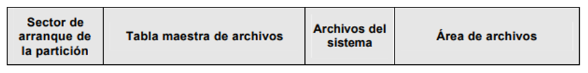

# UT04. WINDOWS 10. GESTIÓN DEL ALMACENAMIENTO

### Contenidos

1. [Organización del almacenamiento](01_organización.md)
2. [**Sistemas de archivos**](02_sistemas_archivos.md)
3. [Configuración de discos en Windows](03_configuración_discos.md)
4. [El sistema de ficheros NTFS](04_ntfs.md)
5. [Carpetas compartidas](05_compartidas.md)

## 2.- SISTEMAS DE ARCHIVOS

Cada partición puede contener un sistema de archivos diferente.

Un sistema de archivos:

- Establece los mecanismos para acceder a los datos que contiene
- Permite o no el acceso a dichos datos en determinadas circunstancias.
- En caso de alguna inconsistencia posibilita medios para su restauración.

### 2.1.- Sistemas de archivos

Existen diferentes sistemas de archivos y cada sistema operativo soporta diferentes sistemas de archivos, algunos de ellos son los siguientes:

- **Ext2**: El primer sistema de archivos diseñado expresamente para Linux.
- **Ext3**: Versión mejorada de Ext2, ampliamente utilizada en distribuciones Linux
- **Ext4**: Nuevo sistema de ficheros para Linux evolucionado de Ext3 algunas de sus ventajas con respecto a este último son:
    - Aumento del tamaño del sistema de ficheros a 1 Exabyte = 220 Terabyte y del tamaño máximo por archivo (16 Tb).
    - Número ilimitado de directorios frente a los 32.000 de Ext3
    - Mayor velocidad en la creación y borrado de ficheros
- **XFS**: Implementado para sistemas Unix, rápido acceso para grandes cantidades de datos y altas velocidades, pero lento en ficheros pequeños. Se utiliza en grandes servidores y donde se maneje mucha información.
- **ReiserFS**: Sistema de archivos diseñado e implementado por la empresa Namesys, liderado por Hans Reiser. Es soportado por Linux y otros sistemas operativos (algunos a través de implementaciones muy inestables).
- **Fat16/Fat32**: Sistemas DOS/Windows 95, Windows 98, este sistema de archivos produce una gran fragmentación del disco.
- **NTFS**: Sistema de archivos implementado para los sistemas operativos Windows Xp/2000/2003 server, Vista y 7.
- **ReFS (Resilient File System)**: Este sistema es propietario de Microsoft y fue introducido en Windows Server 2012. Entre sus características se incluyen mecanismos para la protección de los datos y además aumenta el tamaño de discos que soporta hasta 1 Yotabyte, con un tamaño de fichero máximo de 16 Exabytes.
  
A la acción de crear un sistema de ficheros dentro de una partición se le llama también **formatear** la partición.

### 2.2.- El sistema de archivos FAT (File Allocation Table)

Para comprender mejor cómo funcionan los sistemas de ficheros vamos a ver en detalle el funcionamiento de uno de los más sencillos, el sistema de ficheros FAT.  Este sistema apareció en el año 1980 y aún es utilizado en dispositivos de almacenamiento de pequeño tamaño.

El sistema de archivos FAT se compone de 4 secciones:

- El **sector de arranque** o **MBR**, es el primer sector del disco como ya hemos visto.
- La región **FAT**, contiene dos copias de la tabla de asignación de archivos por seguridad. Estas tablas contienen información sobre los clústeres ocupados por los archivos.
- La región del **directorio raíz**, que es el índice principal de archivos y carpetas.
- La región de **datos**, que es donde se almacenan ya los archivos y carpetas.

Los **clústeres** son los bloques en que se divide la partición. Mientras que el sector es la unidad mínima con la que trabaja el disco duro, el clúster es la unidad mínima con la que trabaja el sistema operativo.

El tamaño de clúster se puede elegir al formatear la partición y los tamaños a elegir dependen de la variante de FAT utilizada, variando entre 2 y 32 KB. Cada archivo ocupa uno o más clústeres en función de su tamaño, de manera que un archivo queda representado por una cadena secuencial de clústeres, que no tienen por qué ser adyacentes. Esta es la causa del problema de la **fragmentación**.

La tabla de asignación de archivos consta de una lista de entradas, cada una con información sobre un clúster. Esta información puede ser:

- Indicador de que el bloque correspondiente está libre (FREE)
- Indicador de que el bloque correspondiente es defectuoso (BAD)
- Un número indicando el siguiente bloque del archivo
- Indicador de que es el último bloque del archivo (EOF)

La región del directorio raíz contiene un listado de nombres de fichero y directorios que se encuentran en el directorio raíz, junto con el número del primer clúster del fichero, así como información relativa al fichero (atributos, fecha y hora de creación, tamaño, ...).

Hay diferentes versiones de FAT:

- **FAT12**: cada entrada de la tabla de asignación tiene 12 bits, lo que limita el número de bloques a 212.
- **FAT16**: cada entrada en la tabla de asignación tiene 16 bits. Además, aumenta el tamaño de bloque hasta los 32KB, por lo que permite discos de hasta 2 GB. El problema es que el gran tamaño de bloque produce una gran fragmentación interna (cualquier fichero, por pequeño que sea, ocupará por lo menos 32KB).
- **FAT32**: cada entrada tiene 32 bits. Tiene un límite de tamaño de archivo de 4GB y de partición de 8TB.
- **exFAT**: apareció con Windows Vista y aumenta el tamaño de archivo hasta los 16 exabytes.

### 2.3.- El sistema de archivos NTFS

#### 2.3.1.- Características de NTFS

NTFS es el sistema de ficheros que fue implantado por primera vez en el sistema Windows NT 3.1 e incluía un gran número de mejores respecto a FAT. Entre estas mejoras destacan:

- **Recuperación**: una de las características más importantes de NTFS es su capacidad para recuperarse ante los errores en el sistema y los fallos de disco. En el caso de dichos fallos, NTFS es capaz de reconstruir volúmenes de disco y devolverlos a un estado consistente. Para ello, utiliza un sistema por el que cada cambio en el sistema de archivos (por ejemplo, la escritura de un fichero) se realiza como una acción atómica, lo que implica que o se realiza de forma completa o no se realiza en absoluto. Estas operaciones, con posibilidad de recuperación, se denominan transacciones y se dice que un sistema de ficheros que los implementa es **transaccional**.
Además, NTFS utiliza almacenamiento redundante para los datos críticos del sistema de archivos, como puede ser la tabla de localización de ficheros.
- **Seguridad**: NTFS asocia a cada elemento del sistema de ficheros (directorios y archivos) una lista de control de acceso (ACL), que determina quienes pueden acceder a dicho fichero y con qué permisos.
- **Discos y archivos grandes**: NTFS permite archivos y volúmenes más grandes que FAT, permitiendo archivos de hasta 16 TiB y volúmenes de hasta 256 TiB.

#### 2.3.2.- Volúmenes NTFS y estructura de archivos

NTFS hace uso de los siguientes conceptos de almacenamiento de disco:

- Sector: la unidad física de almacenamiento más pequeña del disco, normalmente de un tamaño de 512 bytes.
- Clúster: uno o más sectores contiguos. El tamaño del clúster en sectores siempre es un múltiplo de 2.
- Volumen: una partición lógica de un disco, formada por un conjunto de clústeres y utilizada por el sistema de archivos para asignar espacio. Un volumen está formado por: 
  
    - La información del sistema de archivos
    - Una colección de archivos
    - Un espacio restante que se puede asignar a los archivos.

El clúster es la unidad fundamental de asignación en NTFS, que no trabaja con sectores. El tamaño máximo de clúster es entre 1 y 128 sectores.

#### 2.3.3.- Estructura de un volumen NTFS

Cada elemento de un volumen NTFS es un archivo, y cada archivo está formado por una colección de atributos. Incluso el contenido del archivo se trata como un atributo.

La estructura de un volumen NTFS es:

Los diferentes elementos son:

- **Sector de arranque de la partición** (aunque se llame sector, puede estar formado por un máximo de 16 sectores): contiene información sobre la estructura del volumen, las estructuras del sistema de archivos y la información de arranque de inicio y el código.
- **Tabla maestra de archivos (Master File Table, MFT)**: contiene información sobre todos los archivos y carpetas (directorios) del volumen NTFS, y la información sobre el espacio disponible no asignado. En esencia, la MFT es una lista de todos los contenidos de este volumen, organizada como un conjunto de filas en una estructura de base de datos relacional.
- **Archivos del sistema** (suele tener 1MB de longitud): entre los archivos de esta región se encuentran los siguientes:
    - **MFT2**: un espejo de las tres primeras filas del MFT, utilizado para garantizar el acceso a la MFT en caso de fallo de un único sector.
    - **Archivo registro**: una lista de pasos de transacciones utilizadas para la recuperación en NTFS.
    - **Mapa de bits de los clústeres**: una representación del volumen, mostrando que clústeres están ocupados.
    - **Tabla de definición de atributos**: define los tipos de atributos soportados en este volumen.

#### 2.3.4.- TABLA MAESTRA DE ARCHIVOS

El corazón del sistema de archivos NTFS es la **MFT**. La MFT se organiza como una tabla de registros de longitud variable (entre 1 y 4 KB). Cada registro describe un archivo o una carpeta de un volumen, incluyendo la propia MFT, que se trata como un archivo.

Si un archivo es suficientemente pequeño, se localiza completamente en una fila de la MFT. En otro caso, el registro para dicho archivo contiene información parcial y el resto del archivo se encuentra en otros clústeres del volumen.
 
Cada registro de la MFT está formado por un conjunto de atributos que sirve para definir las características del archivo y sus contenidos. Algunos ejemplos de atributos son:

- Información estándar: permisos, fechas de creación y modificación, …
- Nombre de archivo o carpeta
- Descriptor de seguridad: propietario de archivo y quien puede acceder
- Datos: contenido del archivo

***
[Volver al índice principal](index_UT04.md)