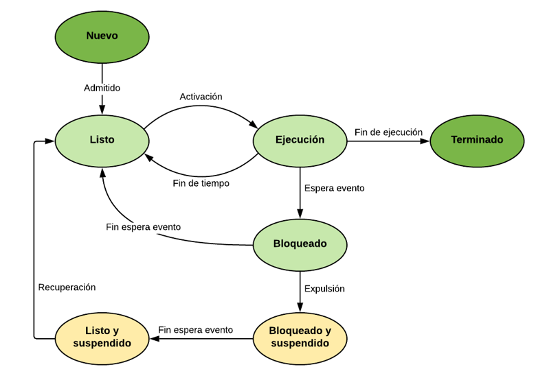

<link rel="stylesheet" href="../styles.css">

## Contenidos

1. El administrador de tareas]
2. Gestión de procesos
3. Servicios
4. El monitor de recursos
5. El visor de eventos
6. Gestión de energía
7. Directivas de grupo local
8. Programador de tareas

# 1.- GESTIÓN DE PROCESOS

La gestión de procesos es una de las tareas más importantes del sistema operativo, ya que, a fin de cuentas, todo lo que ocurre en un ordenador son procesos y el fin último de un ordenador es precisamente ejecutar procesos.
Por ello es importante comprender todo lo relativo a los procesos ya que nos ayudará a administrar con más eficiencia un nuestro sistema.

## 1.1.- Definición de proceso

Un **proceso** se puede definir como un **programa en ejecución**. Un programa es algo estático, simplemente una secuencia de instrucciones que indican qué tiene que hacer el ordenador para cumplir el cometido de dicho programa. Sin embargo, cuando el usuario decide ejecutar el programa se crea un proceso a partir de dicho programa.

Al contrario que el programa, un proceso es algo **dinámico** que evoluciona con el tiempo e implica una serie de pasos y operaciones. Algunos de estos eventos que tienen lugar en el sistema al ejecutar un programa son:

- Las instrucciones del programa son cargadas en la memoria principal. Asimismo, se reservará espacio en la memoria para los datos con los que trabajará el proceso.
- El sistema operativo crea una serie de estructuras de datos para llevar un seguimiento del proceso. Esta estructura se denomina **Bloque de Control de Proceso (BCP)** e incluye información como:
    - Identificador del proceso
    - Direcciones de memoria utilizadas por el proceso
    - Prioridad del proceso
    - Recursos utilizados
    - Permisos del proceso
    - Etcétera
- La información del proceso es cargada en los registros del procesador de forma que éste pueda saber cuál es la siguiente instrucción que debe ser ejecutada.

## 1.2.- Ciclo de vida de un proceso

Todos los procesos tienen un **ciclo de vida** en el que pasan por una serie de estados. En este ciclo de vida hay dos momentos relevantes por los que todos los procesos han de pasar, que son su **creación** y su **finalización**.

Hay cuatro sucesos principales que pueden causar la creación de un proceso:

- **Inicialización del sistema**: Cuando arrancamos el ordenador, el boot loader almacenado en el MBR se encarga de ejecutar el cargador del sistema operativo. Este programa se encargará de lanzar todos los procesos propios del sistema operativo, los cuales pueden ser de dos tipos:
    - En **primer plano**, procesos que interactúan con el usuario por lo que también se les denomina interactivos.
    - En **segundo plano**, procesos que realizar una tarea sin necesidad de mostrarle una interfaz al usuario. A estos procesos se les denomina servicios.
- **Ejecución de una llamada al sistema para crear procesos por un programa en ejecución**: Un proceso puede emitir llamadas al sistema para crear otros procesos que le ayuden en su labor.
- **Solicitud de un usuario para crear un proceso**: Un usuario puede crear un proceso desde la línea de comandos o a través el entorno de ventanas.
- **Como parte de un trabajo por lotes**: Se da en los sistemas por lotes de los mainframes grandes. Un trabajo por lotes es un conjunto de tareas que el sistema ejecuta cuando decide que tiene los recursos suficientes para ejecutarlo.

De forma análoga, los procesos también llegan a un momento en que deben **finalizar**, pudiendo ser por uno de los siguientes motivos:

- **Terminación normal**: Una vez que el proceso ha finalizado las tareas que tenía que realizar se lo comunicará al sistema operativo para que lo elimine de memoria, así como sus estructuras de datos asociadas.
- **Terminación por error**: Puede ser que los parámetros introducidos por el usuario no sean correctos, por lo que el proceso finalizará su ejecución. 
- **Error fatal**: Este motivo es producido por un error causado por el proceso, a menudo debido a un defecto o fallo en el programa, como hacer referencia a una posición de memoria no permitida o realizar una división entre cero.
- **Terminado por otro proceso**: En este caso otro proceso (que tiene los permisos necesarios) pide al sistema operativo que termine con el proceso. Un ejemplo es el uso del comando `Stop-Process` de Powershell.
 
Entre la creación y la destrucción de un proceso, pasará por diferentes estados entre los que irá cambiando como respuesta a determinados eventos, que pueden tener orígenes muy variados: parte de la ejecución del propio proceso, interacción con el usuario, eventos producidos por el sistema operativo, …

Los **estados** que puede tener un proceso son:
- **En ejecución**: el proceso se está ejecutando en ese momento en el procesador. En cada instante, solo puede haber un proceso en ejecución en el procesador.
- **Bloqueado**: durante su ejecución, los procesos realizarán operaciones, pero tarde o temprano deberán realizar una operación de entrada y salida. Por ejemplo, leer un dato del disco o esperar la pulsación de una tecla por el usuario.
En estas situaciones, el proceso abandona la CPU para permitir que otro proceso pueda utilizarla y pasa a un estado bloqueado mientras espera a que finalice la operación de E/S.
- **Listo**: cuando finaliza la operación de E/S a la que está esperando, el proceso ya podrá volver a ejecutarse, pero es muy probable que el procesador esté siendo utilizado en ese momento por otro proceso, por lo que deberá esperar a que quede libre para volver al estado de ejecución. Otra posibilidad para que un proceso pase a este estado es por decisión del planificador, un componente del sistema operativo que decide cómo se reparten el uso del procesador entre todos los procesos. Por ejemplo, puede pasar un proceso de ejecución a listo porque lleve demasiado tiempo ejecutándose o porque haya llegado otro proceso con mayor prioridad que quiera ejecutarse.
- **Nuevo**: cuando se crea un nuevo proceso en el sistema, el sistema operativo le asigna un **identificador** (**PID**, process identifier) y crea una serie de estructuras de datos asociadas, pero no tiene por qué incluirlo en el grupo de procesos ejecutables, por ejemplo, porque ya haya demasiados procesos en el sistema. En esta situación se dice que el proceso está en estado nuevo.
- **Terminado**: tarde o temprano todos los procesos finalizan su ejecución, por lo que el sistema operativo los excluirá de la lista de procesos ejecutables. Sin embargo, es habitual que el sistema conserve durante un tiempo las estructuras de datos asociadas al proceso, por ejemplo, para que los programas de auditoría puedan extraer información de este. 
- **Suspendido**: cuando ejecutamos un programa, y por tanto se convierte en proceso, es copiado en memoria el código del programa, así como los datos que necesite. De esta forma, cuantos más procesos tengamos en ejecución en el sistema más memoria tendremos ocupada, cuando realmente muchos de esos procesos tal vez estén esperando eventos de E/S que tardarán bastante en finalizar.
Una solución a esto es el **intercambio**, que consiste en mover procesos de la memoria principal al disco para dejar espacio en memoria para otros procesos. Esto generará dos nuevos estados:
    - **Bloqueado suspendido**: un proceso bloqueado que pase a memoria secundaria pasará a este estado.
    - **Listo suspendido**: cuando finalice el evento al que estaba esperando el proceso, ya podrá ejecutarse, pero antes tendría que volver a la memoria principal. Es decir, es el paso previo a listo cuando un proceso ha sido enviado a la memoria secundaria.

***
[Volver al índice principal](index_UT05.md)