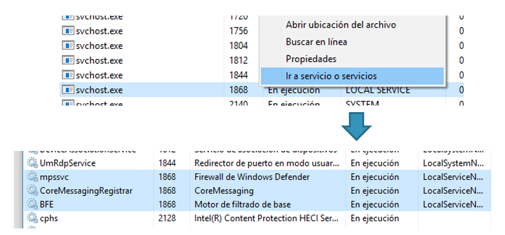
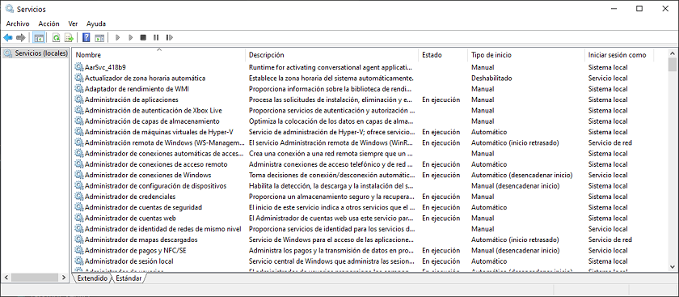
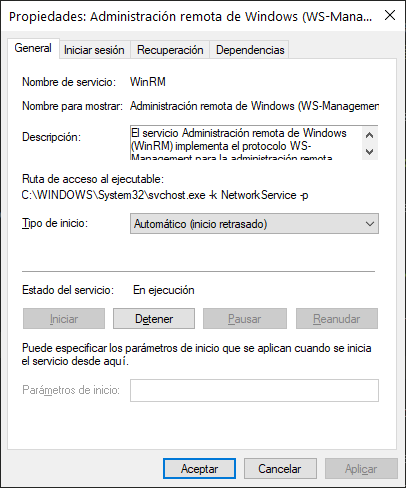
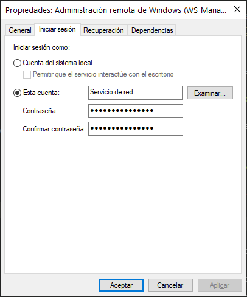
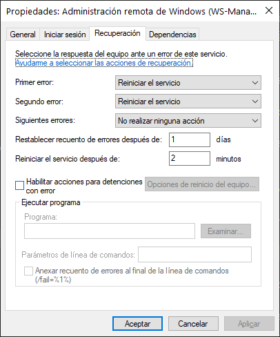
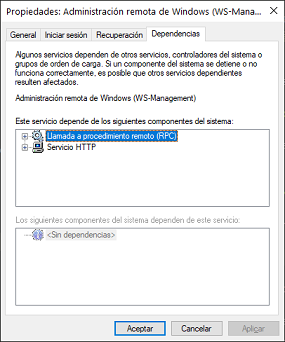

<link rel="stylesheet" href="../styles.css">

## Contenidos

1. Gestión de procesos
2. El administrador de tareas
3. Servicios
4. El monitor de recursos
5. El visor de eventos
6. Gestión de energía
7. Directivas de grupo local
8. Programador de tareas

# 3.- SERVICIOS

En UNIX y en Linux, estos programas se llaman **demonios**, y en Windows, se llaman **Servicios**. Son programas que pueden iniciarse automáticamente cuando se inicia Windows y proporcionan alguna función esencial, dando, como su nombre indica, algún servicio a los usuarios.

Los servicios se ejecutan independientemente de que un usuario haya iniciado sesión ya que son propiedad de cuentas de usuario especiales del sistema, las cuales les proporcionan los permisos necesarios para realizar su cometido.

El sistema tiene una serie de servicios disponibles, pero no es necesario que se encuentren todos en ejecución en todo momento. Normalmente se pueden configurar para:

- Que se inicien **automáticamente** cuando se inicia Windows.
- Iniciarlos **manualmente**, bien cuando se requiera o cuando lo requiera un programa. Por ejemplo, el servicio `msiserver` es el encargado de instalar los paquetes con extensión `.msi` (Windows Installer) en el sistema. Por defecto, este servicio está apagado, pero en el momento en que hacemos doble click en un fichero con extensión `.msi` se pondrá en ejecución para realizar la instalación.
- Estar **deshabilitados**, en el caso de servicios que no queremos que estén en ejecución.

Cuando Windows se inicia, se ejecuta el programa **Controlador de servicios** `services.exe`, que inicia los controladores de dispositivos y los servicios de manera ordenada. 

Los servicios en Windows se pueden lanzar desde dos tipos de archivos diferentes:

- **Archivos ejecutables independientes (.exe)**
- **Bibliotecas de enlace dinámico (.dll)**. Dado que las librerías no son ficheros ejecutables, requieren de un programa que los cargue, y este programa es ``svchost.exe``. Este es el motivo por el que en el *Administrador de tareas* es común ver múltiples instancias del proceso con este nombre. Cada una de ellas gestiona uno o varios servicios. Es posible saber qué servicios corresponden a cada instancia de `svchost` haciendo click derecho sobre el proceso en el *Administrador de tareas* y seleccionando *Ir al servicio*.

Para administrar los servicios de forma gráfica hay que ir a *Herramientas administrativas -> Servicios*.	

Haciendo click derecho sobre cada servicio se puede ver información detallada del mismo en un cuadro de diálogo con varias pestañas.

## 3.1.- Propiedades de los servicios

Para ver información más detallada de cada servicio hacemos doble click sobre el mismo.	

### 3.1.1.- Servicios. Pestaña General

En la pestaña **General** vemos información básica sobre el servicio, entre lo que se puede destacar lo siguiente:

- **Nombre del servicio**
- **Ruta de acceso al ejecutable**, el programa que ha lanzado el servicio. Como se comentó, se puede ver que muchos servicios son lanzados por el programa `svchost.exe`.
- **Tipo de inicio**, que puede ser:
  - **Automático**: el servicio se inicia automáticamente cuando Windows se inicia. Los servicios sin dependencias se inician primero, seguidos de los servicios que dependen de ellos.
  - **Manual**: el servicio no se inicia a no ser que lo solicite alguna aplicación, otro servicio o se inicie de forma manual.
  - **Deshabilitado**: el servicio no se iniciará bajo ninguna circunstancia. Al deshabilitar un servicio se deshabilitan los servicios que dependen de él.	
- **Estado del servicio**: aquí se puede ver en qué estado se encuentra el servicio (parado, en ejecución o pausado) y también modificar el estado.

### 3.1.2.- Servicios. Pestaña Iniciar sesión

Los servicios, al igual que cualquier programa en Windows, tienen un usuario propietario que es el que determina qué permisos y derechos tiene el servicio. Aquí se podría cambiar el usuario que ejecutará el servicio, que es la forma de restringir los permisos y derechos que tendrá el servicio.

Por norma general, la mayoría de los servicios se ejecutan desde una cuenta del sistema, siendo las más comunes:

- **Local System**: es la utilizada por la mayoría de los servicios e implica el nivel de privilegios máximo. Se podría ver como la versión para servicios de la cuenta de *Administrador*.
- **Local Service**: es una cuenta con privilegios mínimos y que accede a otros equipos de la red con credenciales anónimas.
- **Network Service**: también tiene privilegios mínimos en el equipo local y actúa con las credenciales del equipo en la red.

### 3.1.3.- Servicios. Pestaña Recuperación

Al igual que puede ocurrir con cualquier programa, los servicios también pueden finalizar o colgarse ante un error inesperado. Esto puede suponer un problema en el caso de servicios importantes del sistema, ya que una detención en su ejecución puede suponer la caída de algún servicio importante.

Para solucionar este problema, Windows monitoriza todos los servicios en ejecución de forma que puede detectar una parada inesperada y actuar en consecuencia. En base a esto permite realizar una de las siguientes acciones cuando detecta que un servicio se ha parado:

- **No realizar ninguna acción**
- **Reiniciar el servicio**, intenta volver a ejecutar el mismo programa que lanzó el servicio.
- **Ejecutar un programa**, es posible seleccionar un programa o script que se ejecute como respuesta a la parada del servicio, por ejemplo, para enviar un correo electrónico de aviso o para realizar alguna tarea en el sistema.
- **Reiniciar el equipo**

### 3.1.4.- Servicios. Pestaña Dependencias

Muchos servicios requieren que haya otros servicios ejecutándose antes de ejecutarse ellos mismos, y a su vez, pueden ser necesarios para que otros servicios se puedan ejecutar. Esto es lo que se llaman **dependencias**.

En esta pestaña se pueden ver todos los servicios de los que depende el servicio seleccionado y, a su vez, ver qué servicios dependen de él.

***
[Volver al índice principal](index_UT05.md)