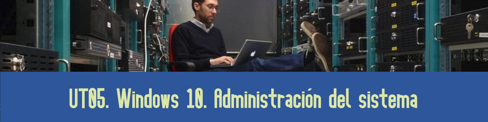

# UT05. WINDOWS 10. ADMINISTRACIÓN

ESTO TAL VEZ SE DEBERÍA INTEGRAR EN LA UNIDAD 3, O DIVIDIRLO EN **ADMINISTRACIÓN BÁSICA Y AVANZADA**

### Contenidos

1. Gestión de procesos
2. El administrador de tareas
3. Servicios
4. El monitor de recursos
5. El visor de eventos
6. Gestión de energía
7. Directivas de grupo local
8. Programador de tareas

## 4.- EL MONITOR DE RECURSOS