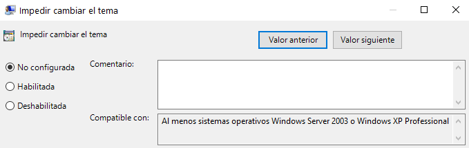

<link rel="stylesheet" href="../styles.css">

## Contenidos

1. Gestión de procesos
2. El administrador de tareas
3. Servicios
4. El monitor de recursos
5. El visor de eventos
6. Gestión de energía
7. Directivas de grupo local
8. Programador de tareas

# 7.- DIRECTIVAS DE GRUPO LOCAL

## 7.1.- Introducción

Las **directivas de grupo** son un mecanismo de Windows que permite configurar muchos aspectos importantes del equipo o de la red. Con las directivas de grupo se pueden realizar multitud de tareas como:

- Limitar qué aplicaciones pueden instalar los usuarios
- Deshabilitar dispositivos portátiles como memorias USB
- Deshabilitar protocolos de red como TLS 1.0 para forzar a que se use una versión más actual y segura.
- Limitar las configuraciones que el usuario puede realizar en el *Panel de Control*
- Establecer una imagen predeterminada como fondo de escritorio.

Para acceder al *Editor de Políticas Locales* simplemente hay que ejecutar el complemento del MMC `gpedit.msc`.

## 7.2.- Estructura del árbol de Directivas de Grupo Local

Las *Directivas de Grupo* se organizan en una estructura arborescente que parte de dos raices:

- **Configuración de equipo**: son configuraciones que se aplican a todo el equipo, independiente del usuario que haya iniciado sesión. Hacen efecto durante el arranque del sistema operativo, antes de que se muestre la pantalla de inicio de sesión.
- **Configuración de equipo**: en este caso son configuraciones que se aplican a usuarios determinados, y por tanto, hacen efecto después de que el usuario haya iniciado sesión.

Cada una de estas dos ramas principales se divide a su vez en tres sub-ramas, que tienen el mismo nombre en ambas ramas, aunque su contenido difiere. Estas tres sub-ramas son:

- Configuración de software
- Configuración de Windows
- Plantillas administrativas

Profundizando en las diversas ramas al final se llega a las directivas. Cada directiva establece una configuración específica en el sistema y se puede cambiar el valor de la misma haciendo doble click sobre ella.

Aunque hay gran variedad de directivas y con diferentes formas de configurarlas, las más comunes son:

- Directivas que se pueden habilitar: muchas directivas pueden ser **habilitadas** para que se aplique lo que dice, o **deshabilitadas** para que no se aplique. En este tipo de directivas hay una tercera posibilidad, que es **no configurada**. Este valor tiene más sentido cuando el equipo se encuentra en un **dominio**, donde se pueden aplicar directivas a varios niveles con diferentes preferencias. En ese caso una directiva no configurada quiere decir que en este nivel no se establece ningún valor para la directiva y que se deja que se tome esa decisión en un nivel superior.

- Directivas que se aplican a usuarios determinados: 

Equipo -> Configuración de Windows -> Scripts (inicio o apagado)

Permite indicar un script que se ejecutará durante el arranque del equipo

Equipo -> Configuración de Windows -> Configuración de Seguridad -> Directivas de cuenta -> Directiva de contraseñas

Aquí se presenta la posibilidad de:

- Limitar la longitud y complejidad de la contraseña
- Impedir que al cambiar la contraseña se reutiliza una previamente utilizada
- Establecer la vigencia máxima y mínima de la contraseña

Equipo -> Configuración de Windows -> Configuración de Seguridad -> Directivas de cuenta -> Directiva de bloqueo de cuenta

Permite marcar un límite de intentos de introducción de la contraseña. Tras ese número de intentos fallidos se bloqueará la cuenta durante el tiempo que se especifique.

Equipo -> Configuración de Windows -> Configuración de Seguridad -> Directivas locales - Directiva de auditoría

Una **auditoría** consiste en registrar determinados eventos que tengan lugar en el sistema en ficheros de *log* que se pueden visualizar posteriormente en el **Visor de eventos**. En esta rama de las directivas se puede indicar qué tipo de eventos se van a auditar y, por tanto, de qué tipo de eventos quedará registro.

Las opciones al seleccionar una directiva de auditoría son:

- **Correcto**: se audita lo que indique la directiva cuando tiene éxito, por ejemplo, si se marca en la directiva *Auditar eventos de inicio de sesión de cuenta* quedará registrada cada vez que un usuario inicie sesión en el sistema, pero no los intentos de inicio de sesión en que ponga una contraseña errónea.
- **Incorrecto**: en este caso se audita lo contrario, es decir, cada vez que el usuario intenta hacer lo indicado por la auditoría pero no lo consigue por el motivo que sea. En el ejemplo anterior se registrarían todos los intentos de iniciar sesión en que el usuario introduce una contraseña incorrecta.

***
[Volver al índice principal](index_UT05.md)