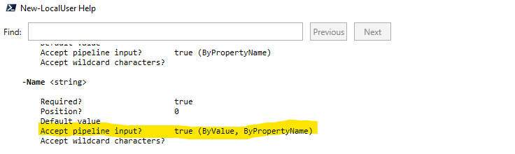

### Contenidos

1. [Introducción a Powershell](01_introducción.md)
2. [Objetos y el pipeline](02_pipelines.md)
3. [**Tipos de datos y variables**](03_tipos_datos_y_variables.md)
4. [El sistema de ficheros en Powershell](04_sistema_ficheros.md)
5. [Gestión de Hyper-V desde Powershell](05_hyperv.md)
6. [Gestión de usuarios y grupos](06_usuarios.md)
7. [Gestión avanzada de usuarios y grupos](07_usuarios_avanzado.md)
8. [Conexión remota](08_conexion_remota.md)
9. [Powershell y el almacenamiento](08_almacenamiento.md)


# 3.- TIPOS DE DATOS Y VARIABLES

Por lo que hemos visto hasta ahora, la estructura de los comandos de Powershell es la siguiente:

```powershell
     comando -parametro [valor_parametro] -parametro [valor_parametro] ....
```

Es decir, los comandos admiten una serie de parámetros que opcionalmente pueden tener un valor. Este valor puede ser de diversos tipos, según el parámetro de que se trate, por ejemplo un número o una cadena de texto. A los diversos tipos a los que puede pertenecer un valor se les denomina **tipos de datos** y los tipos de datos con los que puede trabajar son una característica muy importante de cualquier lenguaje de programación.

Por otro lado, aunque el valor del parámetro podemos indicarlo directamente, como hemos hecho hasta ahora, también podemos recuperar un valor que hayamos guardado previamente en una **variable**, que sirven precisamente para almacenar información que posteriormente podrá ser recuperada.

En este apartado veremos con más detalle qué son las variables y algunos de los tipos de datos más comunes.


## 3.1.- Variables en Powershell

Una **variable** es un **espacio en memoria en el que se puede guardar información**, normalmente para hacer referencia a dicha información posteriormente. Las variables se identifican por un nombre cuyo primer carácter es el símbolo dólar (`$`). Algunas características de los nombres de las variables son:

- No se distinguen mayúsculas de minúsculas
- El nombre de la variable puede contener letras, números y algunos caracteres especiales, sin embargo, lo más aconsejable es utilizar únicamente letras, dígitos y el carácter subrayado (`_`).
- Conviene que los nombres de las variables sea representativos del valor que van a contener.
- Con objeto de evitar caracteres no estándar como vocales con tilde, eñes o similares, no es mal hábito poner el nombre de las variables en inglés.
- Es aconsejable utilizar una nomenclatura consistente en el uso de mayúsculas y minúsculas. Dos opciones habituales son:
  - CamelCase: en el caso de nombres de variables con varias palabras, se escriben todas las letras en minúsculas salvo la primera letra de la segunda palabra y sucesivas. Por ejemplo, `$userProcesses`.
  - Snake_case: en este caso se utiliza el guión bajo como separador de palabras y todas las letras en minúsculas. Por ejmplo, `$user_processes`.


### 3.2.- Definición y uso de variables

Para definir una variable se utiliza el símbolo igual (`=`) seguido del valor que se desee que almacene. El valor puede ser de diferentes tipos:

```powershell
PS C:\>$numberOfItems = 125
PS C:\>$myName = "victor"
PS C:\>$calc = Get-Process -Name Calculator
PS C:\>$anArray = 1, 2, 3
```

Para usar una variable simplemente hay que poner el nombre de la misma y será reemplazado por el valor que le fue asignado. Por ejemplo:

```powershell
PS C:\> Get-LocalUser -Name $myName 
```

A una variable se le puede asignar un valor diferente en cualquier momento, incluso de un tipo de datos diferente al que se le asignó inicialmente.

```powershell
PS C:\> $a = 125
PS C:\> $a
125
PS C:\> $a = "Hola"
PS C:\> $a
Hola
```

Es posible forzar a que una variable únicamente pueda contener datos de un determinado tipo precediendo el nombre de la variable con el nombre del tipo de datos rodeado de corchetes durante la asignación de la variable.

```powershell
PS C:\>  [int]$a=125
PS C:\> $a
125
PS C:\> $a="hola"
MetadataError: Cannot convert value "hola" to type "System.Int32". Error: "Input string was not in a correct format."
```


## 3.3.- Comandos relacionados con variables

Como no podía ser de otra forma, en Powershell también hay una serie de comandos para trabajar con variables. Estos son:

- `Get-Variable`: muestra por pantalla todas las variables que hay definidas junto con su valor.
- `New-Variable`: permite crear una variable nueva de la forma `New-Variable -Name a -Value 120`. Es importante destacar aquí que el nombre de la variable se indica sin el símbolo `$`.
- `Set-Variable`: mientras que el comando anterior crea una variable nueva, este comando simplemente asigna un valor a una variable existente.
- `Clear-Variable`: borra el valor de la variable, dejándola igual a `$null`.
- `Remove-Variable`: elimina la variable.


## 3.4.- Variables automáticas

Si ejecutas el comando `Get-Variable` podrás ver que hay una gran cantidad de variables que no has creado, sino que son creadas automáticamente por el sistema con información sobre el mismo. En la [documentación de Powershell](https://docs.microsoft.com/en-us/powershell/module/microsoft.powershell.core/about/about_automatic_variables?view=powershell-7.1) se encuentra una descripción detallada de todas ellas. A modo de resumen, algunas de las más destacables son:

- `$True` y `$False`: representan los valores booleanos verdadero y falso que veremos más adelante.
- `$pwd`: contiene el directorio de trabajo actual.
- `$home`: el directorio personal del usuario
- `$IsLinux`, `$IsWindows` y `$IsMacOS`: continen verdadero o falso en función del sistema en que se consulten.
- `$null`: es una variable especial que representa un valor vacío o nulo, es decir, indica la ausencia de valor.
- `$PSVersionTable`: información sobre la versión de Powershell que se está ejecutando.


## 3.4.- Tipos de datos

Powershell dispone de gran cantidad de tipos de datos, aunque el conocimiento de la mayoría de ellos está más allá de los objetivos del presente curso por lo que únicamente veremos lo más reseñables. 

Es posible saber el tipo de dato que almacena cualquier variable con el método GetType().

```powershell
PS C:\> $a = "Powershell"
PS C:\> $a.GetType()

IsPublic IsSerial Name                                     BaseType
-------- -------- ----                                     --------
True     True     String                                   System.Object
```

### 3.4.1.- Tipos de datos numéricos

Hay cinco tipos de datos numéricos en Powershell:

- `int`: representa un número entero que se almacena en 32 bits, lo que implica que su valor puede estar entre -2147483648 y +2147483647.
- `long`: también para números enteros, pero en este caso se le dedican 64 bits para almacenarlo. Esto hace que sus valores puedan estar entre -9223372036854775808 y +9223372036854775807.
- `float`: para números con valores decimales con una precisión de 32 bits.
- `double`: números con valores decimales con 64 bits de precisión.
- `decimal`: en este caso duplica la precisión hasta 128 bits.


### 3.4.2.- Booleanos

Otro tipo de datos son los **booleanos**, valores que únicamente pueden ser verdadero (True) o falso (False). Estos dos valores están representados por dos variables especiales del sistema denominadas `$True` y `$False`.

Igualmente, cuando queremos pasar a un comando un valor de parámetro de tipo booleano, debemos usar estas variables.

```powershell
PS C:\> Get-LocalUser | Where-Object Enabled -eq $True
```

### 3.4.3.- Cadenas 

Una **cadena** o **string** es una secuencia de cero o más caracteres. Cuando se indica una cadena en el valor de un parámetro no es necesario rodearla de comillas, pero en el caso de asignarla a una variable si será necesario, por lo que no es mal hábito acostumbrarse a rodear las cadenas de comillas.

Las comillas pueden ser simples o dobles, y, aunque por norma general no hay diferencia entre unas y otras, hay una situación en la que sí se diferencian en su comportamiento, y es cuando hay una variable dentro de la cadena.

- Si se utilizan **comillas dobles** y hay una variable dentro de la cadena se reemplazará dicha variable por su valor.
- Si se utilizan **comillas simples** y hay una variable en la cadena, no habrá ningún tipo de reemplazo y se mantendrá el nombre de la variable.

```powershell
PS C:\> $a = "Victor"
PS C:\> "Hola, me llamo $a"
Hola, me llamo Victor
PS C:\> 'Hola, me llamo $a'
Hola, me llamo $a
```

Como todo en Powershell, las cadenas también son objetos, y como tales también tienen propiedades y métodos. Estos son:
- `length`: esta propiedad almacena la longitud de la cadena.
- `ToLower`: método que devuelve la cadena con todas las letras en minúsculas.
- `ToUper`: método que devuelve la cadena con todas las letras en mayúsculas.

```powershell
PS C:\> $a = "Hola, Mundo!!"
PS C:\> $a.Length
13
PS C:\> $a.ToLower()
hola, mundo!!
PS C:\> $a.ToUpper()
HOLA, MUNDO!!
```

Observa que cuando se hace referencia a una **propiedad** en Powershell se pone la misma detrás del nombre de la variable separándola con el carácter punto y, en el caso de hacer referencia a un **método** hay que poner los paréntesis después del nombre del método.


### 3.4.4.- Arrays

Un **array** o **matriz** no almacena un único valor, sino que almacena un conjunto de valores que pueden ser del mismo tipo de datos o de diferentes. Los arrays son un elemento muy útil en cualquier lenguaje de programación y por tanto también en Powershell. Aquí únicamente veremos muy por encima los arrays, pero si tienes interés en profundizar en el tema la [ayuda en línea de Powershell](https://docs.microsoft.com/es-es/powershell/scripting/learn/deep-dives/everything-about-arrays?view=powershell-7.2) es el sitio ideal para ello.

En clase ya hemos trabajado muchas veces con arrays sin darnos cuenta, porque todos los comandos que devuelven un conjunto de objetos (por ejemplo, `Get-Process`) en realidad lo que están devolviendo es un array de objetos.

Si lo que queremos es definir nosotros un array, la sintaxis correcta es utilizando el símbolo arroba (`@`) seguido del listado de elementos del array separados por comas y rodeados por paréntesis.

```powershell
PS C:\> $mi_array = @( 'a', 'b', 'c' )
PS C:\> $mi_array
a
b
c
```

También se pueden omitir las comas si indicamos los elementos del array en diferentes líneas. Este método es preferible principalmente por legibilidad, ya que es más fácil ver de un vistazo qué elementos tiene el array.

```powershell
PS C:\> $otro_array = @(
>> 'a'
>> 'b'
>> 'c'
>> )
PS C:\> $otro_array
a
b
c
```

Aunque utilizar los símbolos `@( )` es lo correcto y funciona siempre, en la mayoría de las ocasiones también es posible declarar los arrays omitiendo estos símbolos y simplemente enumerando todos los elementos del mismo separados por comas.

```powershell
PS C:\> $mi_array = 'a', 'b', 'c'
PS C:\> $mi_array
a
b
c
```

Una vez declarado un array, es posible hacer referencia a uno de sus elementos utilizando los corchetes tras el nombre del array e indicando entre ellos el índice del elemento que queremos extraer, teniendo en cuenta que **el primer elemento del array tiene el índice 0**.

```powershell
PS C:\> $mi_array[0]
a
PS C:\> $mi_array[2]
c
```

Pero cuando realmente son útiles los arrays es cuando queremos iterar sobre todos los elementos del array y utilizar cada uno de estos elementos para algo. Esto se puede ver mejor con un caso práctico.

Por ejemplo, supongamos que queremos crear una serie de usuarios en una máquina llamados `alumno01`, `alumno02`, ... `alumno04`.  Para realizar esta operación necesitaríamos ejecutar 4 comandos, cada uno de ellos para crear cada uno de los usuarios. En cambio, si utilizamos arrays, podemos hacerlo de la siguiente forma:

```powershell
PS C:\> $users = @(
>> 'alumno01'
>> 'alumno02'
>> 'alumno03'
>> 'alumno04'
>> )
PS C:\> $users | New-LocalUser -NoPassword

Name     Enabled Description
----     ------- -----------
alumno01 True
alumno02 True
alumno03 True
alumno04 True
```

Lo que estamos haciendo con el código anterior al enviar el array por la canalización es simplemente ejecutar el comando `New-LocalUser` cuatro veces y en cada una de ellas recibiendo por el pipeline cada uno de los elementos del array. Como este comando admite por el pipeline el nombre del usuario a crear, creará los cuatro usuarios.



Otra posibilidad de uso de los arrays es en combinación con el comando `ForEach-Object`. Este comando recibe por el pipeline un array de objetos, y ejecute el bloque de script (recuerda que esto son una serie de comandos rodeados por llaves) que se le pasa como parámetro una vez para cada uno de los elementos del array. Dentro del bloque de script se puede hacer referencia al elemento correspondiente del array con la variable especial `$_` o `$PSItem`.

De esta forma, el ejemplo anterior de creación de usuarios lo podemos hacer de la siguiente forma:

```powershell
PS C:\> $users | ForEach-Object {
>> New-LocalUser $_ -NoPassword
>> }

Name     Enabled Description
----     ------- -----------
alumno01 True
alumno02 True
alumno03 True
alumno04 True
```

Extendiendo este ejemplo, podemos crear un **array bidimensional** donde cada elemento de un array es a su vez otro array y de esta forma almacenar varios valores para cada usuario.

```powershell
PS C:\> $users = @(
>> @('alumno01', 'Primer alumno de ISO'),
>> @('alumno02', 'Segundo alumno de ISO'),
>> @('alumno03', 'Tercer alumno de ISO')
>> )
```

Es importante tener en cuenta que en el caso de declarar arrays bidimensionales **es obligatorio separar los elementos por comas**, al contrario que cuando creábamos un array normal.

Con esta modificación, la variable `$_` será un array que contiene dos elementos (el nombre y la descripción), por lo que dentro del bloque de script habrá que referenciar estos elementos mediante su índice.

```powershell
PS C:\> $users | ForEach-Object {
>> New-LocalUser $_[0] -Description $_[1] -NoPassword
>> }

Name     Enabled Description
----     ------- -----------
alumno01 True    Primer alumno de ISO
alumno02 True    Segundo alumno de ISO
alumno03 True    Tercer alumno de ISO
```


***

[Volver al índice principal](index_UT06.md)