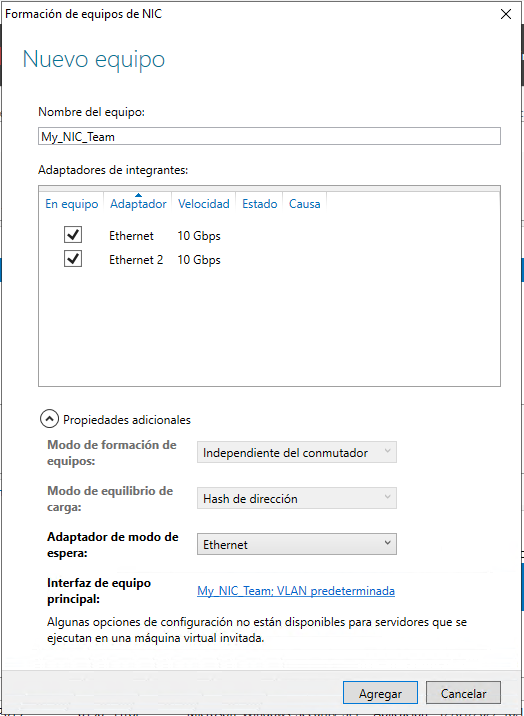

## Contenidos

1. [Instalación de Windows Server](01_instalación.md)
2. [Instalación en modo Core](02_instalación_core.md)
3. [**Tareas post-instalación**](03_postinstalación.md)
4. [Administración remota del servidor](04_admin_remota.md)
5. [Administración de discos en Windows Server. Grupos de almacenamiento](05_admin_discos.md)


# 3.- TAREAS DE POST-INSTALACIÓN

Una vez instalado el sistema hay una serie de tareas que debemos abordar. Entre estas tareas se encuentran:

- Configurar la conexión de red
- Establecer la hora del sistema
- Habilitar el escritorio remoto
- Asignar un nombre al equipo
- Unir el servidor a un dominio si hubiera uno.


## 3.1.- Tareas post-instalación en entorno gráfico

Estas tareas iniciales se pueden realizar desde *Administrador de servidor -> Servidor local*.  Aquí podemos cambiar el nombre del servidor (Nombre de equipo), cambiar la configuración de red (Ethernet), configurar la política de actualizaciones del servidor (Windows Update) y establecer la hora del servidor (Zona horaria). Ten en cuenta que este último punto es especialmente importante en el caso de que queramos instalar Active Directory ya que es **requisito imprescindible** la correcta sincronización de los relojes de todos los equipos del dominio.
 


## 3.2.- Tareas post-instalación en Server Core

Cuando estamos trabajando en Server Core estas tareas son algo más complicadas ya que debemos realizarlas utilizando la línea de comandos.


### 3.2.1.- Cambio del nombre del equipo

Si queremos saber el nombre que tiene actualmente el servidor podemos utilizar el comando `hostname` o `ipconfig`.

Para cambiar el nombre del equipo desde la línea de comandos debes utilizar el comando `netdom` de la siguiente manera:

```powershell
C:\>netdom renamecomputer %ComputerName% /NewName: <NewComputerName>
```

Recuerda que las cadenas rodeadas del símbolo % son variables. En concreto `%ComputerName%` es una variable de entorno definida por el propio sistema que almacena el nombre actual del equipo.

También puedes cambiarlo desde PowerShell mediante el Cmdlet `Rename-Computer`. Los parámetros de este Cmdlet son:

- `-ComputerName`: nombre del equipo que queremos modificar (si no lo ponemos el valor por defecto es la máquina local)
- `-NewName`: nuevo nombre del equipo.
- `-Restart`: reinicia automáticamente el equipo para aplicar los cambios.

```powershell
PS C:\>Rename-Computer –NewName <NewComputerName> -Restart
```


### 3.2.2.-Establecer una dirección IP estática

El siguiente paso para realizar es cambiar la IP dinámica que tiene el sistema instalado por defecto por una IP estática. Si realizamos esta tarea desde la línea de comandos debemos recurrir a PowerShell.

Los pasos que hay que realizar para asignar una dirección IP estática son los siguientes:

1.	En primer lugar, hay que ejecutar el Cmdlet `Get-NetIPInterface` para obtener información de las interfaces de red. De la salida de este comando nos tenemos que fijar en el valor de la columna **IfIndex** de la interfaz que queremos configurar. Ese valor será el que utilizaremos posteriormente para referencia el adaptador de red.
2.	Para cambiar la configuración de red utilizamos el Cmdlet `New-NetIPAddress` que puede tener los siguientes parámetros:
    - `-InterfaceIndex`: aquí indicamos el valor que obtuvimos en primer paso.
    - `-IPAddress`: dirección estática que se quiere establecer.
    - `-PrefixLenght`: longitud del prefijo, es decir, la máscara de subred en formato numérico (p.e. 24)
    - `-DefaultGateway`: puerta de enlace predeterminada
Así pues, la llamada quedaría de la forma:

```powershell
PS C:\>New-NetIPAddress –InterfaceIndex 12 –IPAddress 192.168.10.20 –PrefixLength 24 –DefaultGateway 192.168.10.1
```
3.	Ahora queda configurar los servidores DNS  si es que nuestro servidor va a tener salida a Internet. Para ello utilizaremos el Cmdlet Set-DNSClientServerAddress que admite los parámetros:
- `-InterfaceIndex`: igual que en el caso anterior
- `-ServerAddresses`: dirección IP del servidor DNS. Admite varios servidores separados por comas.

```powershell
PS C:\>Set-DNSClientServerAddress –InterfaceIndex 12 –ServerAddresses 8.8.8.8,8.8.4.4
```

Hay que tener en cuenta que el comando `New-NetIPAddress` crea una nueva IP y la añade a un adaptador, por lo que si este adaptador de red ya tiene una dirección IP no la sustituirá, sino que pasará a tener ambas direcciones IP.

Si lo que queremos es cambiar la dirección IP asignada al adaptador será necesario eliminar primero la anterior con el comando `Remove-NetIpAddress`.

Para realizar pruebas de conectividad puede ser necesario deshabilitar el firewall de Windows para que no bloquee los mensajes ping entrantes. Esta tarea se puede realizar mediante el comando `Set-NetFirewallProfile` de la siguiente forma:

```powershell
Set-NetFirewallProfile -Profile Domain,Public,Private -Enabled False
```

## 3.3.- Configuración de NIC Teaming

**NIC teaming** es una nueva característica disponible a partir Windows Server 2012R2 que permite a los administradores combinar el ancho de banda de múltiples adaptadores de red, incrementando de esta manera el rendimiento y la tolerancia a fallos.

Como sabes uno de los puntos fuertes de Windows 2012R2 es la virtualización, que entre otras cosas permite separar las funciones de red en diferentes sistemas sin necesidad de comprar una tarjeta de red para cada uno de ellos. Sin embargo, el punto negativo de esta característica es que podemos tener varios servidores virtualizados que dependen de una única tarjeta de red por lo que **un fallo en ésta supondrá la caída de todos los servidores**.

Para solucionar este problema 2012R2 incluye permite realizar NIC teaming. Esto consiste en combinar varias tarjetas de red en una única interfaz balanceando la carga entre ellas y proporcionando tolerancia a fallos en el servicio ya que si una tarjeta falla el resto continuarían con su función. La novedad a partir de 2012R2 es que no es necesario hardware específico, como en anteriores implementaciones, sino que es independiente del hardware. 



Windows Server dispone de los siguientes modos de NIC teaming:

- **Formación de equipos estática (Static Teaming)**: este modo es dependiente de switch, usa el protocolo IEEE 802.3ad (draft), el cual solo agrupa los adaptadores de red. Este modo nos obliga a configurar los switches y el host para identificar los vínculos que forman el equipo. Este modo no ayuda al switch ni al host a identificar cables desconectados ni otro tipo de errores.
- **Independiente del conmutador (Switch Independient)**: este modo es totalmente independiente al switch, y este no sabe en ningún momento que las tarjetas de red forman un grupo. Este modo nos permite conectar las diferentes tarjetas de red a distintos switches, lo cual no significa que sea obligatorio, pero si muy recomendable. Este modo también nos permite poder poner un adaptador de red en modo espera por si alguno fallase.
- **LACP (Link Aggregation Control Protocol Teaming)** este modo también es dependiente de switch. Usa el protocolo IEEE 802.1ax que funciona como un protocolo de control de enlaces agregados. Crea automáticamente los equipos y reconoce cuando se agrega y se quita un adaptador de red gracias a la emisión y recepción de paquetes LACP. Este modo necesita que activemos el uso del protocolo LACP en el switch y en el host.
 
Además, tenemos que elegir el modo de equilibrio de carga:

- **Hash de dirección**: este modo es muy efectivo cuando tenemos mucho tráfico de salida ya que envía por todos los adaptadores de red, pero solo recibe por uno, se suele usar principalmente para servidores Web y FTP.
- **Puerto Hyper-V**: este modo está muy bien para cuando se tienen máquinas virtuales en el host y solo necesitamos que cada máquina virtual use la velocidad de un solo adaptador de red.
- **Dinámico**: este modo vino de la mano de Windows Server 2012 R2 y es una mezcla de los dos mejorada, nos permite balancear el tráfico de entrada y salida aprovechando el ancho de banda al máximo.
 
Finalmente podemos indicar que un adaptador se ponga en Modo de espera. Esta opción solo está disponible con la formación de equipos modo Independiente del conmutador (Switch Independient) y nos permite poder dejar en modo espera a uno o varios adaptadores de red, así en el caso de que un adaptador dejara de funcionar entraría en funcionamiento uno en modo de espera.
 

***
[Volver al índice principal](index_UT07.md)
