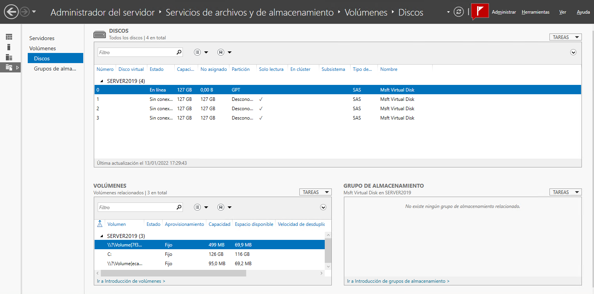
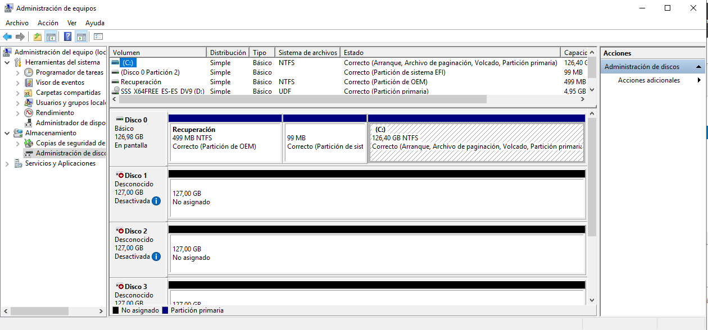
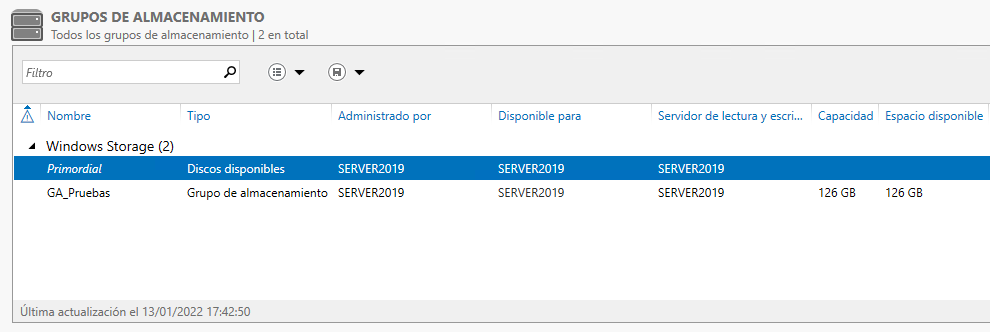
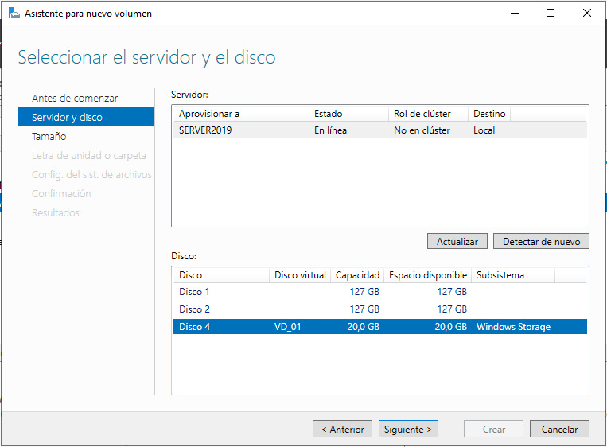

## Contenidos

1. [Instalación de Windows Server](01_instalación.md)
2. [Instalación en modo Core](02_instalación_core.md)
3. [Tareas post-instalación](03_postinstalación.md)
4. [Administración remota del servidor](04_admin_remota.md)
5. [**Administración de discos en Windows Server. Grupos de almacenamiento**](05_admin_discos.md)


# 5.- ADMINISTRACIÓN DE DISCOS EN WINDOWS SERVER 2012

Windows Server incluye una serie de herramientas que permiten administrar los discos tanto en un entorno gráfico como desde la línea de comandos. Todas las instalaciones incluyen por defecto el rol **Servicios de archivos y de *almacenamiento**, que permite trabajar con volúmenes, discos, grupos de almacenamiento, carpetas compartidas y dispositivos iSCSI.

Toda la funcionalidad proporcionada por este rol se encuentra accesible a través del **Administrador del servidor**, que proporciona una  herramienta gráfica que permite trabajar con grupos de almacenamiento y crear discos virtuales, así como realizar algunas (pero no todas) las operaciones estándar sobre discos físicos.



Para la realización de las operaciones habituales sobre los discos físicos se puede utilizar el complemento del MMC (Microsoft Management Console) Administración de discos. Para acceder a esta herramienta debemos ir a *Administrador del servidor -> Servidor local -> Herramientas -> Administración de equipos -> Administración de discos*.




## 5.1.- Añadir un nuevo disco físico

Cuando añadimos un nuevo disco a Windows Server, es necesario **inicializarlo** antes de poder utilizarlo. Los discos físicos los podemos ver en *Administrador del servidor -> Servicios de archivos y de almacenamiento -> Discos* donde se puede ver que los discos no inicializados tienen marcada como partición *Desconocido*.
 


Para inicializar el disco únicamente debemos hacer click derecho sobre él y escoger la opción *Inicializar*. Con esta acción creamos la tabla de particiones permitiendo así ya utilizar el disco. Hay que destacar que, aunque Windows Server puede trabajar con tablas de particiones MBR y GPT, únicamente puede inicializar discos con la tabla de particiones GPT. Sin embargo, aún es posible convertir el disco a MBR utilizando el complemento *Administrador de discos del MMC* haciendo click derecho sobre el disco y seleccionando *Convertir en disco MBR*.


## 5.2.- Grupos de almacenamiento

Una vez que se han añadido varios discos físicos al sistema, es posible concatenarlos en los denominados **grupos de almacenamiento**. Un grupo de almacenamiento simplemente es la unión de varios discos físicos en una especie de _abstracción_ del almacenamiento de la cual se pueden extraer discos virtuales de cualquier tamaño.


### 5.2.1.- Creación de grupos de almacenamiento

Para crear un grupo de almacenamiento hay que seguir los siguientes pasos:
- Ir a *Administrador del servidor -> Servicios de archivos y de almacenamiento -> Grupos de almacenamiento*.
- En el apartado *Grupos de almacenamiento* por ahora solo está el **Grupo primordial**, que contiene todos los discos físicos que no están en ningún grupo de almacenamiento y, por tanto, pueden añadirse a uno.
- Si hacemos click con el botón derecho podremos escoger *Nuevo grupo de almacenamiento*.
- Esto lanzará el asistente para la creación de grupos de almacenamiento que pedirá los siguientes datos:
    - **Nombre**, con el que identificaremos el grupo de almacenamiento.
    - **Discos físicos** que queremos añadir al grupo.
- Tras aceptar, ya tendremos un grupo de almacenamiento cuya capacidad es la suma de las capacidades de todos los discos que lo forman.
 


Una vez creado el grupo de almacenamiento se podrán añadir o eliminar discos físicos en cualquier momento en función de las necesidades de forma totalmente transparente para el usuario ya que no afectará a los discos virtuales que se hayan creado a partir del grupo.


### 5.2.2.- Creando discos virtuales

Una vez creado el grupo de almacenamiento es el momento de crear **discos virtuales**. Estos discos son extraídos del grupo de almacenamiento y pueden ser utilizados tanto por las máquinas virtuales con Hyper-V como desde el propio sistema operativo como si fuera un disco duro normal.

Los pasos para crear un disco virtual son:

- Hay que ir a *Administración del servidor -> Servicios de archivos y de almacenamiento -> Grupos de almacenamiento*.
- En la parte superior, en **Grupos de almacenamiento**, seleccionamos el grupo de almacenamiento del que queramos extraer los discos virtuales. Ten en cuenta que el grupo **Primordial** incluye los discos físicos que no están en ningún grupo de almacenamiento, y, por tanto, no se pueden crear discos virtuales en él.
- En la parte inferior izquierda, en el apartado *Discos virtuales*, hacemos click en la parte superior en *Tareas* y seleccionamos *Nuevo disco virtual*. Esto lanzará el asistente para la creación de un disco virtual. Algunos aspectos a tener en cuenta en este asistente son:
    - En **Nombre del disco virtual** hay una casilla de verificación en la parte inferior que indica **Crear niveles de almacenamiento en este disco virtual**. Esta casilla solo se activará si en el grupo de almacenamiento hay discos físicos magnéticos y sólidos. Si la marcamos, Windows se encargará de grabar en el disco SSD aquellos ficheros que más se utilicen para poder así beneficiarse de la mayor velocidad de este tipo de dispositivos.
    - En **Distribución del almacenamiento** debemos escoger si el disco virtual va a tener algún tipo de redundancia. Las opciones son:
        - **Simple**: no habrá ningún tipo de redundancia.
        - **Mirror**: el disco virtual tendrá una configuración RAID1, es decir, los datos se almacenarán duplicados en dos discos físicos diferentes. Por supuesto, requiere que el grupo de almacenamiento tenga por lo menos 2 discos físicos.
        - **Parity**: en este caso el disco virtual tendrá una configuración RAID5. Esto requiere que haya por lo menos 3 discos físicos en el grupo de almacenamiento.
    - En **Aprovisionamiento** se indicará cómo se va a reservar el espacio del disco virtual dentro del grupo de almacenamiento. Hay dos opciones:
      - **Aprovisionamiento delgado**: solo se tomará del grupo de almacenamiento el espacio realmente ocupado por datos en el disco virtual. Este modo permite discos virtuales más grandes que el espacio disponible en los discos físicos.
      - **Aprovisionamiento fijo**: reserva todo el espacio asignado al disco virtual.
    - Tras confirmar los datos ya tendremos creado el disco virtual. A todos los efectos este disco se comportará igual que los discos físicos hasta el punto de que se mostrará en el *Admiministrador de discos* al igual que cualquier otro disco.


### 5.2.2.- Creación de un volumen

En Windows Server 2012 hay dos herramientas diferentes que nos permiten crear volúmenes. La primera se encuentra en *Administrador del servidor -> Herramientas -> Administración de equipos -> Administración de discos*. Esta es la misma herramienta que encontramos en otras versiones de Windows incluso de escritorio. 

La otra herramienta la encontramos en el *Administrador del servidor -> Servicios de archivos y de almacenamiento -> Discos*.
 
Desde ambas herramientas es posible crear volúmenes y no hay diferencia entre ellas más allá de las diferencias en la interfaz ya que, aunque lanzan asistentes diferentes, las opciones dentro de ellos son las mismas.



Las opciones más relevantes de este asistente son:

- En **Asignar a letra de unidad o carpeta** se indica la forma en que se accederá al volumen creado. Las opciones son:
    - **Letra de unidad**: el volumen tendrá asignada una letra que lo identificará.
    - **La siguiente carpeta**: en este caso se accederá al volumen según el modo de Linux, ya que el volumen se montará en una carpeta y, cuando se acceda a esa carpeta, se estará accediendo al volumen.
    - **No asignar a una letra de unidad o carpeta**: se creará el volumen, pero no se podrá acceder a él.
- En **Seleccionar configuración del sistema de archivos** tenemos las siguientes opciones:
    - **Sistema de archivos**: aquí está la única diferencia entre ambos asistentes, en *Administración del servidor* únicamente permite escoger entre NTFS y ReFS, mientras que el otro asistente también permite la opción de escoger FAT.
    - **Tamaño de la unidad de asignación**: aquí indicamos el tamaño del clúster en el sistema de ficheros.
    - **Etiqueta de volumen**: si queremos asignarle un nombre al volumen.


## 5.3.- Administración de grupos de almacenamiento desde Powershell

Al igual que otras tareas administrativas de Windows, también es posible trabajar con los grupos de almacenamiento desde PowerShell, realizando las mismas tareas que hemos hecho desde el entorno gráfico.


### 5.3.1.- Creación del grupo de almacenamiento

El primer *cmdlet* que tenemos que conocer es `Get-PhysicalDisk`, que muestra información sobre los discos físicos que hay instalados en el sistema. Entre la información mostrada hay una columna denominada `CanPool` que indicará si ese disco se puede añadir a un grupo de almacenamiento (`True`) o no (`False`).

```powershell
PS C:\> Get-PhysicalDisk

DeviceId FriendlyName      SerialNumber MediaType   CanPool OperationalStatus HealthStatus Usage         Size
-------- ------------      ------------ ---------   ------- ----------------- ------------ -----         ----
0        Msft Virtual Disk              Unspecified False   OK                Healthy      Auto-Select 127 GB
1        Msft Virtual Disk              Unspecified True    OK                Healthy      Auto-Select 127 GB
2        Msft Virtual Disk              Unspecified True    OK                Healthy      Auto-Select 127 GB
3        Msft Virtual Disk              Unspecified False   OK                Healthy      Auto-Select 127 GB
```

También es posible utilizar el parámetro `-CanPool` para indicarle que solo nos muestre los discos que se pueden añadir a un grupo de almacenamiento.
 
De la salida de este comando nos interesa también la columna **FriendlyName**, ya que será el valor con el que referenciaremos los discos al crear el grupo de almacenamiento.
Lo siguiente que debemos conocer es el nombre del subsistema de almacenamiento, para ello debemos utilizar el comando `Get-StorageSubsystem`.
 
```powershell
PS C:\> Get-StorageSubSystem

FriendlyName                  HealthStatus OperationalStatus
------------                  ------------ -----------------
Windows Storage on SERVER2019 Healthy      OK
```

Una vez conocidos estos valores ya es el momento de crear el grupo de almacenamiento mediante el comando `New-StoragePool`, el cual requiere tres parámetros:

- `-FriendlyName`: nombre con que se identificará el grupo de almacenamiento. Puede ocurrir que haya varios discos que compartan el mismo nombre. Para evitar este problema también se puede utilizar el identificador del disco con el parámetre `-UniqueId`.
- `-StorageSubSystemFriendlyName`: nombre del subsistema de almacenamiento.
- `-PhysicalDisks`: discos que vamos a añadir al grupo de almacenamiento. 

Aquí el problema es que no es suficiente con indicar el nombre del disco en el parámetro `-PhysicalDisks`, sino que hay que pasar el objeto que identifica al disco físico. Es posible obtener este objeto con el comando `Get-PhysicalDisk`.

El modo de usarlo se puede ver en el siguiente ejemplo.

```powershell
PS C:\> New-StoragePool -FriendlyName "Datos" -StorageSubSystemFriendlyName "Windows Storage on SERVER2019" -PhysicalDisks (Get-PhysicalDisk -UniqueId 600224804C5487D1A329AD1D5AD9A81F)

FriendlyName OperationalStatus HealthStatus IsPrimordial IsReadOnly      Size AllocatedSize
------------ ----------------- ------------ ------------ ----------      ---- -------------
Datos        OK                Healthy      False        False      126.48 GB        256 MB
```

Ahora podemos verificar si el grupo de almacenamiento se ha creado correctamente con el comando `Get-StoragePool`.

```powershell
PS C:\> Get-StoragePool

FriendlyName OperationalStatus HealthStatus IsPrimordial IsReadOnly      Size AllocatedSize
------------ ----------------- ------------ ------------ ----------      ---- -------------
Primordial   OK                Healthy      True         False         508 GB     253.97 GB
Datos        OK                Healthy      False        False      126.48 GB        256 MB
GA_Pruebas   OK                Healthy      False        False      126.48 GB        768 MB
```

### 5.3.2.- Creación de los discos virtuales

El comando para crear discos virtuales es `New-VirtualDisk`. Algunos de sus parámetros que debemos conocer son:
- `-StoragePoolFriendlyName`: nombre del grupo de almacenamiento del que queremos extraer el disco virtual.
- `-FriendlyName`: nombre que vamos a asignar al disco virtual.
- `-Size`: tamaño del disco virtual. La unidad de medida se indica justo a continuación del valor, por ejemplo, 40GB.
- `-ResiliencySettingName`: qué tipo de redundancia va a tener el disco virtual. Los valores pueden ser: `simple`, `mirror` o `parity`.
- `-ProvisioningType`: tipo de aprovisionamiento. Los valores posibles son: `thin` o `fixed`.
 
```powershell
PS C:\> New-VirtualDisk -StoragePoolFriendlyName "Datos" -FriendlyName "VS_02" -Size 30GB -ResiliencySettingName "simple" -ProvisioningType "thin"

FriendlyName ResiliencySettingName FaultDomainRedundancy OperationalStatus HealthStatus  Size FootprintOnPool StorageEf
                                                                                                               ficiency
------------ --------------------- --------------------- ----------------- ------------  ---- --------------- ---------
VS_02        Simple                0                     OK                Healthy      30 GB          256 MB  100,00 %
```

### 5.3.3.- Creación de volúmenes

Desde Powershell no se pueden crear volúmenes a partir de un disco virtual, sino que deben extraerse directamente del grupo de almacenamiento siendo el disco virtual creado automáticamente en el proceso. Como ya habrás deducido, el comando para crear un volumen es `New-Volume` y los parámetros más importantes son:

- `-StoragePoolFriendlyName`: nombre del grupo de almacenamiento del que se extraerá el volumen.
- `-FriendlyName`: nombre que le vamos a asignar al volumen.
- `-DriveLetter`: letra que le vamos a asignar al volumen.
- `-ResilienceSettingName`: tipo de redundancia del disco virtual que va a contener el volumen. Los valores posibles son Simple, Mirror y Parity.
- `-Size`: tamaño del volumen
- `-FileSystem`: el sistema de ficheros con que se formateará. Su valor puede ser `NTFS` o `ReFS`
- `-ProvisioningType`: tipo de aprovisionamiento que tendrá el disco virtual que va a contener el volumen. Sus valores pueden ser `Fixed` o `Thin`.
 

```powershell
PS C:\> New-Volume  -StoragePoolFriendlyName "Datos" `
                    -FriendlyName "Documentos" `
                    -DriveLetter "X" `
                    -ResiliencySettingName "Simple" `
                    -Size 40GB `
                    -FileSystem "NTFS" `
                    -ProvisioningType "Thin"

DriveLetter FriendlyName FileSystemType DriveType HealthStatus OperationalStatus SizeRemaining     Size
----------- ------------ -------------- --------- ------------ ----------------- -------------     ----
X           Documentos   NTFS           Fixed     Healthy      OK                      39.9 GB 39.98 GB


PS C:\> get-volume

DriveLetter FriendlyName          FileSystemType DriveType HealthStatus OperationalStatus SizeRemaining     Size
----------- ------------          -------------- --------- ------------ ----------------- -------------     ----
D           SSS_X64FREE_ES-ES_DV9 Unknown        CD-ROM    Healthy      OK                          0 B  4.95 GB
            Recuperación          NTFS           Fixed     Healthy      OK                     69.85 MB   499 MB
X           Documentos            NTFS           Fixed     Healthy      OK                      39.9 GB 39.98 GB
C                                 NTFS           Fixed     Healthy      OK                    116.43 GB 126.4 GB
                                  FAT32          Fixed     Healthy      OK                     69.18 MB    95 MB
```


***
[Volver al índice principal](index_UT07.md)