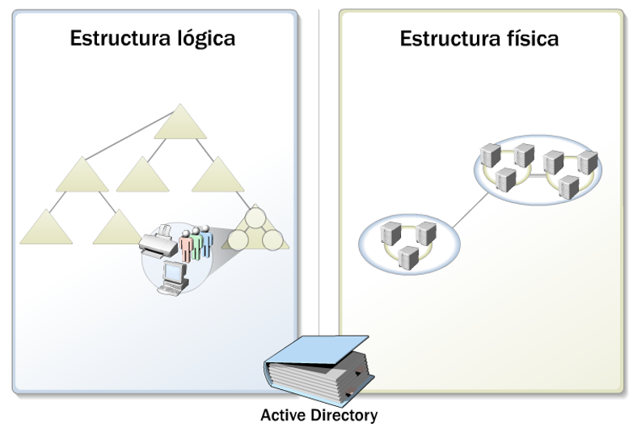
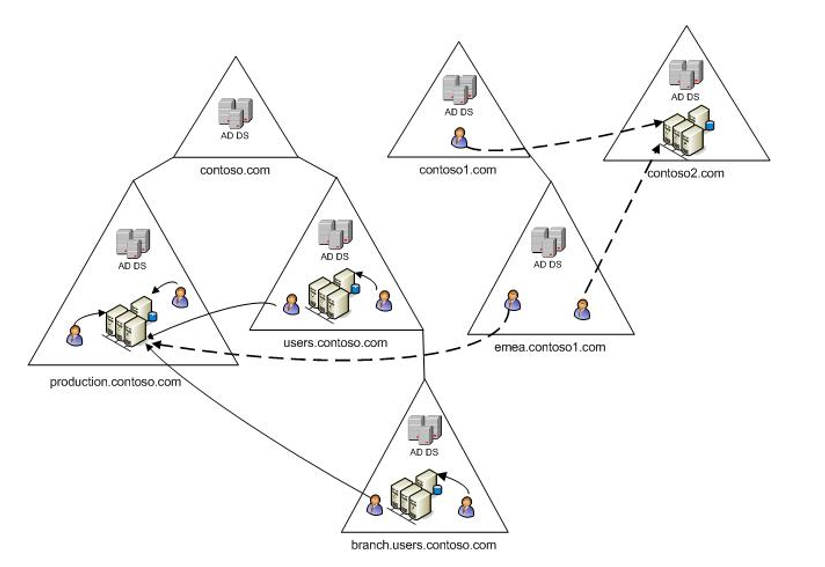
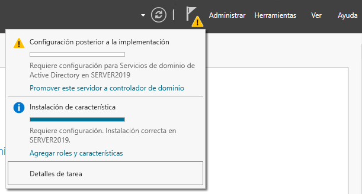
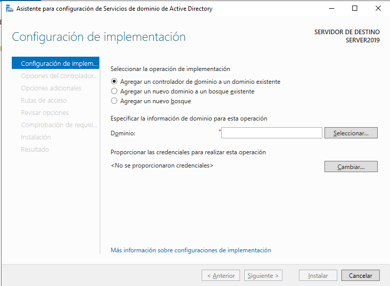
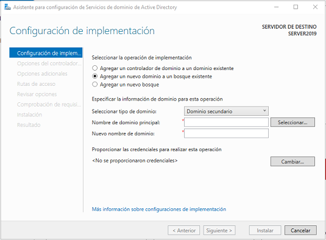
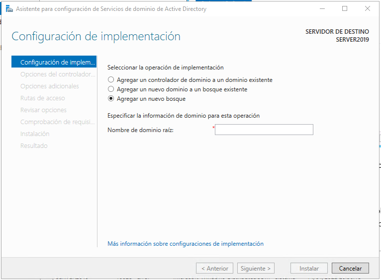
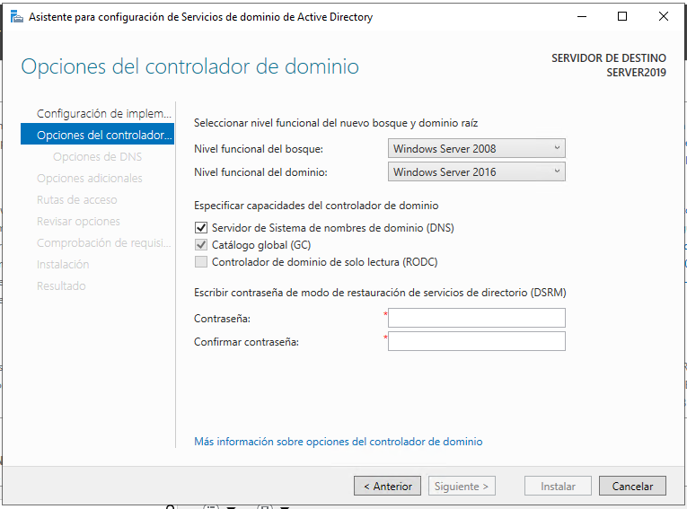
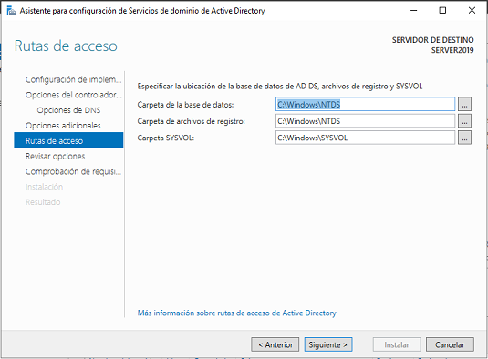

### Contenidos

1. [**Active Directory**](01_active_directory.md)
2. [Usuarios y grupos del dominio](02_usuarios_dominio.md)
3. [Carpetas personales en AD](03_carpetas_personales.md)
4. [Carpetas compartidas por un grupo](04_carpetas_compartidas_grupo.md)
5. [Perfiles de usuario: locales, móviles, obligatorios, temporales y super-obligatorios](05_perfiles_usuarios.md)
6. [Asignación de derechos a usuarios y grupos](06_derechos_usuarios.md)
7. [Group Policy Objects (GPOs) y Group Policy Preferences (GPPs)](07_gpo_gpp.md)
8. [Despliegue remoto de aplicaciones](08_despliegue_aplicaciones.md)
9. [Segundo controlador de dominio](09_segundo_dc.md)
10. [DFS](10_dfs.md)

# 1.- ACTIVE DIRECTORY

## 1.1.- Introducción a Active Directory

### 1.1.1.- Conceptos básicos de Active Directory

Un **directorio** es una lista que permite organizar y localizar elementos.

En términos informáticos los dos elementos de un directorio son:

- **El almacén de datos**: contiene los objetos tales como aplicaciones, bases de datos, impresoras, usuarios,…
- **Los servicios** que actúan sobre los datos. Lleva a cabo funciones como: replicación, medidas de seguridad, distribución de datos,…

**Se puede definir Active Directory como un almacén de objetos y un servicio basado en la red que ubica y administra  recursos, poniéndolos al alcance de grupos y usuarios**.

Algo importante que hay que tener en cuenta al trabajar con Active Directory es que **todo es un objeto**, ya sean usuarios, servidores, estaciones de trabajo, documentos o impresoras. Y, como todo objeto, todo lo que se puede encontrar en AD tiene una serie de **propiedades** o **atributos** que le define, así como una **Lista de Control de Acceso (ACL)** que determina qué usuarios y grupos pueden acceder a dicho recurso, así como los permisos con los que puede acceder.

Active Directory dispone de dos elementos estructurales más un tercer elemento que sería el esquema:

- **Estructura lógica**: está compuesta por los objetos así como sus atributos asociados. Los objetos de AD se organizan según un modelo jerárquico de **dominio**.
- **Estructura física**: esta estructura presenta mecanismos para la replicación y comunicación de datos. Sus dos aspectos fundamentales son:
  - La definición de elemento estructural de la subred IP, constituido por los **sitios** de Active Directory.
  - El **servidor físico** que almacena y replica datos de AD.
- **Esquema**: contiene las definiciones de todos los objetos que se crean y almacenan en Active Directory y sus propiedades. El esquema es responsabilidad del **controlador de dominio**, aunque una copia se replica a todos los controladores de dominio del bosque para asegurar la integridad y coherencia de los datos en todo el bosque.

### 1.1.2.- Bloques organizativos de Active Directory

La estructura lógica define la organización de los datos dentro del directorio activo, para ello recurre a una serie de bloques organizativos, que son:

- Dominios
- Árboles de dominio
- Bosques de dominio
- Unidades organizativas

#### Dominio

El **dominio** consta de los sistemas de equipo y los recursos de red que comparte un _límite de seguridad lógica_. En ocasiones se crean para definir límites funcionales como aquellos entre las unidades administrativas. 

También se les considera agrupaciones de recursos o servidores que utilizan un nombre de dominio común, conocido como **espacio de nombres**.

#### Árbol de dominios

Cuando múltiples dominios comparten un esquema, relaciones de confianza de seguridad y un catálogo global, se crea un **árbol de dominio**, definido por espacios de nombre comunes y contiguos. Por ejemplo:  hijo1.raiz.com, hijo2.raiz.com e hijo3.raiz.com pueden formar parte de un árbol, ya que comparten una nomenclatura contigua y pueden tener un esquema y catálogo global comunes.

El primer dominio creado se conoce como **dominio raíz** y contiene la configuración y los datos de esquema para el árbol.

Hay múltiples motivos que pueden motivar la creación de diferentes dominios dentro de un árbol, entre los que se pueden destacar:

- Permiten gestionar organizaciones diferentes y proporcionar identidades de unidad. Por ejemplo, las diferentes filiales de una empresa podrían tener su propio dominio, pero dentro de un árbol de dominios común a todos ellos.
- Se pueden reforzar distintos límites de seguridad y directivas de contraseña
- Dividir una entidad en varios dominios proporciona una mejor gestión cuando el número de objetos administrado es muy grande
- Descentraliza la administración

#### Bosque de dominios

Cuando se añade un nuevo dominio a un árbol se establecen unas _relaciones de confianza transitivas_, pero las relaciones de confianza también se pueden establecer entre árboles de dominio con distintos espacios de nombres. Cuando esto ocurre, es decir, cuando hay relaciones de confianza entre diferentes árboles de dominio se habla de un **bosque de dominios**.

Todos los árboles de un bosque de dominios comparten una serie de atributos, que incluyen el catálogo global, la configuración y el esquema. Los bosques de dominios no tienen nombre propio.

#### Unidades organizativas

Dentro de un dominio hay un gran número de objetos, como usuarios, equipos, ... que puede ser de cientos o miles. Para organizar todos estos objetos Active Directory proporciona un objeto de contenedor que se denomina **Unidad Organizativa**, y que permite crear una estructura jerárquica en la que las unidades organizativas pueden contener todo tipo de objetos, así como otras unidades organizativas.

# 2.- Instalación de Active Directory

Para disponer de Active Directory en una red, es necesario tener un equipo (o más) que centralice la gestión de todos los recursos del dominio. Este equipo se denomina **controlador de dominio** y requiere tener instalado el rol **Servicios de Dominio de Active Directory**.

Sin embargo, hay dos tareas muy importantes que hay que abordar como paso previo a la instalación del rol, dicho correctamente, a la **promoción** del equipo a controlador de dominio. Estos pasos son:

- Asignación de una IP estática.
- Asignar el nombre del equipo, ya que una vez haya sido promovido a controlador de dominio el nombre del equipo no podrá ser modificado.

Una vez verificados estos dos puntos ya se puede instalar el rol **Servicios de dominio de Active Directory**, un proceso sumamente sencillo que simplemente consiste en aceptar todos los puntos propuestos por el asistente de instalación del rol.

Sin embargo, instalar el rol no implica que el equipo ya sea controlador de dominio, sino que hay que configurar Active Directory como paso previo a la promoción a controlador de dominio. Esto se avisa en el panel de advertencias de Windows Server.

En este aviso ya indica un enlace que pone *Promover este servidor a controlador de dominio*, cuya pulsación lanzará el asistente para la configuración de servicios de dominio de Active Directory.

## 2.1.- Configuración de implementación

Aquí hay tres opciones para escoger.

### Agregar un controlador de dominio a un dominio existente

Esto implica que ya hay un dominio creado, con su controlador de dominio, y que queremos agregar un segundo controlador de dominio con objeto de conseguir alta disponibilidad o simplemente un reparto de la carga de trabajo. Aquí es necesario indicar el nombre del dominio al que se quiere agregar el controlador y también las credenciales de un usuario con privilegios de administración en el dominio

### Agregar un nuevo dominio a un bosque existente

Este sería el caso en el que ya se tiene un bosque, teniendo en cuenta que se considera un bosque tanto al formado por múltiples dominio y/árboles como el que está formado por un único dominio.

Aquí se puede escoger:

- **Dominio secundario**: ya hay un árbol que tiene por lo menos un dominio y se va a agregar otro dominio a dicho árbol. 
- **Dominio de árbol**: cuando es el primer dominio del árbol.

### Crear un nuevo bosque

Cuando el dominio no se va a integrar en ningún bosque existente, y por tanto será el primer dominio del bosque, será necesario escoger esta opción

## 2.2.- Opciones del controlador de dominio

Las opciones que hay que escoger en este paso son:

**Nivel funcional del bosque y del dominio**

Cada nueva versión de Windows Server introduce nuevas funcionalidades en Active Directory, pero eso tiene el problema de que estas funcionalidades no estarán soportadas por controladores de dominio que tengan versiones anteriores de Windows Server. Indicando el nivel funcional se limitan estas funcionalidades para permitir controladores de dominio con versiones antiguas de Windows. De esta forma, si se indica un nivel funcional de Windows Server 2012, se podrán agregar controladores de dominio que ejecuten por lo menos esta versión del sistema operativo, aunque no se podría agregar un controlador de dominio con Windows Server 2008.

Se puede indicar por separado el nivel funcional del bosque (que se aplicará a todo el bosque) y del dominio (que únicamente se aplicará al dominio que se está creando y, por tanto, solo afectará a controladores de dominio secundarios que se agreguen).  Hay que tener en cuenta que el nivel funcional del bosque limita el del dominio, es decir, si por ejemplo se establece un nivel funcional del bosque en Windows Server 2012 el del dominio debería ser una versión por lo menos igual o más nueva.

**Capacidades del controlador del dominio**

En todo dominio de Active Directory es necesario disponer de un **servidor DNS**, y seleccionando esta casilla se instalará automáticamente junto con Active Directory. Si no se marcara la casilla será necesario tener otro servidor DNS en la red cuyos datos se pedirían más adelante.

Marcar la casila de **catálogo global** implica que el catálogo de Active Directory se guardará en este controlador de dominio. Si es el primer controlador de dominio de un dominio no se puede desmarcar, pero si se estuviera agregando un segundo controlador se podría optar entre tener una copia del catálogo o no.

De forma análoga, la opción de **controlador de dominio de solo lectura (RODC)** solo se muestra cuando se agrega un controlador de dominio secundario, e indica precisamente lo que dice, que el controlador de dominio servirá simplemente de copia de seguridad del controlador de dominio principal.

**Contraseña de modo de restauración de servicios de directorio**

Esta contraseña se requerirá si es necesario restaurar los servicios de directorio.

## 2.3.- Opciones adicionales

Aquí únicamente hay que verificar que el nombre NetBIOS sugerido es correcto.

## 2.4.- Rutas de acceso

Toda la información de Active Directory se almacena en una serie de archivos que contienen la base de datos de AD, los archivos de registro y SYSVOL. Por defecto, estos archivos se almacenan en el directorio `C:\Windows`, pero se podría escoger otra ruta.

## 2.5.- Instalación

Finalmente se mostrará un resumen con las opciones escogidas y se realizará una comprobación para verificar que está todo correcto para promover el equipo a controlador de dominio.

Tras aceptar se procederá a la promoción del equipo y tras reiniciar ya será controlador de dominio.

Tras iniciar sesión se puede apreciar que hay tres nuevas herramientas en el menú *Herramientas* del *Administrador del servidor*:

- Centro de administración de Active Directory
- Sitios y servicios de Active Directory
- Usuarios y equipos de Active Directory

La herramienta *Sitios y servicios de Active Directory* no se verá en el presente curso

# 3.- Agregar equipos al dominio

En este punto hay un dominio de Active Directory que únicamente tiene un controlador de dominio y un usuario