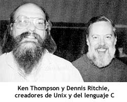

<link rel="stylesheet" href="../styles.css">


## Contenidos

1. [**Introducción a Linux**](01_introducción_linux.md)
2. [Instalación de Linux](02_instalación_linux.md)
3. [El sistema de ficheros en Linux](03_sistema_ficheros_linux.md)
4. [Comandos para el sistema de ficheros](04_comandos_sistema_ficheros.md)
5. [Comandos avanzados del shell Bash](05_avanzados_bash.md)
6. [Expresiones regulares](06_expresiones_regulares.md)


# 1.- INTRODUCCIÓN A LINUX

## 1.1.- Historia de Linux

Para analizar cómo se ha llegado a las versiones actuales de Linux debemos remontarnos al **año 1964**, donde los Laboratorios Bell (AT&T), General Electric y otras compañías estaban trabajando para desarrollar un sistema operativo muy complejo denominado **MULTICS**. La idea detrás de este sistema operativo era crear un sistema que diera servicio simultáneamente a múltiples usuarios. Aunque el proyecto fue finalmente abandonado por su bajo rendimiento, algunas de las ideas que implantó han servido de base a todos los sistemas operativos posteriores.

Tras dejar el proyecto, dos de los desarrolladores de este: **Ken Thompson** y **Dennis Ritchie**, decidieron aprovechar el trabajo que habían realizado con MULTICS para crear un nuevo sistema operativo más sencillo utilizando una vieja máquina DEC PDP-11, a este sistema operativo lo denominaron UNICS. La primera versión de este sistema operativo fue publicada en el año 1969 rebautizada como **UNIX**.



En el año 1972 publicaron una segunda versión de UNIX desarrollada con un nuevo lenguaje de programación que habían creado los mismos Thompson y Ritchie denominado **lenguaje C**. Al igual que UNIX ha tenido un gran impacto en todos los sistemas operativos posteriores, la gran mayoría de los lenguajes de programación actuales han evolucionado desde el lenguaje C. 

Rápidamente, Unix adquirió una gran popularidad, siendo portado a múltiples plataformas. La primera versión comercial de UNIX apareció en el año 1978 de la mano de Santa Cruz Operation (SCO), siendo rápidamente seguido por versiones de otras empresas: HP-UX, AIX de IBM, Microsoft Xenix, …

En los años 80 AT&T se percató del potencial comercial de UNIX, lo que le llevó a retirar a las universidades su licencia de uso de forma que aquellas que desearan utilizarlo deberían pagar por dicha licencia. La consecuencia directa de esto es que la Universidad de Berkeley decidió tomar la parte del código de Unix que habían aportado ellos mismo para realizar un sistema operativo totalmente suyo al que denominaron **NetBSD**.

De esta versión de Berkeley derivan una familia de Unix libres denominados **FreeBSD** y también sistemas operativos comerciales, entre los que destacan **SunOS**, utilizados en plataformas Solaris, y los populares **Mac OS X**.

Paralelamente a lo anterior, en el año 1983 **Richard Stallman** acuñó el concepto de software e inició el proyecto GNU, cuyo objetivo era construir un sistema operativo totalmente libre. Para ayudar en esta tarea fundó un par de años más tarde la **Free Software Foundation**. Para 1990 el proyecto GNU ya estaba bastante desarrollado y disponía de muchos de los programas necesarios para un sistema operativo: un compilador de C (gcc), librerías, un editor de textos (Emacs), un intérprete de comandos (Bash), … pero se habían quedado atascados en lo más importante: el núcleo. Había desarrollado un kernel, denominado **Hurd**, pero daba múltiples problemas.


Un par de años antes, en 1991, un estudiante de la Universidad de Helsinki, llamado **Linus Torvalds**, comenzó a usar en su PC un pequeño Unix gratuito, llamado **Minix**, que había sido programado por el profesor **Andrew Tannenbaum** desde cero con propósitos educativos y publicado su código en el libro *Operating Systemas. Designa and implementation*.  Como Minix era muy limitado, Linus decidió reescribir algunas de sus partes para hacerlo más funcional.

En octubre de 1991 Linus publicó la primera versión oficial de su sistema operativo, al que denominó **Linux**. Este era capaz de ejecutar el intérprete de comandos Bash y el compilador de C gcc. A partir de este momento, comenzaron a unirse al proyecto más y más programadores atraídos por la idea de completar el trabajo, reescribiendo, mejorando y acelerando el desarrollo de este sistema. En marzo de 1994 se publicó la versión 1.0, la cual ya era suficientemente completa y estable.

A partir de ese momento, Linux no ha parado de crecer, siendo en la actualidad ampliamente utilizado principalmente en entornos de servidores, así como en smartphones (ya que Android está basado en el kernel Linux).


## 1.2.- Estructura de un comando en Linux

A la hora de introducir las órdenes en Linux hay que ser muy cuidadoso con la sintaxis, ya que todos los caracteres que introduzcamos cuentan.

Los comandos tienen la siguiente sintaxis:

```bash
$ comando arg1 .. argN mod1 mod2 …
```

La primera palabra debe ser el comando a ejecutar, tras el que se indican los argumentos si los tiene, y los modificadores. Hay que tener en cuenta lo siguiente:

- Los **argumentos** suelen indicar los datos con los que trabaja el comando. Los **modificadores**, en cambio, alterar el funcionamiento habitual del comando.
- Linux es lo que se denomina case *sensitive*, es decir, que **distingue entre mayúsculas y minúsculas**.
- El separador de argumentos y de modificadores es el espacio, por lo que si un argumento contiene espacios debe rodearse de comillas, ya sean simples o dobles.
- El orden de los modificadores es indiferente, el de los argumentos debe ser el especificado en la sintaxis del comando.
- Los modificadores se pueden ver en la ayuda del comando, y tienen dos formas diferentes de indicarse:
  - Con una única letra, en cuyo caso se indican anteponiendo el símbolo guion (`-`)
  - Con una palabra, en cuyo caso se indican anteponiendo dos guiones (`--`)
- Se pueden combinar varios modificadores de una letra poniendo todos seguidos precedidos de un único guion. Por ejemplo, las órdenes `ls -l -a` y `ls -la` son equivalentes.
- Si un comando es muy largo se puede indicar en varias líneas. También se puede forzar el salto de línea poniendo el carácter barra invertida (`\`).
- Se pueden indicar varios comandos en la misma línea separándolos con el carácter punto y coma (`;`)
- La tecla  `Tab`  sirve para autocompletar la palabra que estamos escribiendo, ya sea un comando o un argumento. Al pulsar esta tecla completará la palabra actual a partir de los caracteres que ya hayamos introducido. Si hubiera varios que coinciden con los caracteres ya introducidos no mostrará nada y debemos pulsar el tabulador una segunda vez para que se muestren todas las posibilidades.
- Con los cursores arriba y abajo se puede navegar entre los comandos que hemos introducido previamente.
- Asimismo, se puede ver el listado de estos comandos con el comando `history`.
- También se puede buscar en el historial con la combinación de teclas  `Ctrl+R`.


## 1.3.- Ayuda en Linux

Linux dispone de un gran número de comandos y muchos con una sintaxis bastante compleja y con muchas opciones, por lo que habitualmente será necesario acceder a la ayuda. Afortunadamente, la ayuda en Linux es muy extensa y accesible.

El principal comando para consultar la ayuda en `man`, que invoca la página del manual de Linux del comando que se le pase como argumento. Por ejemplo, en la siguiente imagen se muestra la página del manual del comando `cp`.
 
 ```
CP(1)                                               User Commands                                               CP(1)

NAME
       cp - copy files and directories

SYNOPSIS
       cp [OPTION]... [-T] SOURCE DEST
       cp [OPTION]... SOURCE... DIRECTORY
       cp [OPTION]... -t DIRECTORY SOURCE...

DESCRIPTION
       Copy SOURCE to DEST, or multiple SOURCE(s) to DIRECTORY.

       Mandatory arguments to long options are mandatory for short options too.

       -a, --archive
              same as -dR --preserve=all

       --attributes-only
              don't copy the file data, just the attributes

       --backup[=CONTROL]
              make a backup of each existing destination file

       -b     like --backup but does not accept an argument

       --copy-contents
              copy contents of special files when recursive

 Manual page cp(1) line 1 (press h for help or q to quit)
 ```

Otro comando muy similar para obtener la ayuda es el comando `info`, que muestra la ayuda de una forma muy similar al comando `man`.

Si solo queremos saber qué hace un determinado comando disponemos de la orden `whatis`, que mostrará únicamente la función realizada por el comando pasado como parámetro.
 
 ```bash
┌──(victor㉿PORTATIL)-[/mnt/c/Users/victor]
└─$ whatis cp
cp (1)               - copy files and directories
 ```


***
[Volver al índice principal](index_UT10.md)