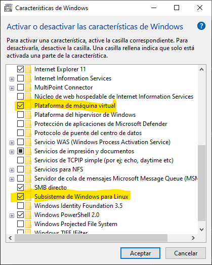
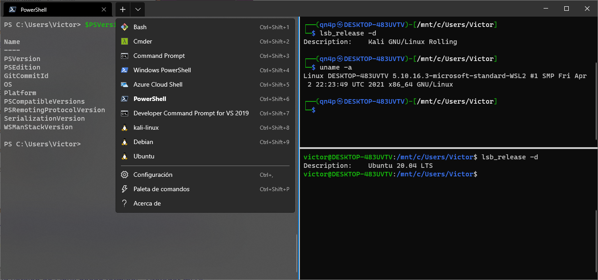

<link rel="stylesheet" href="../styles.css">


## Contenidos

1. [Introducción a Linux](01_introducción_linux.md)
2. [**Instalación de Linux**](02_instalación_linux.md)
3. [Bonding de red](03_bonding_red.md)
4. [El sistema de ficheros en Linux](04_sistema_ficheros_linux.md)
5. [Comandos para el sistema de ficheros](05_comandos_sistema_ficheros.md)
6. [Comandos avanzados del shell Bash](07_comandos_avanzados_bash.md)
7. [Expresiones regulares](08_expresiones_regulares.md)


# 2.- INSTALACIÓN DE LINUX


## 2.1.- Instalación de Linux mediante WSL (Subsistema de Windows para Linux)

En los últimos años se ha producido un acercamiento de Microsoft hacia Linux que se ha traducido en una integración cada vez mayor de Linux dentro de los sistemas Windows. Probablemente, el máximo exponente de esta integración sea **WSL (Windows Subsytem Layer)**, que permite ejecutar un kernel de Linux dentro de Windows sin necesidad de máquinas virtuales.

La última versión, **WSL 2**, permite incluso ejecutar aplicaciones gráficas de Linux, así como grandes mejoras en el rendimiento.

### 2.1.1.- Instalación de WSL

Lo primero que necesitamos es tener activado **Hyper-V** en Windows, ya que el kernel de Linux en WSL se ejecuta sobre el hipervisor de Windows.

Además, hay que activar las siguientes características:

- Plataforma de máquina virtual
- Subsistema de Windows para Linux

Estas pueden ser activadas mediante la herramienta *Activar o desactivar las herramientas de Windows*.



También es posible activarlas desde Powershell, para ello se ejecutan las siguientes órdenes y a continuación se reinicia el sistema.

```powershell
PS C:\>dism.exe /online /enable-feature /featurename:Microsoft-Windows-Subsystem-Linux /all /norestart

PS C:\>dism.exe /online /enable-feature /featurename:VirtualMachinePlatform /all /norestart
```

### 2.1.2.- Instalación de WSL 2

En este momento tenemos WSL, que es requisito para tener WSL 2. Ahora realizamos los siguientes pasos:

- Descargamos el [kernel de WSL 2](https://wslstorestorage.blob.core.windows.net/wslblob/wsl_update_x64.msi)
- Ejecutamos el instalador
- Establecemos WSL 2 como opción por defecto con la orden `wsl --set-default-version 2`


### 2.1.3.- Opciones de WSL

Una vez que ya tenemos WSL 2 instalado en nuestro sistema podemos ejecutar los siguientes comandos en una terminal de Powershell.

#### Mostrar todas las distribuciones que se pueden instalar

```powershell
PS C:\> wsl --list --online
A continuación, se muestra una lista de las distribuciones válidas que se pueden instalar.
Instalar con 'wsl --install -d <Distribución>'.

NAME            FRIENDLY NAME
Ubuntu          Ubuntu
Debian          Debian GNU/Linux
kali-linux      Kali Linux Rolling
openSUSE-42     openSUSE Leap 42
SLES-12         SUSE Linux Enterprise Server v12
Ubuntu-16.04    Ubuntu 16.04 LTS
Ubuntu-18.04    Ubuntu 18.04 LTS
Ubuntu-20.04    Ubuntu 20.04 LTS
```


#### Ver las distribuciones que tenemos instaladas en el sistema

```powershell
PS C:\> wsl --list --verbose
  NAME          STATE           VERSION
* kali-linux    Running         2
  Debian        Stopped         2
```

#### Instalar una distribución

```powershell
PS C:\> wsl --install --distribution Ubuntu
Descargando: Ubuntu
Instalando: Ubuntu
Se ha instalado Ubuntu.
Iniciando Ubuntu...
```

Cuando se ejecuta esta orden se descargará la distribución y solicitará introducir un nombre de usuario y contraseña. Este usuario es independiente del usuario de Windows y se utilizará solamente dentro de la distribución instalada. 


#### Lanzar una distribución

```powershell
PS C:\> wsl -d ubuntu
To run a command as administrator (user "root"), use "sudo <command>".
See "man sudo_root" for details.

victor@DESKTOP-483UVTV:/mnt/c/$ exit
logout
PS C:\>
```

Si tenemos instalado Windows Terminal será posible abrir diferentes distribuciones en diferentes pestañas. Simplemente hay que elegir la distribución deseada en el menú desplegable que hay a la derecha de las pestañas.




## Instalación de Linux en máquina física o virtual

El proceso de instalación de Linux en una máquina, ya sea física o virtual, es muy sencillo, y las preguntas que hay que responder dependen en gran medida de la distribución que estemos instalando.


***
[Volver al índice principal](index_UT10.md)