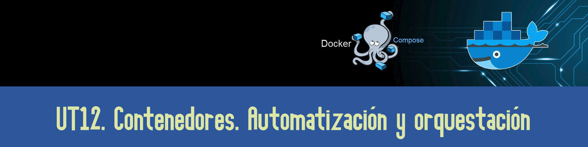

# UT12. CONTENEDORES. AUTOMATIZACIÓN Y ORQUESTACIÓN

PONER EL RESUMEN DE LA UNIDAD

### Contenidos

1. Virtualización de servicios con contenedores. Docker.
2. Despliegue automatizado de máquinas virtuales. Vagrant.
3. Herramientas de gestión de la configuración. Ansible.

### Prácticas

- PR1201: Vagrant

***
[Volver al índice principal](../index.md)