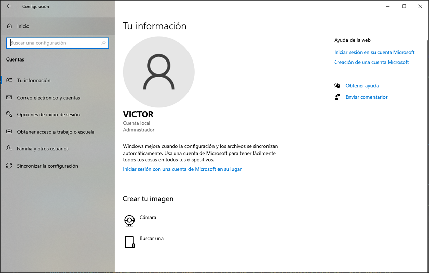
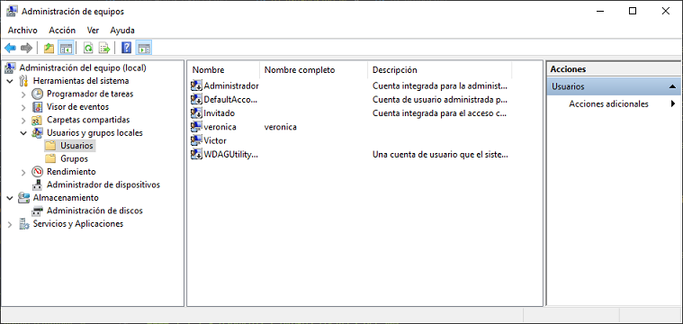
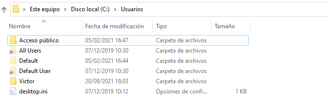
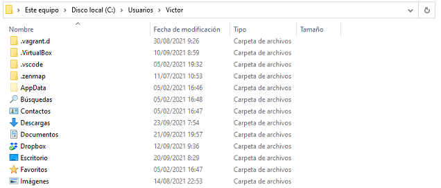
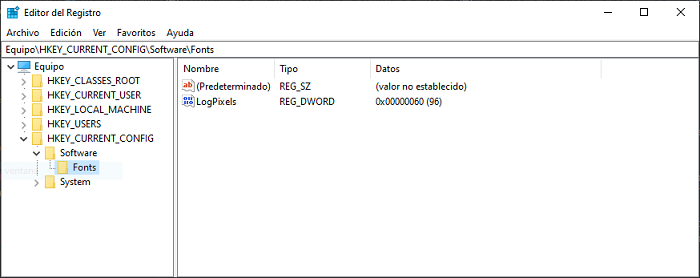

# 4.- Gestión de usuarios en Windows

Las cuentas de usuario y los grupos son un elemento muy importante en la administración de un sistema operativo, ya que a través de ellos se gestiona toda la seguridad del sistema mediante los permisos sobre el sistema de ficheros y a través de los derechos de usuario. Todo lo que un usuario puede hacer en el sistema está validado a través de sus credenciales.


## 4.1.- Conceptos básicos sobre usuarios

A grandes rasgos, en Windows 10 se distinguen dos tipos de cuentas: 
- **Cuentas de administrador**: permiten acceso sin límites para todo tipo de tareas administrativas, tales como instalar software, modificar el registro o crear nuevos usuarios.
- **Cuentas de usuario**: son las cuentas utilizadas por los usuarios para el trabajo diario, tal como aplicaciones ofimáticas, navegación por Internet, … Trabajar como usuario normal incrementa la seguridad ya que limita el alcance que puedan tener posibles virus o código malicioso que pueda infectar el ordenador. Esto se debe a que los programas tienen tantos privilegios como el usuario que los ejecuta


### 4.1.1.- Cuentas predefinidas

Cuando instalamos Windows 10 hay un número de usuarios que son creados automáticamente, por lo que son comunes a todos los sistemas. Estas cuentas son:

- **Administrador**: es una cuenta especial que tiene control total sobre todo el equipo. Por defecto está deshabilitada, por lo que no se puede iniciar sesión con ella.
- **DefaultAccount**: es una cuenta de usuario creada por el sistema y que solamente es utilizada por él. 
- **Invitado**: permite a los usuarios acceder al sistema incluso aunque no tenga credenciales. Dado que hay riesgos de seguridad inherentes a este tipo de cuentas está deshabilitada por defecto. Cuando se habilita, su número de privilegios es muy reducido.
- **HomeGroupUser$**: esta cuenta permite a la máquina conectarse a otras máquinas si tenemos un grupo de hogar. Es creada en el momento en que nos unimos a un Home Group.
- **Usuario inicial**: Esta cuenta es la que se crea para el usuario de Windows durante la instalación, con el nombre que escoja el usuario. Hay que tener en cuenta que tiene privilegios de administrador.


### 4.1.2.- Cuentas locales y cuentas de dominio

Windows 10 soporta dos tipos de cuentas: **cuentas locales** y **cuentas de dominio**. Este tipo de cuentas depende del entorno de red en el que trabaje el equipo, bien sea un grupo de trabajo o un dominio.

- **Dominio**: en un dominio con Active Directory hay una administración centralizada de todos los usuarios de la red, lo que significa que la información de los usuarios no se almacena en cada uno de los equipos sino que se gestiona desde un servidor. Cuando un usuario inicia sesión sus credenciales no se validan en el propio equipo, sino que lo hacen en el servidor.
- **Grupo de trabajo**: la alternativa a la gestión centralizada de la red son los grupos de trabajo. En este caso tenemos una red descentralizada donde los usuarios no pertenecen a toda la red, sino que pertenecen a cada equipo de esta. Cuando iniciamos sesión en un equipo, las credenciales se verifican en el propio equipo, y, por tanto, son propias del mismo, no valdrían para otro equipo. Incluso si tuviéramos en dos equipos diferentes dos usuarios con el mismo nombre y contraseña, seguirían siendo usuarios diferentes, ya que cada uno pertenece a un equipo diferente.


## 4.2.- Trabajando con cuentas de usuario

Para administrar los usuarios y grupo de un sistema tenemos dos posibles medios. Por un lado, hay un complemento de la consola de administración de Microsoft denominada **Usuarios y grupos locales**, y por otro, la herramienta **Cuentas** que podemos encontrar dentro de **Configuración**.


### 4.2.1.- Desde el menú de configuración

Desde el diálogo *Configuración* podemos acceder a la gestión de nuestra propia cuenta. En este punto conviene destacar que en Windows 10 hay dos tipos de cuentas de usuario:

- **Cuenta local**: son las cuentas tradicionales de Windows. Creadas y gestionadas en el propio equipo y cuyo alcance no va más allá del mismo.
- **Cuentas de Microsoft**: en este caso nuestra cuenta está vinculada a una cuenta en la nube de Microsoft, identificada por un correo electrónico. Microsoft poco a poco va forzando a los usuarios hacia la utilización de este tipo de cuentas, por lo que hay algunas funcionalidades que solo están disponibles en ellas, tales como la sincronización.



Cuando vamos al apartado Cuentas de *Configuración* tenemos las siguientes opciones:

- **Tu información**: aquí tenemos una visión global de la cuenta y podremos cambiar la imagen de esta, así como pasar a una cuenta de Microsoft si estuviéramos trabajando con una cuenta local.
- **Correo electrónico y cuentas**: se pueden añadir otras cuentas para utilizarlas con el correo electrónico, el calendario, … Por ejemplo, la cuenta de Office 365 aunque la nuestra sea una cuenta local.
- **Opciones de inicio de sesión**: probablemente el apartado más interesante del UAC ya que hay un gran número de opciones para configurar:
    - **Inicio de sesión**: en Windows 10 hay múltiples formas de iniciar sesión, y se pueden configurar desde aquí. Estas formas son:
        - **Rostro de Windows Hello**: si tienes una cámara compatible se puede iniciar sesión mediante reconocimiento facial.
        - **Huella digital de Windows Hello**: otro sistema de identificación biométrica, necesitando en este caso un lector de huellas digitales.
        - **PIN de Windows Hello**: esta opción es interesante cuando la cuenta que utilizamos es una cuenta de Microsoft. Cuando es así, la contraseña que tenemos que introducir es la de la cuenta de Microsoft, y eso puede suponer un problema de seguridad, ya que esa contraseña es la que da acceso a nuestra cuenta en la nube, y, por tanto, posiblemente a todos nuestros datos. Además, esa contraseña debería ser suficientemente complicada, lo que implica un engorro teclearla cada vez que iniciemos sesión. El Pin es una alternativa al uso de esta contraseña, permitiendo definir una contraseña únicamente válida para este equipo.
        - **Clave de seguridad**: un principio de la seguridad informática es que hay diferentes formas de identificar a un usuario en un sistema. Puede ser mediante algo que el usuario sabe (una contraseña), por algo que el usuario es (reconocimiento facial o huella dactilar) o algo que el usuario tiene, y este último método es lo que podemos definir aquí. En este caso lo que se tiene es una memoria USB. Con esta opción podremos insertar un USB y cargar en él un archivo con la clave de forma que cada vez que iniciemos sesión tengamos que introducir dicha memoria USB.
        - **Contraseña**: aquí podemos cambiar la contraseña habitual que utilizamos.
        - **Contraseña de imagen**: en este caso nos identificaremos mediante una serie de movimientos predefinidos con el ratón sobre una imagen.
    - **Requerir inicio de sesión**: para indicar si el usuario tiene que autenticarse cuando el equipo vuelve de la suspensión o no.
    - **Bloqueo dinámico**: si nuestro equipo tiene Bluetooth podemos activar esta opción, en la cual se empareja nuestro ordenador con otro dispositivo, por ejemplo, un teléfono móvil, de forma que si no se detecta ese dispositivo cerca del ordenador lo bloquee.
- **Familia y otros usuarios**: si queremos agregar otras cuentas al equipo. Aquí también tenemos la opción de quisco multimedia, interesante en ordenadores que están expuestos al público y se quiere que este muestre una única aplicación de la que los usuarios no podrán salir. 
- **Sincronizar la configuración**: para esto necesitamos una cuenta de Microsoft que utilicemos en varios ordenadores y permite compartir automáticamente información entre ellos.


### 4.2.2.- Usuarios y grupos locales del MMC

A este complemente podemos acceder creando una consola MMC personalizada, o bien utilizando la consola **Administración de equipos**, a la que se accede seleccionando *Administrar* en el menú contextual (botón derecho del ratón) de *MiPC*.



Este es el sitio más adecuado para crear cuentas locales. Al crear un usuario nos pide la siguiente información:

- **Nombre de usuario**: el nombre con el que se iniciará sesión. Este es el único campo obligatorio. Es importante mantener la nomenclatura en la organización, por ejemplo, inicial del nombre más apellidos. Además, también hay que prever un mecanismo para saber cómo tratar con nombres de usuario duplicados. Hay una serie de reglas que hay que cumplir con el nombre de usuario:
   - Debe tener entre 1 y 20 caracteres
   - Debe ser único entre el resto de los usuarios y grupos del equipo.
   - No puede contener los siguientes caracteres: `/\[]:;|=,+?<>”@`
   - No puede estar formado exclusivamente por guiones o espacios.
- **Nombre completo**: permite introducir el nombre completo del usuario.
- **Descripción**: si queremos introducir información extra, como el cargo o la localización.
- **Contraseña** y **Confirmar contraseña**
- **El usuario debe cambiar la contraseña en el siguiente inicio de sesión**: obliga al usuario a introducir su propia contraseña.
- **El usuario no puede cambiar la contraseña**: solo los administradores podrán cambiar la contraseña de un usuario
- **La contraseña nunca expira**: con esto nos saltamos las directivas de seguridad que establezcan una fecha de caducidad de las contraseñas.
- **La cuenta está deshabilitada**: la contraseña no podrá ser utilizada para iniciar sesión con ella. Esta opción puede ser interesante si queremos utilizar la cuenta como plantilla para crear otras cuentas, o bien si un empleado va a estar ausente un tiempo, para evitar un uso indebido de su cuenta.
  
Cuando creamos un usuario, lo identificamos mediante el nombre de usuario que le hemos asignado durante su creación. Sin embargo, internamente Windows no utiliza este nombre, sino que asigna a cada usuario un identificador, denominado SID (Secure Identifier). Utilizando Powershell podemos ver el identificador que tiene asignado cada usuario.
 
```powershell
PS C:\> Get-LocalUser | Select-Object name, sid

Name               SID
----               ---
Administrador      S-1-5-21-3905278565-3786481297-2151777357-500
DefaultAccount     S-1-5-21-3905278565-3786481297-2151777357-503
Invitado           S-1-5-21-3905278565-3786481297-2151777357-501
...
```

Todas las restricciones de seguridad asociadas al usuario hacen referencia a este identificador, y no al nombre de usuario. Esto conlleva una serie de ventajas muy importantes:

- Permite cambiar el nombre del usuario sin afectar nada, ya que la configuración de seguridad está asociada al SID y no al nombre del usuario.
- Evita los problemas que podríamos tener si eliminamos un usuario y creamos posteriormente otro con el mismo nombre de usuario, ya que tendrá diferente SID.

Como curiosidad, el significado de cada una de las partes del SID es:

- Los tres primeros caracteres indican que es un SID (`S`), el nivel de revisión (`1`) y el valor de entidad de identificación (`5, nt authority`)
- A continuación va el identificador de dominio (los siguientes tres bloques de dígitos), único para cada dominio, de forma que se garantiza que no habrá dos SID iguales en diferentes dominios de la misma empresa. En el caso de las cuentas y grupos integrados, este valor siempre es 32 (Builtin). Por ejemplo, el grupo integrado **Administradores** tiene siempre el SID `S-1-5-32-544`.
- Finalmente, el último número es el identificador de la cuenta dentro del dominio.

Si quieres saber más sobre los SID o simplemente consultar los SID universales conocidos que son los mismos en todos los equipos puedes consultarlo en la [web de Microsoft](https://docs.microsoft.com/es-es/windows/security/identity-protection/access-control/security-identifiers).

### 4.2.3.- Deshabilitando cuentas de usuario

Aunque las cuentas de usuario se pueden eliminar, realmente no es una buena política, siendo aconsejable **deshabilitarlas**, de forma que la cuenta sigue existiendo, pero no será posible iniciar sesión con ella.

Hay que tener en cuenta que, si borramos una cuenta de usuario, todos los datos de este se perderán, no siendo posible recuperarlos. Además, en aquellos ficheros sobre los que hubiera tenido permiso el usuario seguirán tendiendo el SID de este en su ACL, aunque ya no corresponda a ningún usuario.


### 4.2.4.- Eliminando y renombrando cuentas de usuario

Estas dos funciones también se podrán realizar mediante la consola del MMC, en el complemento **Usuarios y grupos locales**.

Renombrar las cuentas de usuario es un proceso muy sencillo y sin ningún efecto colateral gracias a que internamente Windows no utiliza el nombre de usuario, sino que todo lo que esté relacionado con el usuario lo está a través del SID. 

Por ejemplo, esta puede ser una buena práctica en el caso de antiguos empleados, cuya cuenta haya sido deshabilitada, para reflejar esa condición en el nombre de este.


## 4.3.- Control de Cuentas del Usuario (UAC)

### 4.3.1.- ¿Qué es el UAC?

El **Control de Cuentas de Usuarios (UAC)** es una tecnología e infraestructura de seguridad, introducida en Windows Vista, que pretende marcar una distinción clara para el usuario entre operaciones diarias de trabajo en el sistema y operaciones que requieren privilegios especiales y que, por tanto, son susceptibles de ser utilizadas por software malicioso para realizar cambios no autorizados en el sistema.

Básicamente, UAC consiste en que, aunque el usuario tenga privilegios de administrador, todas las operaciones que ejecute lo harán en un contexto de usuario normal, a menos que autorice explícitamente mediante un cuadro de diálogo que se mostrará cuando una aplicación vaya a realizar un cambio que afecte en el sistema. Esto evita que aplicaciones, virus, malware o usuarios inexpertos realicen cambios sin conocimiento del administrador.

Las acciones que activarán el UAC son fácilmente identificables porque hay un escudo amarillo y azul en ellas, indicando que son necesarios privilegios elevados para realizarlas.


El cuadro de diálogo de advertencia varía en función de si el usuario que las lanza tiene privilegios de administrador o no: 

- Si el usuario tiene privilegios de administrador simplemente le informará de qué programa es el que quiere realizar la acción, siendo necesaria la confirmación por parte del usuario. 
- En cambio, si se trata de un usuario sin privilegios, el cuadro de diálogo será diferente, solicitándole que introduzca las credenciales de un usuario que sea administrador.
 	 
Por defecto, cuando se muestra este cuadro de diálogo el fondo se atenúa, indicando que el sistema entra en un estado especial en el que bloquean todos los programas hasta que se cierre este diálogo. Esto sirve para impedir que otro programa interfiera con este cuadro de diálogo, por ejemplo, simulando la pulsación del botón **Sí** haciéndose pasar por el usuario.


### 4.3.2.- Niveles del UAC

Es posible cambiar la configuración del UAC yendo a la aplicación Cambiar la configuración de *Control de Cuentas de Usuario*, en la que podemos escoger entre cuatro niveles diferentes:

- **Notificar siempre**: en este caso nos avisará siempre que el usuario o programas intenten realizar cambios en el sistema. Es la más restrictiva de todas las opciones, equivalente a la implementada en Windows Vista, siendo la más molesta para el usuario. También es la opción más segura.
- **Notificarme solo cuando los programas intenten realizar cambios en mi equipo**: esta es la opción activada por defecto y solo pedirá confirmación cuando algún programa intente realizar cambios que requieran privilegios administrativos. Si es el usuario quien realiza las operaciones manualmente no se le mostrará el cuadro de diálogo. Esta opción tiene algunos potenciales problemas de seguridad, ya que un programa malicioso podría simular pulsaciones de teclas y movimientos del ratón para realizar las operaciones.
- **Notificarme solo cuando una aplicación intente realizar cambios en el equipo (no atenuar el escritorio)**: no se avisa cuando el usuario realiza manualmente las operaciones, pero, además, cuando un programa intenta realizar cambios y se muestra el cuadro de diálogo para solicitar confirmación, no lo hará en un modo especial, sino que se mostrará como una ventana más. Este método es menos intrusivo, pero incrementa el riesgo en la seguridad, ya que una aplicación maliciosa podría simular el movimiento del ratón para pulsar el botón de confirmación.
- **No notificarme nunca**: en este nivel deshabilitamos completamente el UAC, por lo que el usuario no se verá interrumpido por ningún aviso, suponiendo por tanto un importante problema de seguridad.


## 4.4.- Perfiles de usuario

### 4.4.1.- El directorio C:/Usuarios

En un equipo con Windows, cada usuario tiene su propio entorno, por ejemplo, tiene sus documentos en la carpeta *Mis documentos*, tiene un tema establecido, o cualquier otra personalización que únicamente pueda ver desde su cuenta. 

Toda esta información propia del usuario se almacena en lo que se llama **perfil del usuario**. El perfil de cada usuario se guarda en una carpeta dentro del directorio `C:\usuarios`. En este directorio habrá un subdirectorio por cada usuario del sistema qué tendrá el mismo nombre que dicho usuario y, en su interior, tendremos todos los datos propios de este. Por defecto, cada usuario solamente tiene permiso para ver el contenido de su propio perfil. 
 
Si accedemos al directorio `C:\Usuarios`, podemos ver que, aparte de los directorios que pertenecen los usuarios, hay una serie de directorios o **perfiles predefinidos**. Estos son:

- **Acceso público**: Si accedemos a este directorio podremos ver que tiene una serie de subdirectorios análogos a las carpetas de documentos del usuario, por ejemplo, hay uno para descargas, documentos, imágenes, música, o videos. Todos los usuarios del sistema tienen permiso de lectura y escritura sobre todos estos directorios, y sirven para intercambiar documentos con el resto de los usuarios del equipo o de la red. 
- **Default**: Cada vez que creamos un usuario en el sistema se le tiene que crear una carpeta con su propio perfil, para ello, necesitaremos un perfil que sirva como plantilla coma y ese es precisamente, el cometido del directorio *Default*. Cuando se crea un perfil de usuario se coge todo el contenido de este directorio y se copia en el directorio del perfil del usuario recién creado. Esto, puede ser útil cuando queremos que todos los usuarios creados el sistema tengan una serie de configuraciones o documentos ya incluidos desde el momento de su creación. 
- **All Users**: Este perfil incluye configuración común a todos los usuarios. Por norma general, las aplicaciones que instalemos que son utilizables para todos los usuarios, incluirán sus configuraciones en este perfil. Por ejemplo, aquellas que ponen un acceso directo a dicha aplicación en el escritorio. Cualquier elemento que coloquemos en este perfil será accesible en los perfiles de todos los usuarios.



Hay que tener en cuenta que alguna de estas carpetas puede no mostrarse, ya que, por defecto, algunas están ocultas (por lo que habrá que marcar la casilla *Elementos ocultos*) y otras están marcadas como *archivos protegidos del sistema*, siendo necesario ir a *Vista -> Opciones -> Cambiar opciones de carpeta y búsqueda -> Pestaña Ver* y desmarcar la opción *Ocultar archivos protegidos del sistema operativo*.


### 4.4.2.- El directorio de perfil

Dentro del directorio de *Usuarios*, cada usuario tiene un directorio propio con su perfil en el que él es el único que tiene permiso de lectura. Aquí podemos identificar las carpetas que vemos en el Explorador de archivos, tales como *Documentos*, *Imágenes*, … o incluso el *Escritorio*, cuyo contenido está en la carpeta homónima (en función del idioma de instalación es posible que los nombres de estos directorios sean *Images*, *Documents*, *Desktop*, ...)




### 4.4.3.- El fichero NTUSER.DAT

De todos los ficheros que podemos encontrar en la carpeta de perfil de un usuario, probablemente el más importante sea el fichero **NTUSER.DAT**, un fichero oculto que contiene la configuración y preferencias del usuario.

Cada vez que el usuario aplica un cambio de configuración, como modificar el fondo de escritorio o seleccionar una resolución de monitor diferente, debe haber un sitio donde se puedan almacenar estos datos para que la próxima vez que inicie sesión se recuerden, y este lugar es el fichero `NTUSER.DAT`.

En realidad, el fichero `NTUSER.DAT` guarda la configuración cuando el usuario cierra sesión, pero mientras el usuario está trabajando con el ordenador estos datos se guardan en un sitio más accesible, y este sitio es el **registro**, así que este es un buen momento para comprender qué es el registro de Windows.


### 4.4.4.- El registro de Windows

El **registro de Windows** es un gran contenedor de información que tiene una estructura arborescente y donde tanto Windows como las aplicaciones que tengamos guardan información. La definición oficial del registro según el Microsoft Computer Dictionary es la siguiente:

> Una base de datos jerárquica central utilizada en Microsoft Windows 98, Windows CE, Windows NT y Windows 2000 con el fin de almacenar información necesaria para configurar el sistema para uno o varios usuarios, aplicaciones y dispositivos hardware.
> El Registro contiene información que Windows utiliza como referencia continuamente, por ejemplo, los perfiles de los usuarios, las aplicaciones instaladas en el equipo y los tipos de documentos que cada aplicación puede crear, las configuraciones de las hojas de propiedades para carpetas y los iconos de aplicaciones, los elementos de hardware que hay en el sistema y los puertos que se están utilizando.
> El Registro reemplaza a la mayoría de los archivos .ini basados en texto que se utilizan en los archivos de configuración de Windows 3.x y MS-DOS, como Autoexec.bat y Config.sys. Aunque el Registro es común a varios sistemas operativos Windows, existen algunas diferencias entre ellos.

Es posible ver el contenido del registro mediante el programa `regedit.exe`.
 


Al abrir el registro se pueden apreciar 5 nodos principales que dan paso a las 5 ramas del registro:

- **HKEY_CLASSES_ROOT**: contiene todos los tipos de archivos registrados en el sistema con sus aplicaciones asociadas y los comandos que admiten, así como datos utilizados por Windows para las operaciones OLE (copiar, cortar, pegar, ...).
- **HKEY_LOCAL_MACHINE**: es probablemente la rama más importante, ya que en ella se guardan todos los aspectos de configuración tanto del sistema operativo como de todo el software instalado o de los dispositivos hardware. Las tres subclaves más importantes son:
    - **HARDWARE**: contiene todos los datos de la configuración del sistema, incluyendo desde las funciones ACPI soportadas hasta el gestor de dispositivos Plug and Play.
    - **SOFTWARE**: almacena toda la información de las aplicaciones instaladas.
    - **SYSTEM**: controla los servicios que se cargarán al iniciar la sesión, así como los datos de arranque, las diferentes configuraciones posibles, el nombre de la máquina y el control del sistema de archivos.
    - **SAM**: contiene las cuentas de usuario locales y la información sobre grupos, incluyendo sus contraseñas. Debido a lo sensible de estos datos, hay que tener privilegios especiales para acceder a ellos, pudiendo únicamente el usuario SYSTEM .
- **HKEY_USERS**:  contiene información específica de todos los usuarios activos en el sistema. Esto incluye todos los usuarios que tienen iniciada sesión en ese momento, así como los usuarios especiales del sistema. Cada clave del registro dentro de este nodo está identificada mediante el **Identificador de Seguridad (SID)** de dicho usuario. Los valores almacenan configuraciones específicas de ese usuario, tales como unidades mapeadas, impresoras instaladas, variables de entorno, … que son cargadas en cuanto el usuario inicia sesión. Los nodos que podemos encontrar son:
    - **.DEFAULT**: su contenido es el mismo que el de la subclave S-1-5-18
    - **S-1-5-18**: corresponde a la cuenta del sistema local.
    - **S-1-5-19**: almacena datos de la cuenta del servicio local (Local Service)
    - **S-1-5-20**: corresponde al servicio de red (Network Service)
    - **S-1-5-21-XXX**: son las cuentas de usuarios. 
- **HKEY_CURRENT_CONFIG**: este nodo no almacena información, sino que apunta a un nodo dentro de HKEY_LOCAL_MACHINE que contiene información sobre el perfil hardware utilizado.
- **HKEY_CURRENT_USER**: contiene la configuración del usuario que ha iniciado sesión. El contenido de este nodo es almacenado en el fichero NTUSER.DAT.

