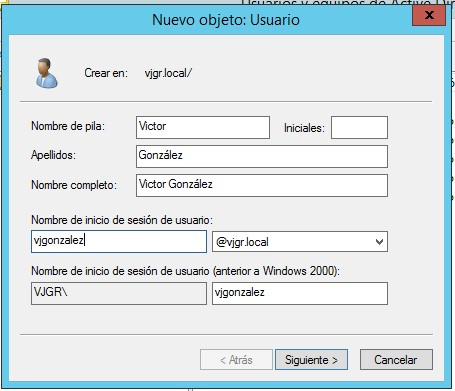
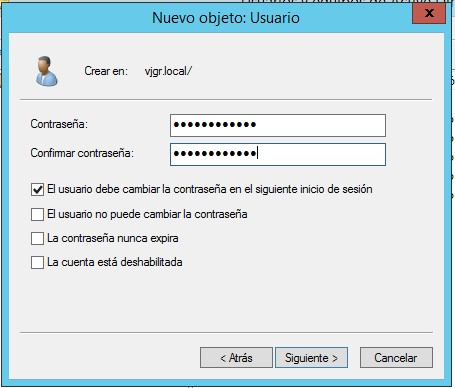

# 2.- Usuarios y grupos del dominio

## 2.1.- Herramientas de administración de usuarios

Al igual que ocurre en los sistemas de escritorio, los usuarios y grupos son uno de los elementos más importantes de un dominio ya que prácticamente toda la seguridad del sistema gira en torno a ello.

Aparte de **Powershell**, Active Directory dispone de dos herramientas gráficas para la creación y gestión de los mismos: **Usuarios y Equipos de Active Directory** y el **Centro de administración de Active Directory**. Ambas son similares en cuanto a funcionalidad y la elección de una u otra dependerá de nuestras preferencias.

## 2.2.- Contenedores del dominio

Cuando abrimos cualquiera de las dos herramientas anteriores podemos ver que hay una serie de contenedores en el dominio. En principio únicamente vemos seis de estos contenedores, pero podremos ver el listado completo yendo al menú `Ver -> Características avanzadas`.

Algunos de los más importantes son:

- **Builtin**: contiene todos los grupos predefinidos del sistema. Como recordarás, los grupos predefinidos son grupos creados con el sistema con una serie de permisos pre-asignados que sirven para otorgar privilegios a usuarios mediante su pertenencia a los mismos.
- **Computers**: por defecto, cada equipo que es agregado al dominio se incluye en este contenedor.
- **Domain controllers**: análogo al anterior, pero para los controladores de dominio.
- **LostAndFound**: contiene objetos que han sido creados a la vez que la Unidad Organizativa que los va a contener ha sido eliminada. 
- **System**: contine información de configuración sobre el dominio.
- **Users**: contiene otros usuarios y grupos predefinidos del sistema (aparte de los que hay en *Builtin*) y, además, se utiliza como contenedor para los nuevos usuarios que se creen en el dominio.

## 2.3.- Grupos de seguridad predeterminados de Active Directory

Los grupos de seguridad predeterminados de Active Directory los podemos ver en los contenedores `Builtin` y `Users`. Estos grupos sirven para **otorgar acceso a los recursos compartidos y para delegar roles administrativos** específicos en todo el dominio.

A muchos grupos predeterminados se les asigna automáticamente un conjunto de derechos de usuario que autorizan a los miembros del grupo a realizar acciones específicas en un dominio, como iniciar sesión en un sistema local o realizar copias de sguridad de archivos y carpetas (grupo *Operadores de copia de seguridad*).

Agregar un usuario a uno de estos grupos le otorgará todos los privilegios y permisos asociados a dicho grupo.

Hay un gran número de grupos de seguridad predeterminados cuyo nombre es bastante descriptivo de la función que realizan. Si quieres información más detallada sobre alguno de ellos puedes consultar [esta página](https://learn.microsoft.com/es-es/windows-server/identity/ad-ds/manage/understand-security-groups) de Microsoft.

## 2.4.- Grupos de identidades especiales

Los **grupos de identidades especiales** son unos grupos especiales del dominio que no tienen pertenencias específicas que se puedan modificar (es decir, no podemos agregar o eliminar manualmente usuarios a los mismos), pero pueden representar usuarios diferentes en momentos diferentes en función de las circunstancias.

Algunos de estos grupos son:

- **Inicio de sesión anónimo**: cualquier usuario que acceda al sistema a través de un inicio de sesión anónimo, por ejemplo, un usuario que visita una web publicada en el servidor corporativo.
- **Usuarios autenticados**: cualquier usuario que ha accedido al sistema a través de un proceso de inición de sesión.
- **Todos**: todos los usuarios interactivos, de red, de acceso telefónico y autenticados son miembros de este grupo.
- **Interactivo**: contiene todos los usuarios que han iniciado sesión en el sistema local.
- **Red**: este grupo incluye implícitamente todos los usuarios que han iniciado sesión a través de una conexión de red.
- **Inicio de sesión interactivo remoto**: representa a todos los usuarios que han iniciado sesión actualmente en un equipo mediante una conexión de Protocolo de Escritorio remoto. Este grupo es un subconjunto del grupo *Interactivo*.

En la [web de Microsoft](https://learn.microsoft.com/es-es/windows-server/identity/ad-ds/manage/understand-special-identities-groups) puedes consultar la relación completa de grupos de entidades especiales y qué usuarios incluye cada uno.

## 2.5.- Creación de usuarios en el dominio

La creación de usuarios es un proceso muy sencillo. La ventana que se muestra cuando creamos un usuario es la siguiente:

Los datos que hay que rellenar son:

- **Nombre de pila y apellidos**: estos campos son meramente informativos.
- **Nombre de inicio de sesión de usuario**: es el nombre por el que se identificará al usuario en el sistema, por lo que debe ser **único en todo el dominio** y además respetar las mismas normas de nomenclatura que ya vimos en Windows 10. Hay dos formas de representar el nombre de inicio de sesión de usuario completo:
  - La forma por defecto es añadiendo al nombre de usuario el símbolo arroba y el nombre del dominio al que pertenece el usuario. Por ejemplo, `vjgonzalez@vjgr.local`.
  - La otra representación compatible con versiones más antiguas, es precediendo el nombre del usuario con el nombre NETBIOS del dominio y el símbolo contrabarra. Por ejemplo: `VJGR\vjgonzalez`.