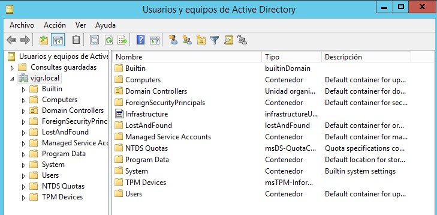

# 2.- Usuarios y grupos del dominio

## 2.1.- Herramientas de administración de usuarios

Al igual que ocurre en los sistemas de escritorio, los usuarios y grupos son uno de los elementos más importantes de un dominio ya que prácticamente toda la seguridad del sistema gira en torno a ello.

Aparte de **Powershell**, Active Directory dispone de dos herramientas gráficas para la creación y gestión de los mismos: **Usuarios y Equipos de Active Directory** y el **Centro de administración de Active Directory**. Ambas son similares en cuanto a funcionalidad y la elección de una u otra dependerá de nuestras preferencias.

## 2.2.- Contenedores del dominio

Cuando abrimos cualquiera de las dos herramientas anteriores podemos ver que hay una serie de contenedores en el dominio. En principio únicamente vemos seis de estos contenedores, pero podremos ver el listado completo yendo al menú `Ver -> Características avanzadas`.

Algunos de los más importantes son:

- **Builtin**: contiene todos los grupos predefinidos del sistema. Como recordarás, los grupos predefinidos son grupos creados con el sistema con una serie de permisos pre-asignados que sirven para otorgar privilegios a usuarios mediante su pertenencia a los mismos.
- **Computers**: por defecto, cada equipo que es agregado al dominio se incluye en este contenedor.
- **Domain controllers**: análogo al anterior, pero para los controladores de dominio.
- **LostAndFound**: contiene objetos que han sido creados a la vez que la Unidad Organizativa que los va a contener ha sido eliminada. 
- **System**: contine información de configuración sobre el dominio.
- **Users**: contiene otros usuarios y grupos predefinidos del sistema (aparte de los que hay en *Builtin*) y, además, se utiliza como contenedor para los nuevos usuarios que se creen en el dominio.

