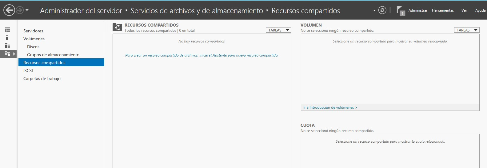

# 3.- Carpetas personales en Active Directory

Comenzando ya con las tareas básicas de administración de Active Directory, la primera que abordaremos será la creación de **carpetas personales** para los usuarios. Estas carpetas permitirán al usuario disponer de un espacio de almacenamiento accesible desde cualquier ubicación de la red a través de una unidad de red.

La creación de carpetas personales se puede dividir en tres partes:
- Creación de una carpeta compartida en el servidor que contenga todas las carpetas de los usuarios.
- Configuración de una carpeta compartida en la cuenta de cada usuario.
- Acceder desde el equipo cliente a la carpeta compartida.

## 3.1.- Creación de una carpeta compartida en el servidor

## 3.2.- Asociación de la carpeta compartida a la cuenta del usuario

## 3.3.- Comprobar que el usuario puede acceder a ella

Primero creamos una carpeta en el servidor

Compartimos la carpeta de forma similar a como lo hacemos en Windows 7
Vamos a Propiedades de la carpeta y en la pestaña Compartir hacemos click en Uso compartido avanzado.

Marcamos la casilla de Compartir esta carpeta y ponemos el nombre por el que queremos que se muestre la carpeta en la red.

Al igual que pasa con Windows 10, si queremos que la carpeta no se muestre a los usuarios debemos poner el símbolo $ al final de su nombre.

Por defecto tiene asignado únicamente permisos de lectura para el grupo Todos.

Este grupo es demasiado genérico, por lo que vamos a reemplazarlo por el grupo Usuarios del dominio, además le daremos permisos de Control total. 

Los permisos tienen que quedar de esta manera.

El siguiente paso es configurar las cuentas de cada usuario para que la utilicen como lugar de almacenamiento en red.
Esto lo hacemos desde la herramienta Usuarios y equipos de Active Directory

Seleccionamos todos los usuarios a los que queramos asignar una carpeta y vamos a Propiedades

Observa que como hemos seleccionado varios usuarios únicamente vemos las propiedades que pueden ser comunes a todos ellos.

Vamos a la pestaña Perfil y marcamos la casilla Carpeta particular.

Aquí tenemos dos opciones:
Ruta de acceso local: esta opción indica que el usuario verá la carpeta compartida como una carpeta dentro de su propio sistema de ficheros.
Conectar: en este caso verá la carpeta compartida como una unidad de red. Será el caso que configuraremos ahora.

Cuando queremos conectar la carpeta como unidad de red debemos indicar una letra de unidad e indicar la ruta de la carpeta en la red.
La sintaxis es la siguiente:

`\\servidor\carpeta_contenedora\carpeta_compartida`

Por lo tanto lo pondremos de la siguiente forma:
Observa cómo hemos indicado el nombre de la carpeta (que se llamará igual que el usuario)

Seguro que recuerdas que en Windows las cadenas rodeadas por el símbolo por ciento (%) son variables de entorno.
En concreto la variable %username% es la que almacena el nombre del usuario.
Aquí utilizamos esta variable porque estamos trabajando con varios usuarios a la vez y no podríamos poner un texto normal porque entonces las carpetas de todos los usuarios se llamarían igual.

