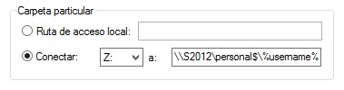

# 3.- Carpetas personales en Active Directory

Comenzando ya con las tareas básicas de administración de Active Directory, la primera que abordaremos será la creación de **carpetas personales** para los usuarios. Estas carpetas permitirán al usuario disponer de un espacio de almacenamiento accesible desde cualquier ubicación de la red a través de una unidad de red.

La creación de carpetas personales se puede dividir en tres partes:
- Creación de una carpeta compartida en el servidor que contenga todas las carpetas de los usuarios.
- Configuración de una carpeta compartida en la cuenta de cada usuario.
- Acceder desde el equipo cliente a la carpeta compartida.

## 3.1.- Creación de la carpeta compartida

Podemos crear la carpeta compartida de la misma forma en que se crean en Windows 10 a través del menú contextual de la carpeta, tal como se vio en el apartado [Carpetas compartidas](../UT04_Win10_Almacenamiento/05_compartidas.md) de la unidad de trabajo 4.

La otra posibilidad es utilizar la opción *Recursos compartidos* que se encuentra en el rol *Servicios de archivos y almacenamiento*.

Este rol es el único que está habilitado por defecto en el sistema tras la instalación del mismo, pero no con toda su funcionalidad. Si accedes a *Agregar roles y características* podrás ver todas las funcionalidades que hay disponibles, pero por ahora solo vamos a agregar la denominada **Administrador de recursos del servidor de archivos**.

Una vez instalado ya podremos ir a *Servicios de archivos y almacenamiento* desde donde tendremos una vista general de todos las carpetas que hay compartidas en el sistema, y también podremos lanzar el asistente para crear una nueva carpeta haciendo *click* en *Tareas -> Nuevo recurso compartido*. 

Las opciones que nos preguntará el asistente son:

- **SMB o NFS**: el protocolo SMB (Server Message Block) es el protocolo utilizado en sistemas Windows para compartir carpetas en red, mientras que NFS (Network File System) es el utilizado en sistemas Linux. Por tanto, esta elección dependerá del sistema operativo de los equipos que tengamos en la red y que vayan a acceder al recurso compartido.
- **Rápido o avanzado**: si deseamos una configuración estándar prefijada o queremos especificar más detalladamente la configuración del recurso compartido.

- **Nombre del recurso compartido**: lo siguiente será indicar el nombre que tendrá el recurso compartido. Recuerda que, al igual que pasa con Windows 10, si finalizamos el nombre del recurso compartido con el símbolo `$` conseguiremos que dicho recurso no sea visible en la red, siendo únicamente accesible para aquellos que conozcan su nombre.
- **Ubicación del recurso compartido**: en la siguiente ventana del asistente hay que indicar la ubicación de la carpeta compartida, tanto el servidor en que la vayamos a ubicar como el volumen. Por defecto, la creará en una carpeta denominada `\shares` dentro del volumen que hayamos indicado, pero también tenemos la opción de personalizar la ubicación.

- **Parámetros de configuración**: en la siguiente ventana del asistente configuramos los siguientes valores:
  - *Habilitar enumeración basada en el acceso*: si lo habilitamos, los usuarios únicamente verán las carpetas y archivos para los que tiene permiso de acceso. Cualquier otro recurso al que no tenga permisos será totalmente invisible para él.
  - *Permitir almacenamiento en caché para el recurso compartido*: esta opción permite que los cliente habiliten una **caché** de archivos de forma que tengan disponibles el contenido de la carpeta compartida aunque no tenga conexión con el equipo que aloja dicha carpeta.
  - *Cifrar acceso a datos*: habilitar esta opción obliga a que todo el tráfico por la red del contenido de esta carpeta esté cifrado.

- **Permisos**: de forma análoga a la configuración en Windows 10, en la siguiente ventana podremos configurar la Lista de Control de Acceso del recurso compartido. Para el caso concreto de la carpeta que contendrá las carpetas personales de todos los usuarios nos aseguraremos de que el grupo especial *Usuarios del dominio* tenga permiso de control total sobre la misma.
  

- **Cuota**: aquí podríamos habilitar una **cuota** para establecer un límite de capacidad que el usuario puede utilizar en la carpeta compartida.

Una vez que hayamos completado todos los pasos del asistente ya podremos ver la carpeta en *Recursos compartidos* y estará disponible para todos los equipos de la red.

## 3.2.- Asociación de la carpeta compartida a la cuenta del usuario

## 3.3.- Comprobar que el usuario puede acceder a ella

El siguiente paso es configurar las cuentas de cada usuario para que la utilicen como lugar de almacenamiento en red, lo cual realizaremos desde la herramienta *Usuarios y equipos de Active Directory*.

Seleccionamos todos los usuarios a los que queramos asignar una carpeta y en el menú contextual seleccionamos *Propiedades*. Esto mostrará la ventana de propiedades de dichos usuarios con una serie de pestañas de entre las que nos interesa la pestaña *Perfil*, el apartado *Carpeta particular*.

Aquí hay dos opciones:

- **Ruta de acceso local**: esta opción indica que el usuario verá la carpeta compartida como una carpeta dentro de su propio sistema de ficheros.
- **Conectar**: en este caso verá la carpeta compartida como una unidad de red. Una **unidad de red** es simplemente una carpeta compartida que se le muestra al usuario como una unidad de almacenamiento más con una letra asignada. 

Como vamos a conectar la carpeta como unidad de red debemos indicar una letra de unidad e indicar la ruta de la carpeta en la red. La sintaxis que tenemos que utilizar en este caso es la siguiente:

`\\servidor\carpeta_contenedora\carpeta_compartida`

Por lo tanto lo pondremos de la siguiente forma:

Observa en la imagen anterior que estamos indicando una carpeta que se creará dentro de la carpeta compartida y que para indicar el nombre de dicha carpeta estamos utilizando una **variable de entorno** (representada por una cadena rodeada por el símbolo por ciento (`%`)).

La variable de entorno  `%username%` es la que contiene el nombre del usuario y la razón de utilizarla aquí es porque estamos indicando la carpeta particular para varios usuarios simultáneamente. De esta forma conseguimos que para cada usuario cree una carpeta con el mismo nombre que el del usuario.

***
[Volver al índice principal](index_UT08.md)

