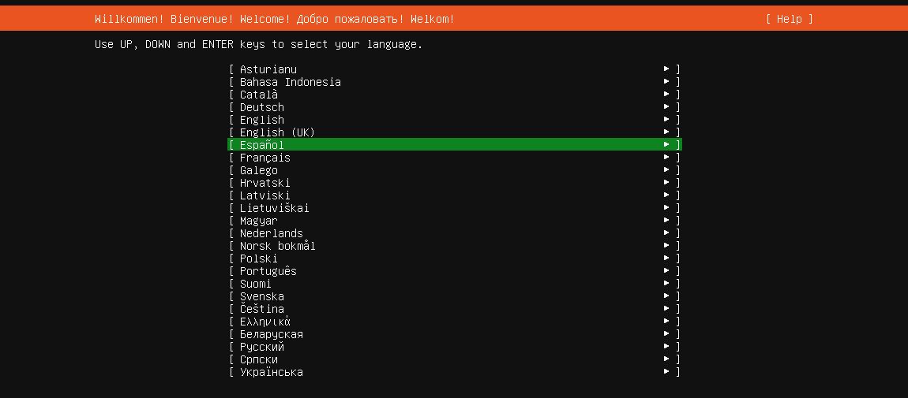
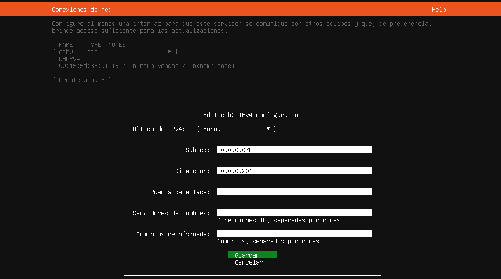
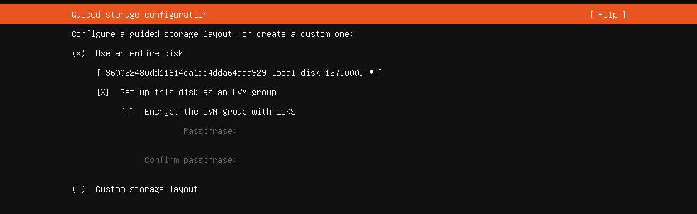
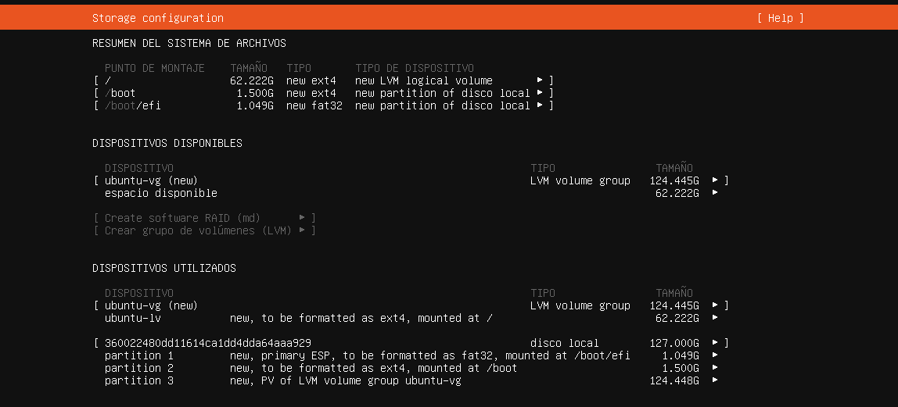
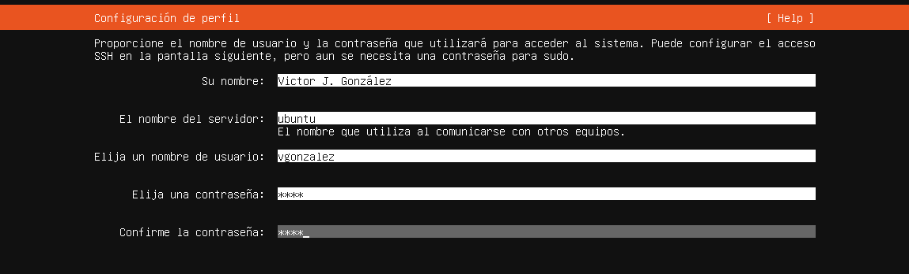
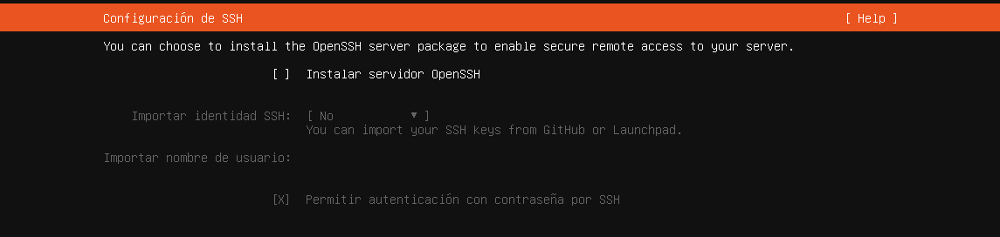
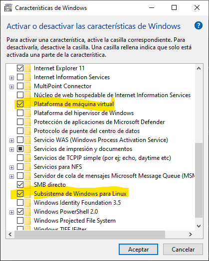
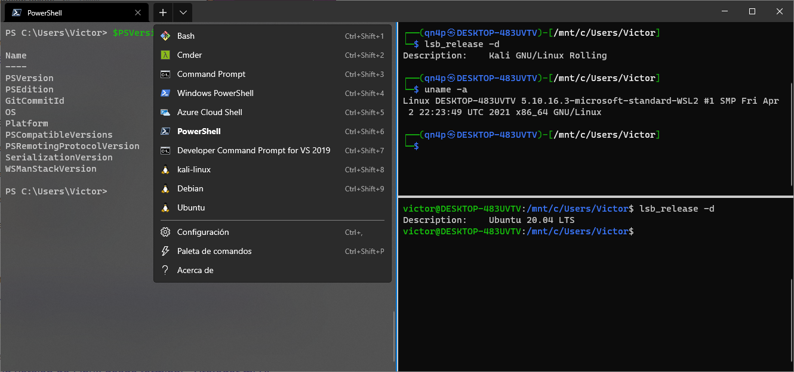

# 1.- Introducción a Linux

## 1.1.- Historia de Linux

Para analizar cómo se ha llegado a las versiones actuales de Linux debemos remontarnos al **año 1964**, donde los Laboratorios Bell (AT&T), General Electric y otras compañías estaban trabajando para desarrollar un sistema operativo muy complejo denominado **MULTICS**. La idea detrás de este sistema operativo era crear un sistema que diera servicio simultáneamente a múltiples usuarios. Aunque el proyecto fue finalmente abandonado por su bajo rendimiento, algunas de las ideas que implantó han servido de base a todos los sistemas operativos posteriores.

Tras dejar el proyecto, dos de los desarrolladores de este: **Ken Thompson** y **Dennis Ritchie**, decidieron aprovechar el trabajo que habían realizado con MULTICS para crear un nuevo sistema operativo más sencillo utilizando una vieja máquina DEC PDP-11, a este sistema operativo lo denominaron UNICS. La primera versión de este sistema operativo fue publicada en el año 1969 rebautizada como **UNIX**.


En el año 1972 publicaron una segunda versión de UNIX desarrollada con un nuevo lenguaje de programación que habían creado los mismos Thompson y Ritchie denominado **lenguaje C**. Al igual que UNIX ha tenido un gran impacto en todos los sistemas operativos posteriores, la gran mayoría de los lenguajes de programación actuales han evolucionado desde el lenguaje C. 

Rápidamente, Unix adquirió una gran popularidad, siendo portado a múltiples plataformas. La primera versión comercial de UNIX apareció en el año 1978 de la mano de Santa Cruz Operation (SCO), siendo rápidamente seguido por versiones de otras empresas: HP-UX, AIX de IBM, Microsoft Xenix, …

En los años 80 AT&T se percató del potencial comercial de UNIX, lo que le llevó a retirar a las universidades su licencia de uso de forma que aquellas que desearan utilizarlo deberían pagar por dicha licencia. La consecuencia directa de esto es que la Universidad de Berkeley decidió tomar la parte del código de Unix que habían aportado ellos mismo para realizar un sistema operativo totalmente suyo al que denominaron **NetBSD**.

De esta versión de Berkeley derivan una familia de Unix libres denominados **FreeBSD** y también sistemas operativos comerciales, entre los que destacan **SunOS**, utilizados en plataformas Solaris, y los populares **Mac OS X**.

Paralelamente a lo anterior, en el año 1983 **Richard Stallman** acuñó el concepto de software e inició el proyecto GNU, cuyo objetivo era construir un sistema operativo totalmente libre. Para ayudar en esta tarea fundó un par de años más tarde la **Free Software Foundation**. Para 1990 el proyecto GNU ya estaba bastante desarrollado y disponía de muchos de los programas necesarios para un sistema operativo: un compilador de C (gcc), librerías, un editor de textos (Emacs), un intérprete de comandos (Bash), … pero se habían quedado atascados en lo más importante: el núcleo. Había desarrollado un kernel, denominado **Hurd**, pero daba múltiples problemas.


Un par de años antes, en 1991, un estudiante de la Universidad de Helsinki, llamado **Linus Torvalds**, comenzó a usar en su PC un pequeño Unix gratuito, llamado **Minix**, que había sido programado por el profesor **Andrew Tannenbaum** desde cero con propósitos educativos y publicado su código en el libro *Operating Systemas. Designa and implementation*.  Como Minix era muy limitado, Linus decidió reescribir algunas de sus partes para hacerlo más funcional.

En octubre de 1991 Linus publicó la primera versión oficial de su sistema operativo, al que denominó **Linux**. Este era capaz de ejecutar el intérprete de comandos Bash y el compilador de C gcc. A partir de este momento, comenzaron a unirse al proyecto más y más programadores atraídos por la idea de completar el trabajo, reescribiendo, mejorando y acelerando el desarrollo de este sistema. En marzo de 1994 se publicó la versión 1.0, la cual ya era suficientemente completa y estable.

A partir de ese momento, Linux no ha parado de crecer, siendo en la actualidad ampliamente utilizado principalmente en entornos de servidores, así como en smartphones (ya que Android está basado en el kernel Linux).


## 1.2.- Instalación de Linux en máquina virtual

El proceso de instalación de Linux en una máquina, ya sea física o virtual, es muy sencillo, y las preguntas que hay que responder dependen en gran medida de la distribución que estemos instalando. En este caso veremos los pasos para instalar **Ubuntu Server 20.04 LTS**.

Descargamos la imagen ISO desde la [página Web de Ubuntu Server](https://ubuntu.com/download/server).

Escogemos el idioma del sistema y del teclado, pulsando las teclas que nos indique para identificar correctamente el teclado.



Ahora toca configurar la red. En este caso concreto mi máquina virtual tiene un único adaptador de Hyper-V conectado a un *conmutador interno*. Como recordatorio, el conmutador interno de Hyper-V interconecta varias máquinas virtuales entre ellas así como con la máquina física a través de un adaptador virtual, pero no asigna automáticamente direcciones IP ni en la máquina física ni en las máquinas virtuales.

En este caso el adaptador virtual de mi máquina física tiene la dirección IP 10.0.0.1/8, por lo que asignaré a la máquina virtual la IP 10.0.0.201/8.

En la pantalla en la que nos encontramos se muestran todos los adaptadores de red del equipo (en este caso máquina virtual). En este punto es importante entender la nomenclatura que sigue Linux para identificar los adaptadores de red. Tradicionalmente se utilizaba una nomenclatura basada en el tipo de adaptador (ethX para interfaces cableadas y wlanX para interfaces inalámbricas), pero eso traía consigo algunos problemas, por ejemplo, que no estaba garantizado que un adaptador tuviera siempre el mismo nombre.

Por ello, en las últimas versiones se utiliza una nomenclatura basada en la **ubicación física del adaptador (biosdevname)**. Esta nomenclatura utiliza varios esquemas:

- **Esquema 1**: se utiliza cuando la BIOS o el firmware del equipo proporciona un número de índice, siendo el nombre del adaptador de la forma `eno1`.
- **Esquema 2**: si el firmware o BIOS proporciona el número de la ranura PCI Express en que está conectada la tarjeta NIC. En este caso el nombre es de la forma `ens1`.
- **Esquema 3**: si no hay ningún número proporcionado por la BIOS se usa una nomenclatura basada en el lugar físico del conector de harware, de la forma `enp0s3`.
- **Esquema 4**: en este caso se utiliza la dirección MAC del adaptador de red, por ejemplo, `enx78e7d1ea46da`.
- **Esquema 5**: en última opción se utilizaría la nomenclatura tradicional:
  - **Adaptadores cableados**: todos los adaptadores Ethernet se identifican mediante `eth` más un número. Así, el primer adaptador será `eth0`, el segundo `eth1`, y así sucesivamente.
  - **Adaptadores inalámbricos**: en caso de que el equipo tenga algún adaptador WiFi los etiquetará como `wlan`, siendo por tanto `wlan0`, `wlan1`, ...

En el caso de máquinas virtuales la nomenclatura varía en cada hipervisor según como simule el hardware. Por ejemplo, en Hyper-V los adaptadores siguen la nomenclatura `ethX` mientras que en VirtualBox utiliza nombres de la forma `enp0s3`, `enp0s8`, ...

Como las imágenes corresponden a una máquina virtual de Hyper-V, el adaptador de red se ve identificado como `eth0`, por lo que cambiamos de **DHCPv4** a **manual** e indicamos los parámetros de configuración de red.



A continuación preguntará por el proxy y por los repositorios, pero no cambiamos nada.

Tras ello toca elegir el particionamiento del disco, por ahora dejamos que realice el particionamiento automáticamente, aunque más adelante ya veremos todas las opciones que tenemos disponibles aquí.





Los siguientes datos que pide son:

- **Nombre**: nuestro nombre completo aunque lo que pongamos es irrelevante.
- **Nombre del servidor**: el nombre por el que se conocerá al equipo en la red
- **Nombre de usuario**: el nombre de inicio de sesión por el que se conocerá a nuestro usuario en el sistema. Conviene limitarse a caracteres en minúscula y dígitos.
- **Contraseña**: al contrario que en Windows, en Linux es obligatorio que todos los usuarios tengan contraseña, aunque no hay ningún requisito de longitud ni de complejidad.



Ahora nos pregunta si queremos instalar un servidor SSH, que es lo más habitual y frecuente en el caso de un servidor. Sin embargo, por ahora no seleccionamos esta opción ya que veremos más adelante como instalarlo y configurarlo.



Y con esto ya estará instalado el sistema.


## 1.3.- Instalación de Linux mediante WSL

En los últimos años se ha producido un acercamiento de Microsoft hacia Linux que se ha traducido en una integración cada vez mayor de Linux dentro de los sistemas Windows. Probablemente, el máximo exponente de esta integración sea **WSL (Windows Subsytem Layer)**, que permite ejecutar un kernel de Linux dentro de Windows sin necesidad de máquinas virtuales.

La última versión, **WSL 2**, permite incluso ejecutar aplicaciones gráficas de Linux, así como grandes mejoras en el rendimiento.

### 2.1.1.- Instalación de WSL

Lo primero que necesitamos es tener activado **Hyper-V** en Windows, ya que el kernel de Linux en WSL se ejecuta sobre el hipervisor de Windows.

Además, hay que activar las siguientes características:

- Plataforma de máquina virtual
- Subsistema de Windows para Linux

Estas pueden ser activadas mediante la herramienta *Activar o desactivar las herramientas de Windows*.



También es posible activarlas desde Powershell, para ello se ejecutan las siguientes órdenes y a continuación se reinicia el sistema.

```powershell
  PS C:\>dism.exe /online /enable-feature /featurename:Microsoft-Windows-Subsystem-Linux /all /norestart

  PS C:\>dism.exe /online /enable-feature /featurename:VirtualMachinePlatform /all /norestart
```

### 2.1.2.- Instalación de WSL 2

En este momento tenemos WSL, que es requisito para tener WSL 2. Ahora realizamos los siguientes pasos:

- Descargamos el [kernel de WSL 2](https://wslstorestorage.blob.core.windows.net/wslblob/wsl_update_x64.msi)
- Ejecutamos el instalador
- Establecemos WSL 2 como opción por defecto con la orden `wsl --set-default-version 2`


### 2.1.3.- Opciones de WSL

Una vez que ya tenemos WSL 2 instalado en nuestro sistema podemos ejecutar los siguientes comandos en una terminal de Powershell.

#### Mostrar todas las distribuciones que se pueden instalar

```powershell
  PS C:\> wsl --list --online
  A continuación, se muestra una lista de las distribuciones válidas que se pueden instalar.
  Instalar con 'wsl --install -d <Distribución>'.

  NAME            FRIENDLY NAME
  Ubuntu          Ubuntu
  Debian          Debian GNU/Linux
  kali-linux      Kali Linux Rolling
  openSUSE-42     openSUSE Leap 42
  SLES-12         SUSE Linux Enterprise Server v12
  Ubuntu-16.04    Ubuntu 16.04 LTS
  Ubuntu-18.04    Ubuntu 18.04 LTS
  Ubuntu-20.04    Ubuntu 20.04 LTS
```


#### Ver las distribuciones que tenemos instaladas en el sistema

```powershell
  PS C:\> wsl --list --verbose
    NAME          STATE           VERSION
  * kali-linux    Running         2
    Debian        Stopped         2
```

#### Instalar una distribución

```powershell
  PS C:\> wsl --install --distribution Ubuntu
  Descargando: Ubuntu
  Instalando: Ubuntu
  Se ha instalado Ubuntu.
  Iniciando Ubuntu...
```

Cuando se ejecuta esta orden se descargará la distribución y solicitará introducir un nombre de usuario y contraseña. Este usuario es independiente del usuario de Windows y se utilizará solamente dentro de la distribución instalada. 


#### Lanzar una distribución

```powershell
  PS C:\> wsl -d ubuntu
  To run a command as administrator (user "root"), use "sudo <command>".
  See "man sudo_root" for details.

  victor@DESKTOP-483UVTV:/mnt/c/$ exit
  logout
  PS C:\>
```

Si tenemos instalado Windows Terminal será posible abrir diferentes distribuciones en diferentes pestañas. Simplemente hay que elegir la distribución deseada en el menú desplegable que hay a la derecha de las pestañas.




***
[Volver al índice principal](index_UT09.md)